# DATA_MODEL_VTKALL_DEMO_PACK_#_v3_timeslots.md

> Documento generado a partir de `DATA_MODEL_VTKALL_DataModel-0_v2.md`.
> Esta versión incorpora la capa operacional de equipos de trabajo, reglas de agenda,
> overrides diarios, micro-slots de 15 minutos y reservas de capacidad.
> El documento original v2 no debe modificarse; esta copia existe para revisión comparativa línea a línea.

## 0.1. Delta v3 — TimeSlots / WorkTeams

La versión v2 ya contenía referencias a equipos mediante:

```text
CatalogOffering.fulfillmentPolicy.suggestedTeamId
Case.assignedTeamId
Appointment.assignedTeamId
WorkOrderTask.assignedTeamId
WorkOrderTask.estimatedDurationMinutes
```

Sin embargo, esas referencias no definían:

```text
qué es un equipo,
cuándo trabaja,
qué capacidad tiene,
qué excepciones aplican por día,
qué reserva bloquea realmente su disponibilidad.
```

La versión v3 agrega una capa operacional mínima:

```text
WorkTeam
WorkTeamScheduleRule
WorkTeamScheduleOverride
ResourceReservation
```

`Appointment`, `Case`, `CatalogOffering` y `TimelineEvent` se mantienen como núcleo del modelo.
La nueva capa no reemplaza la cita; la complementa con capacidad real de taller.

## 0. Punto de partida real del repo

Hoy el sistema tiene un modelo legacy fuerte: **`Cita`**.

`Cita` concentra cliente, teléfono, reserva, vehículo, servicio, producto, tipo de cita, experto asignado, descripción, fecha, estado, notas técnicas, precio estimado, precio final, origen, imágenes, team y estado de trabajo.

También existe `Cliente`, que guarda datos personales, teléfono único, detalles extra, deuda, gasto, WhatsApp LIDs y un array embebido de vehículos.

Además ya existe una fachada `cases` sobre `Cita`: `caseService.js` importa `Cita` y convierte `Cita` a `Case` mediante mappers.

El propio `quoteService.js` reconoce que todavía **no existe un modelo Quote de primera clase**, y que texto, términos, vigencia y metadata de decisión no se persisten.

Por tanto, el diagnóstico del modelo actual es:

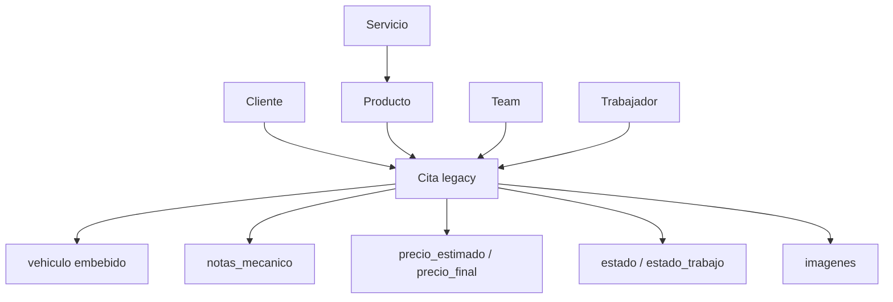

El problema: `Cita` está haciendo de **Appointment + Case + Assessment + AssessmentReport + Quote + WorkOrder parcial**.

Eso debe evolucionar.

---

# 1. Modelo de Datos Objetivo

La raíz no debe ser `Cita`.

La raíz debe ser:

> **Case / Operational Case / Engagement**

En VertikALL, un `Case` representa una unidad operativa/comercial que nace de una interacción del cliente y termina en cierre, entrega, descarte o cancelación.

## 1.1. Modelo canónico general

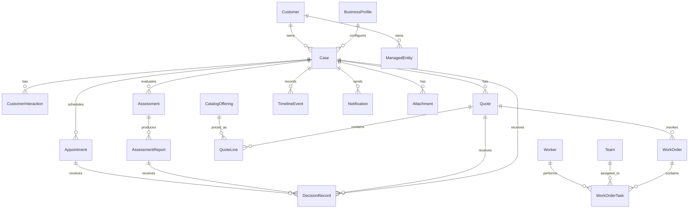

## 1.2. Modelo conceptual en capas

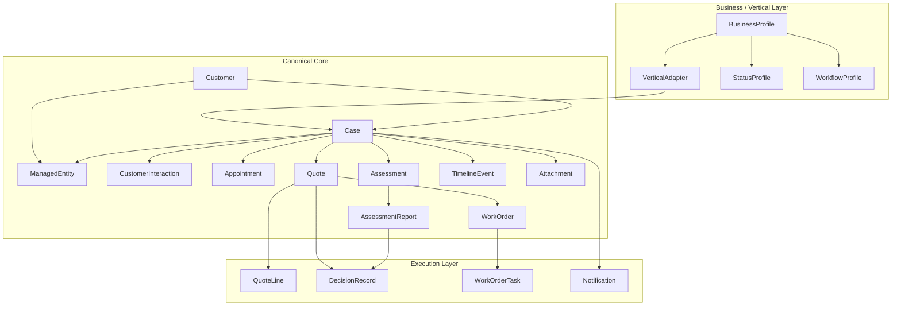

---

# 2. Entidades Core

Estas entidades son compartidas por todos los tipos de negocio.

---

## 2.1. `BusinessProfile`

Representa la configuración de un negocio o vertical.

### Propósito

`BusinessProfile` responde:

* ¿Qué negocio está activo?
* ¿Qué vertical opera?
* ¿Cómo se llama el agente IA?
* ¿Qué entidad gestiona?
* ¿Qué campos pide?
* ¿Qué estados usa?
* ¿Qué workflows aplica?
* ¿Qué catálogo inicial tiene?
* ¿Qué reglas de cotización y WorkOrder tiene?

### JSON ejemplo — Turagua

```json
{
  "_id": "bp_turagua",
  "businessSlug": "turagua",
  "businessName": "Turagua Racing",
  "verticalType": "vehicle_service",
  "brand": {
    "displayName": "Turagua Racing",
    "logoUrl": "/brands/turagua/logo.png",
    "primaryColor": "#00AEEF",
    "secondaryColor": "#111827",
    "country": "PE",
    "timezone": "America/Lima"
  },
  "agent": {
    "name": "Iris",
    "role": "Ejecutiva de atención al público",
    "promptKey": "turagua",
    "primaryChannel": "web",
    "secondaryChannels": ["whatsapp"]
  },
  "labels": {
    "customer": "Cliente",
    "case": "Orden",
    "managedEntity": "Vehículo",
    "appointment": "Cita de evaluación",
    "assessment": "Evaluación",
    "assessmentReport": "Diagnóstico",
    "quote": "Cotización",
    "workOrder": "Orden de Trabajo",
    "workshop": "Taller"
  },
  "features": {
    "supportsAppointments": true,
    "supportsPhotoAssessment": true,
    "supportsPhoneAssessment": true,
    "supportsQuotes": true,
    "supportsWorkOrders": true,
    "supportsDeliveryDate": false,
    "supportsVehicleData": true,
    "supportsFeasibility": false
  },
  "statusProfileId": "status_vehicle_service_v1",
  "workflowProfileId": "workflow_vehicle_service_v1",
  "catalogProfileId": "catalog_turagua_v1",
  "active": true
}
```

### JSON ejemplo — BateYLate

```json
{
  "_id": "bp_bateylate",
  "businessSlug": "bateylate",
  "businessName": "BateYLate",
  "verticalType": "custom_orders",
  "brand": {
    "displayName": "BateYLate",
    "logoUrl": "/brands/bateylate/logo.png",
    "primaryColor": "#EF5DA8",
    "secondaryColor": "#FFF7ED",
    "country": "PE",
    "timezone": "America/Lima"
  },
  "agent": {
    "name": "Esperanza",
    "role": "Ejecutiva creativa de atención al público",
    "promptKey": "bateylate",
    "primaryChannel": "web",
    "secondaryChannels": ["whatsapp"]
  },
  "labels": {
    "customer": "Cliente",
    "case": "Pedido",
    "managedEntity": "Solicitud de postre",
    "appointment": "Consulta de factibilidad",
    "assessment": "Evaluación de factibilidad",
    "assessmentReport": "Informe de Factibilidad",
    "quote": "Cotización",
    "workOrder": "Orden de Producción",
    "workshop": "Taller de Repostería"
  },
  "features": {
    "supportsAppointments": true,
    "supportsPhotoAssessment": true,
    "supportsPhoneAssessment": false,
    "supportsQuotes": true,
    "supportsWorkOrders": true,
    "supportsDeliveryDate": true,
    "supportsVehicleData": false,
    "supportsFeasibility": true
  },
  "statusProfileId": "status_custom_orders_v1",
  "workflowProfileId": "workflow_custom_orders_v1",
  "catalogProfileId": "catalog_bateylate_v1",
  "active": true
}
```

---

## 2.2. `Customer`

Hoy existe `Cliente`, pero necesita evolucionar.

Actualmente `Cliente` guarda `nombre`, `dni`, `numero_telefono`, `email`, `detalles_extra`, `notas`, `total_citas`, `total_gastado`, `deuda_actual`, WhatsApp LIDs y vehículos embebidos.

El problema es que `Cliente` mezcla:

* datos personales;
* métricas financieras;
* vehículos;
* datos legacy;
* datos de WhatsApp.

### Modelo recomendado

```json
{
  "_id": "cus_001",
  "businessSlug": "turagua",
  "type": "person",
  "name": "Ronald Zavaleta",
  "document": {
    "type": "DNI",
    "value": "12345678",
    "country": "PE"
  },
  "contact": {
    "phones": [
      {
        "label": "principal",
        "countryCode": "+51",
        "number": "955479450",
        "normalized": "51955479450",
        "isWhatsapp": true,
        "primary": true
      }
    ],
    "email": "ronald@example.com"
  },
  "whatsapp": {
    "lids": ["123456789@lid"],
    "lastKnownWaId": "51955479450"
  },
  "metrics": {
    "totalCases": 4,
    "totalSpentCents": 125000,
    "currentDebtCents": 0
  },
  "notes": "Cliente recurrente. Prefiere atención por WhatsApp.",
  "status": "active",
  "createdAt": "2026-07-01T10:00:00.000Z",
  "updatedAt": "2026-07-01T10:00:00.000Z"
}
```

### Decisión clave

Los vehículos **no deberían vivir embebidos para siempre dentro de Cliente**.

Para transición está bien mantenerlos, pero el modelo objetivo debe tener `ManagedEntity`.

---

## 2.3. `ManagedEntity`

Esta es una entidad clave para soportar muchos negocios.

`ManagedEntity` representa **aquello sobre lo cual se realiza el servicio, evaluación, diagnóstico, producción o seguimiento**.

| Vertical           | ManagedEntity         |
| ------------------ | --------------------- |
| Turagua            | Vehículo              |
| BateYLate          | Solicitud de postre   |
| Veterinaria        | Mascota               |
| Médico             | Paciente / atención   |
| Ginecólogo         | Paciente / consulta   |
| Belleza            | Cliente + tratamiento |
| Óptica             | Orden óptica / lentes |
| Reparación técnica | Equipo                |
| Catering           | Evento / pedido       |

### Modelo genérico

```json
{
  "_id": "me_001",
  "businessSlug": "turagua",
  "customerId": "cus_001",
  "type": "vehicle",
  "displayName": "Toyota Yaris 2020 ABC-123",
  "summary": "Toyota Yaris 2020, placa ABC-123",
  "data": {
    "brand": "Toyota",
    "model": "Yaris",
    "year": 2020,
    "plate": "ABC-123",
    "vin": null,
    "color": "Negro",
    "mileageKm": 80000
  },
  "status": "active",
  "createdAt": "2026-07-01T10:00:00.000Z",
  "updatedAt": "2026-07-01T10:00:00.000Z"
}
```

### Ejemplo BateYLate

```json
{
  "_id": "me_101",
  "businessSlug": "bateylate",
  "customerId": "cus_202",
  "type": "dessert_request",
  "displayName": "Torta personalizada para cumpleaños",
  "summary": "Torta de 20 porciones, temática floral, entrega sábado",
  "data": {
    "dessertType": "cake",
    "occasion": "cumpleaños",
    "servings": 20,
    "flavorPreferences": ["vainilla", "chocolate"],
    "style": "elegante floral",
    "referenceAttachmentIds": ["att_ref_001"],
    "restrictions": ["sin nueces"],
    "deliveryMode": "delivery",
    "requestedDeliveryDate": "2026-07-05T18:00:00.000Z"
  },
  "status": "active",
  "createdAt": "2026-07-01T10:00:00.000Z",
  "updatedAt": "2026-07-01T10:00:00.000Z"
}
```

### Ejemplo veterinaria futuro

```json
{
  "_id": "me_pet_001",
  "businessSlug": "vet-demo",
  "customerId": "cus_501",
  "type": "pet",
  "displayName": "Luna - Golden Retriever",
  "summary": "Luna, Golden Retriever, 4 años",
  "data": {
    "name": "Luna",
    "species": "dog",
    "breed": "Golden Retriever",
    "ageYears": 4,
    "sex": "female",
    "weightKg": 28,
    "knownConditions": ["alergia leve"]
  },
  "status": "active"
}
```

---

## 2.4. `Case`

`Case` es la raíz operativa.

Un `Case` representa una intención del cliente que entra al sistema y puede convertirse en evaluación, cotización, WorkOrder y cierre.

### Reglas

* Todo `Case` pertenece a un `businessSlug`.
* Todo `Case` pertenece a un `Customer`.
* Todo `Case` puede tener un `ManagedEntity`.
* Un `Case` puede tener una o varias citas.
* Un `Case` puede tener una o varias evaluaciones.
* Un `Case` puede tener uno o varios reportes de evaluación.
* Un `Case` puede tener una o varias cotizaciones.
* Un `Case` puede generar una o varias WorkOrders.
* Un `Case` tiene timeline.
* Un `Case` tiene status canónico.

### Modelo

```json
{
  "_id": "case_001",
  "businessSlug": "turagua",
  "verticalType": "vehicle_service",
  "caseNumber": "TUR-2026-0001",
  "customerId": "cus_001",
  "managedEntityId": "me_001",
  "source": {
    "channel": "web",
    "agent": "Iris",
    "campaign": null,
    "origin": "landing_catalog"
  },
  "intent": {
    "type": "assessment_request",
    "summary": "Cliente solicita evaluación por ruido al frenar",
    "customerText": "Mi carro hace ruido al frenar y quiero revisarlo.",
    "selectedOfferingId": "off_brake_eval"
  },
  "status": "appointment_scheduled",
  "statusGroup": "pre_order",
  "priority": "normal",
  "assignedTeamId": null,
  "assignedWorkerId": null,
  "importantDates": {
    "createdAt": "2026-07-01T10:00:00.000Z",
    "requestedDate": null,
    "scheduledAt": "2026-07-02T15:00:00.000Z",
    "closedAt": null
  },
  "flags": {
    "requiresHumanReview": true,
    "hasOpenQuote": false,
    "hasApprovedQuote": false,
    "hasWorkOrder": false
  },
  "legacy": {
    "legacyType": "Cita",
    "legacyId": "668000000000000000000001"
  },
  "createdAt": "2026-07-01T10:00:00.000Z",
  "updatedAt": "2026-07-01T10:00:00.000Z"
}
```

### Case BateYLate

```json
{
  "_id": "case_byl_001",
  "businessSlug": "bateylate",
  "verticalType": "custom_orders",
  "caseNumber": "BYL-2026-0001",
  "customerId": "cus_202",
  "managedEntityId": "me_101",
  "source": {
    "channel": "web",
    "agent": "Esperanza",
    "origin": "pedido_web"
  },
  "intent": {
    "type": "custom_order_request",
    "summary": "Cliente quiere torta personalizada para cumpleaños",
    "customerText": "Quiero una torta elegante para el cumpleaños de mi mamá.",
    "selectedOfferingId": "off_custom_cake"
  },
  "status": "feasibility_review",
  "statusGroup": "pre_order",
  "priority": "normal",
  "assignedTeamId": "team_bakery",
  "assignedWorkerId": "worker_master_baker",
  "flags": {
    "requiresHumanReview": true,
    "hasAssessmentReport": false,
    "hasOpenQuote": false,
    "hasApprovedQuote": false,
    "hasWorkOrder": false
  },
  "createdAt": "2026-07-01T10:00:00.000Z",
  "updatedAt": "2026-07-01T10:00:00.000Z"
}
```

---

## 2.5. `CustomerInteraction`

`CustomerInteraction` es el registro persistente de toda interacción relevante entre el público/cliente y el negocio, especialmente cuando intervienen Iris o Esperanza.

### Propósito

Permite persistir:

* Q&A;
* captura de intención;
* servicio/producto seleccionado;
* datos extraídos por IA;
* confirmaciones;
* respuestas del cliente;
* evidencia conversacional;
* contexto entregado a backend;
* resultado de la interacción.

### Modelo recomendado

```json
{
  "_id": "int_001",
  "businessSlug": "turagua",
  "caseId": "case_tur_001",
  "customerId": "cus_tur_001",
  "channel": "web",
  "agent": {
    "name": "Iris",
    "type": "ai_agent"
  },
  "direction": "inbound",
  "interactionType": "customer_message",
  "intent": {
    "detectedIntent": "assessment_request",
    "confidence": 0.92,
    "selectedOfferingId": "off_brake_service"
  },
  "content": {
    "text": "Mi carro hace ruido al frenar.",
    "attachmentIds": []
  },
  "outcome": {
    "createdCaseId": "case_tur_001",
    "createdAppointmentId": "appt_tur_001",
    "requiresHumanFollowUp": false
  },
  "createdAt": "2026-07-01T10:00:00.000Z"
}
```

---

# 3. Appointment / Cita / Consulta

`Appointment` debe representar una fecha, slot o consulta.

En Turagua es una **Cita de Evaluación**.

En BateYLate puede ser una **Consulta de Factibilidad**, presencial o asíncrona.

## Modelo

```json
{
  "_id": "appt_001",
  "businessSlug": "turagua",
  "caseId": "case_001",
  "customerId": "cus_001",
  "managedEntityId": "me_001",
  "type": "onsite_assessment",
  "status": "confirmed",
  "scheduledStart": "2026-07-02T15:00:00.000Z",
  "scheduledEnd": "2026-07-02T16:00:00.000Z",
  "timezone": "America/Lima",
  "location": {
    "type": "workshop",
    "label": "Turagua Racing - Taller",
    "address": "Lima, Perú"
  },
  "assignedTeamId": "team_frontdesk",
  "assignedWorkerId": null,
  "confirmation": {
    "required": true,
    "status": "confirmed_by_customer",
    "requestedAt": "2026-07-01T11:00:00.000Z",
    "confirmedAt": "2026-07-01T11:20:00.000Z",
    "channel": "whatsapp",
    "decisionRecordId": "dec_appt_001"
  },
  "legacy": {
    "legacyType": "Cita",
    "legacyId": "668000000000000000000001"
  },
  "createdAt": "2026-07-01T10:00:00.000Z"
}
```

## Modalidades Pack 1

```json
[
  {
    "key": "onsite_assessment",
    "label": "Evaluación presencial",
    "requiresDate": true,
    "requiresPhotos": false,
    "requiresAssignedTechnician": false
  },
  {
    "key": "photo_assessment",
    "label": "Evaluación con fotos",
    "requiresDate": false,
    "requiresPhotos": true,
    "requiresAssignedTechnician": true
  },
  {
    "key": "phone_assessment",
    "label": "Evaluación telefónica",
    "requiresDate": true,
    "requiresPhotos": false,
    "requiresAssignedTechnician": true
  }
]
```

## Decisión importante

`Cita` no debe desaparecer inmediatamente.

Durante migración:

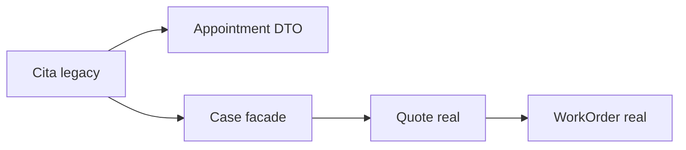

## 3.1. v3 — Appointment y reserva de capacidad

`Appointment` sigue representando la cita o consulta confirmada.

La disponibilidad real ya no debe depender únicamente de un slot precargado.
La cita debe poder referenciar una reserva operacional de capacidad:

```json
{
  "_id": "appt_001",
  "businessSlug": "turagua",
  "caseId": "case_001",
  "customerId": "cus_001",
  "managedEntityId": "me_001",
  "type": "onsite_assessment",
  "status": "confirmed",
  "scheduledStart": "2026-07-03T14:00:00.000-05:00",
  "scheduledEnd": "2026-07-03T15:00:00.000-05:00",
  "timezone": "America/Lima",
  "assignedTeamId": "team_mechanics",
  "assignedWorkerId": null,
  "resourceReservationId": "res_001",
  "confirmation": {
    "required": true,
    "status": "confirmed_by_customer",
    "confirmedAt": "2026-07-03T12:30:00.000-05:00",
    "channel": "manual_agent_sim"
  },
  "createdAt": "2026-07-03T12:30:00.000-05:00"
}
```

### Regla v3

```text
Appointment agenda al cliente.
ResourceReservation bloquea la capacidad real del equipo.
```

Esto evita que `Appointment` se convierta en un calendario técnico y mantiene separada la intención comercial de la ocupación operacional.

# 3B. WorkTeams / TimeSlots / ResourceReservation

Esta sección formaliza los equipos de trabajo y la granularidad mínima de agenda.

## 3B.1. Principios

```text
1. La unidad mínima de agenda es 15 minutos.
2. Un servicio puede ocupar uno o más micro-slots.
3. La duración del servicio viene desde CatalogOffering.
4. La disponibilidad se calcula desde equipo + reglas + overrides + reservas.
5. Appointment no es la fuente de verdad de disponibilidad.
6. ResourceReservation sí es la fuente de verdad del bloqueo de capacidad.
```

## 3B.2. WorkTeam

`WorkTeam` representa un equipo operativo del negocio.

Ejemplos Turagua:

```text
team_frontdesk
team_mechanics
team_detailing
```

Modelo recomendado:

```json
{
  "_id": "team_detailing",
  "businessSlug": "turagua",
  "name": "Lavado y detailing",
  "type": "detailing",
  "capacity": 1,
  "slotGranularityMinutes": 15,
  "active": true,
  "createdAt": "2026-07-03T00:00:00.000-05:00",
  "updatedAt": "2026-07-03T00:00:00.000-05:00"
}
```

### Campos

```text
_id                       ID estable del equipo.
businessSlug              Comercio al que pertenece.
name                      Nombre visible.
type                      frontdesk | mechanics | detailing | bodywork | other.
capacity                  Cuántas atenciones paralelas permite el equipo.
slotGranularityMinutes    Unidad mínima de agenda. Default: 15.
active                    Si el equipo puede recibir reservas.
```

## 3B.3. WorkTeamScheduleRule

`WorkTeamScheduleRule` define el horario recurrente de un equipo.

```json
{
  "_id": "rule_detailing_fri_0800_1800",
  "businessSlug": "turagua",
  "teamId": "team_detailing",
  "weekday": 5,
  "startTime": "08:00",
  "endTime": "18:00",
  "capacity": 1,
  "active": true
}
```

### Reglas

```text
weekday usa 0=domingo, 1=lunes, ..., 6=sábado.
startTime y endTime se interpretan en timezone del negocio.
capacity puede sobreescribir la capacidad base del equipo para esa ventana.
```

## 3B.4. WorkTeamScheduleOverride

`WorkTeamScheduleOverride` define excepciones para una fecha concreta.

Sirve para casos como:

```text
mañana solo atiende de 10:00 a 11:00,
mañana no trabaja el equipo de lavado,
hoy se extiende horario por alta demanda.
```

Modelo recomendado:

```json
{
  "_id": "ovr_detailing_20260704_blocked",
  "businessSlug": "turagua",
  "teamId": "team_detailing",
  "date": "2026-07-04",
  "mode": "block",
  "windows": [],
  "reason": "Equipo de lavado no disponible.",
  "active": true
}
```

### Modos

```text
block     Elimina disponibilidad del equipo en esa fecha.
replace   Reemplaza completamente el horario base del día.
extend    Agrega ventanas adicionales al horario base.
```

Ejemplo `replace`:

```json
{
  "_id": "ovr_frontdesk_20260704_reduced",
  "businessSlug": "turagua",
  "teamId": "team_frontdesk",
  "date": "2026-07-04",
  "mode": "replace",
  "windows": [
    {
      "startTime": "10:00",
      "endTime": "11:00",
      "capacity": 1
    }
  ],
  "reason": "Atención al cliente con horario reducido.",
  "active": true
}
```

## 3B.5. ResourceReservation

`ResourceReservation` representa el bloqueo real de capacidad del equipo.

Una cita de lavado premium de 120 minutos con granularidad de 15 minutos ocupa 8 unidades.

Modelo recomendado:

```json
{
  "_id": "res_001",
  "businessSlug": "turagua",
  "teamId": "team_detailing",
  "catalogOfferingId": "off_lavado_premium",
  "appointmentId": "appt_001",
  "customerId": "cus_001",
  "caseId": "case_001",
  "workflowId": "schedule-consultation-001",
  "startAt": "2026-07-03T08:00:00.000-05:00",
  "endAt": "2026-07-03T10:00:00.000-05:00",
  "durationMinutes": 120,
  "slotGranularityMinutes": 15,
  "requiredUnits": 8,
  "slotKeys": [
    "team_detailing:2026-07-03T13:00:00.000Z",
    "team_detailing:2026-07-03T13:15:00.000Z",
    "team_detailing:2026-07-03T13:30:00.000Z",
    "team_detailing:2026-07-03T13:45:00.000Z",
    "team_detailing:2026-07-03T14:00:00.000Z",
    "team_detailing:2026-07-03T14:15:00.000Z",
    "team_detailing:2026-07-03T14:30:00.000Z",
    "team_detailing:2026-07-03T14:45:00.000Z"
  ],
  "status": "booked",
  "createdAt": "2026-07-03T07:30:00.000-05:00"
}
```

### Estados

```text
held       Bloqueo temporal mientras el cliente confirma.
booked     Reserva confirmada.
cancelled  Cancelada por negocio o cliente.
released   Liberada por rollback o cambio operativo.
expired    Hold vencido.
```

Solo `held` y `booked` bloquean disponibilidad.

## 3B.6. AvailabilitySlot legacy

`AvailabilitySlot` puede mantenerse como compatibilidad temporal para demos, Postman o pantallas antiguas.

Regla v3:

```text
AvailabilitySlot no debe ser la fuente futura de verdad.
La disponibilidad real se calcula desde WorkTeamScheduleRule,
WorkTeamScheduleOverride y ResourceReservation.
```

---

# 4. Assessment / AssessmentReport

Aquí está una de las claves para soportar verticales.

No todos los negocios hacen “diagnóstico”.
No todos hacen “factibilidad”.
Pero todos hacen alguna forma de **evaluación previa**.

Por eso se proponen dos entidades base:

```text
Assessment
AssessmentReport
```

`Assessment` representa el acto de evaluar.
`AssessmentReport` representa el resultado formal de esa evaluación.

`AssessmentReport` reemplaza la necesidad de tener modelos separados como `DiagnosticReport`, `FeasibilityReport`, `TechnicalReport`, `ClinicalNote`, etc.

## 4.1. `Assessment`

```json
{
  "_id": "assess_001",
  "businessSlug": "turagua",
  "caseId": "case_001",
  "customerId": "cus_001",
  "managedEntityId": "me_001",
  "type": "vehicle_assessment",
  "status": "completed",
  "mode": "onsite_assessment",
  "requestedBy": {
    "type": "customer",
    "id": "cus_001"
  },
  "performedBy": {
    "teamId": "team_mechanics",
    "workerId": "worker_001"
  },
  "inputs": {
    "customerComplaint": "Ruido al frenar",
    "symptoms": ["ruido", "vibración leve"],
    "evidenceAttachmentIds": ["att_001"]
  },
  "output": {
    "summary": "Se detecta desgaste en pastillas delanteras.",
    "resultType": "diagnostic_ready",
    "requiresQuote": true,
    "recommendedOfferingIds": ["off_brake_service"]
  },
  "startedAt": "2026-07-02T15:10:00.000Z",
  "completedAt": "2026-07-02T15:45:00.000Z",
  "createdAt": "2026-07-01T10:00:00.000Z"
}
```

---

## 4.2. `AssessmentReport`

`AssessmentReport` es el documento formal producido por un `Assessment`.

### Tipos soportados

```text
diagnostic        // Turagua
feasibility       // BateYLate
technical_review  // reparación técnica
clinical_note     // salud
inspection        // inspección general
```

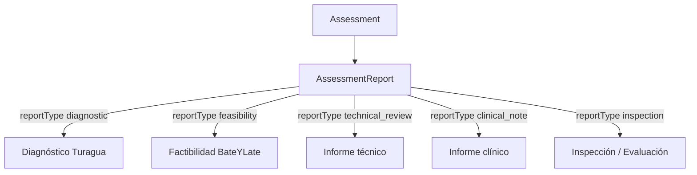

### JSON Turagua — `reportType=diagnostic`

```json
{
  "_id": "ar_tur_001",
  "businessSlug": "turagua",
  "verticalType": "vehicle_service",
  "caseId": "case_tur_001",
  "assessmentId": "assess_tur_001",
  "managedEntityId": "me_vehicle_001",
  "reportType": "diagnostic",
  "status": "ready_for_quote",
  "result": {
    "classification": "diagnostic_ready",
    "canProceedToQuote": true,
    "requiresCustomerConceptApproval": false
  },
  "customerFacingSummary": "Recomendamos cambiar las pastillas delanteras.",
  "internalSummary": "Pastillas delanteras con desgaste avanzado.",
  "findings": [
    {
      "area": "Frenos delanteros",
      "finding": "Pastillas con desgaste avanzado",
      "severity": "medium",
      "evidenceAttachmentIds": ["att_001"]
    }
  ],
  "recommendedOfferingIds": ["off_brake_pads_replace"],
  "createdBy": "worker_001",
  "createdAt": "2026-07-02T15:45:00.000Z"
}
```

### JSON BateYLate — `reportType=feasibility`

```json
{
  "_id": "ar_byl_001",
  "businessSlug": "bateylate",
  "verticalType": "custom_orders",
  "caseId": "case_byl_001",
  "assessmentId": "assess_byl_001",
  "managedEntityId": "me_dessert_001",
  "reportType": "feasibility",
  "status": "feasible_with_changes",
  "result": {
    "classification": "feasible_with_changes",
    "canProceedToQuote": false,
    "requiresCustomerConceptApproval": true
  },
  "customerFacingSummary": "Podemos elaborar tu torta con algunos ajustes en la decoración.",
  "internalSummary": "El diseño es viable si se simplifican flores 3D.",
  "reformulation": {
    "summary": "Reemplazar flores 3D por decoración plana en buttercream.",
    "impact": {
      "priceImpact": "lower",
      "deliveryDateImpact": "same_date_possible",
      "complexity": "medium"
    }
  },
  "createdBy": "worker_master_baker",
  "createdAt": "2026-07-01T14:00:00.000Z"
}
```

---

## 4.3. Estados de Assessment

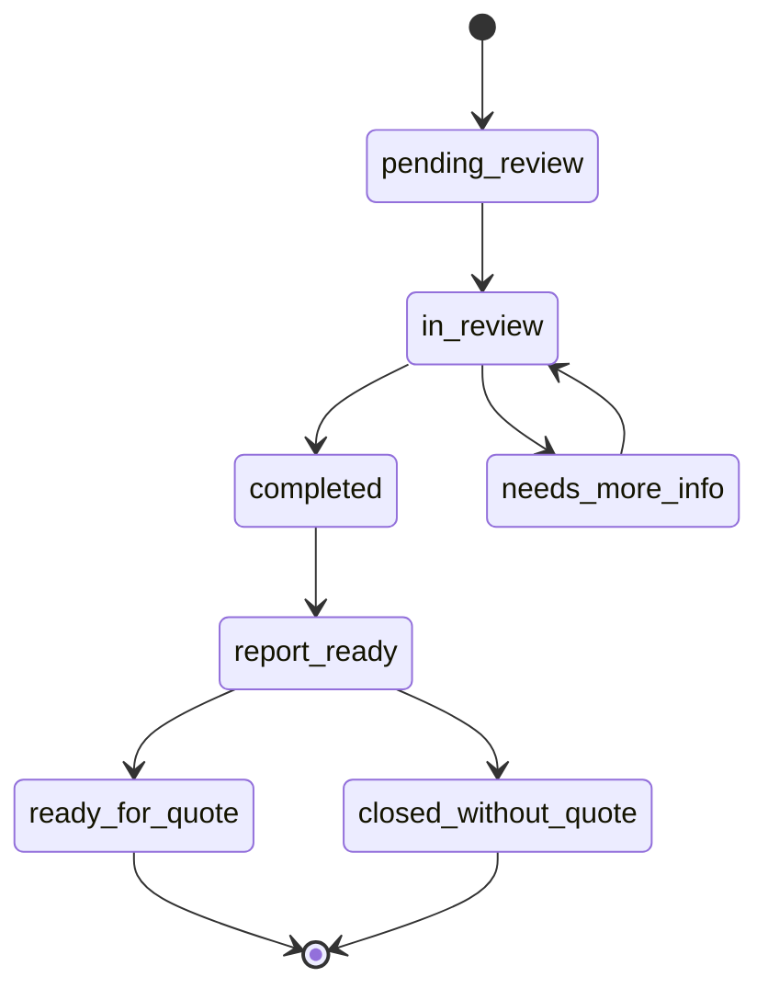

## 4.4. Estados de AssessmentReport para BateYLate

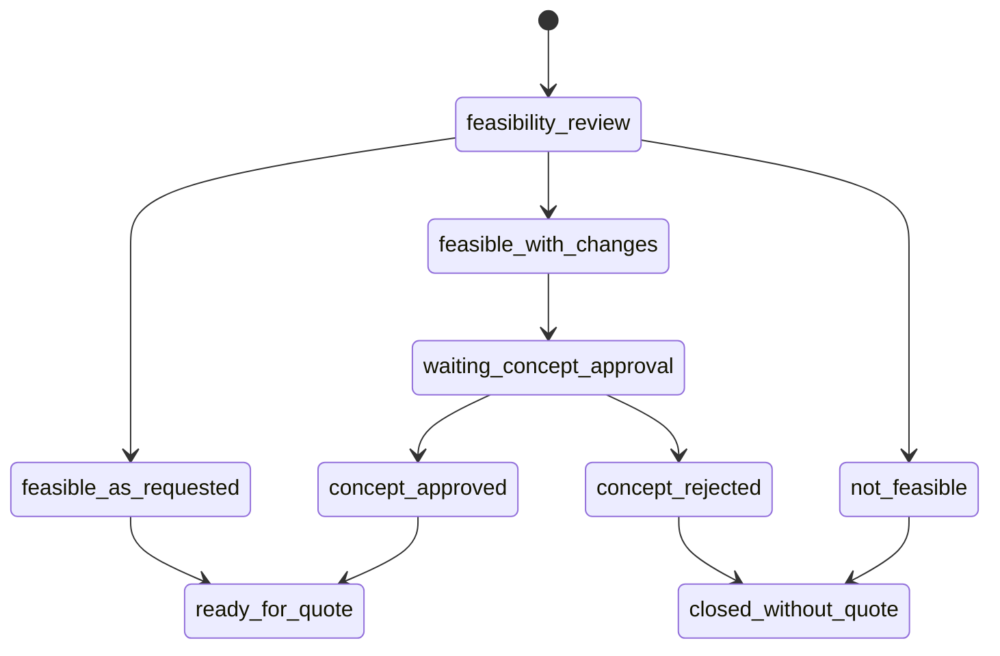

---

# 5. CatalogOffering

Hoy existen `Servicio` y `Producto`.

`Servicio` tiene nombre, descripción, ícono, `ideal_para`, `team_asignado` y activo.
`Producto` tiene nombre, precio, duración, `servicio_padre` y activo.

Eso está bien para MVP, pero se queda corto.

## 5.1. Regla principal

> **CatalogOffering es la fuente de verdad comercial-operativa para ingreso, Iris/Esperanza, evaluación, diagnóstico/factibilidad, cotización y WorkOrder.**

## 5.2. Problema actual

Hoy el catálogo es todavía una mezcla de:

```text
Servicio = categoría o línea
Producto = paquete con precio
```

Pero necesitamos que el catálogo pueda alimentar:

* landing;
* Iris/Esperanza;
* ingreso manual;
* evaluación;
* AssessmentReport;
* cotización;
* WorkOrder;
* equipo sugerido;
* duración;
* modalidad de evaluación;
* reglas de precio.

## 5.3. Modelo recomendado

Crear o evolucionar hacia `CatalogOffering`.

### Turagua

```json
{
  "_id": "off_001",
  "businessSlug": "turagua",
  "verticalType": "vehicle_service",
  "offeringType": "service",
  "category": "frenos",
  "name": "Revisión y servicio de frenos",
  "description": "Evaluación y mantenimiento del sistema de frenos.",
  "publicVisible": true,
  "active": true,
  "pricingPolicy": {
    "type": "from_price",
    "currency": "PEN",
    "basePriceCents": 8000,
    "requiresAssessment": true,
    "requiresFeasibility": false
  },
  "assessmentPolicy": {
    "required": true,
    "allowedModes": ["onsite_assessment", "photo_assessment"],
    "defaultMode": "onsite_assessment"
  },
  "fulfillmentPolicy": {
    "requiresWorkOrder": true,
    "suggestedTeamId": "team_mechanics",
    "defaultTaskTemplates": [
      "Inspección de frenos",
      "Diagnóstico técnico",
      "Ejecución del servicio",
      "Prueba final"
    ]
  },
  "tags": ["frenos", "seguridad", "mantenimiento"],
  "createdAt": "2026-07-01T10:00:00.000Z"
}
```

### BateYLate

```json
{
  "_id": "off_byl_custom_cake",
  "businessSlug": "bateylate",
  "verticalType": "custom_orders",
  "offeringType": "custom_product",
  "category": "tortas",
  "name": "Torta personalizada",
  "description": "Torta diseñada según ocasión, temática y preferencias.",
  "publicVisible": true,
  "active": true,
  "pricingPolicy": {
    "type": "quote_required",
    "currency": "PEN",
    "basePriceCents": null,
    "requiresAssessment": true,
    "requiresFeasibility": true
  },
  "assessmentPolicy": {
    "required": true,
    "assessmentType": "feasibility",
    "allowedModes": ["web_inquiry", "photo_reference"],
    "defaultMode": "web_inquiry"
  },
  "fulfillmentPolicy": {
    "requiresWorkOrder": true,
    "suggestedTeamId": "team_bakery",
    "defaultTaskTemplates": [
      "Validar diseño",
      "Preparar masa",
      "Hornear",
      "Decorar",
      "Empacar",
      "Entregar"
    ]
  },
  "tags": ["cumpleaños", "personalizado", "torta"]
}
```

---

# 5.4. v3 — Duración y equipo operativo en CatalogOffering

`CatalogOffering` se mantiene como fuente comercial-operativa.

En v3, `fulfillmentPolicy` debe incluir la información mínima para que el motor de agenda calcule disponibilidad:

```json
{
  "_id": "off_lavado_premium",
  "businessSlug": "turagua",
  "verticalType": "vehicle_service",
  "offeringType": "service",
  "category": "lavado",
  "name": "Lavado Premium",
  "fulfillmentPolicy": {
    "requiresWorkOrder": true,
    "suggestedTeamId": "team_detailing",
    "estimatedDurationMinutes": 120,
    "slotGranularityMinutes": 15,
    "defaultTaskTemplates": [
      "Recepción del vehículo",
      "Lavado exterior",
      "Limpieza interior",
      "Inspección final"
    ]
  }
}
```

### Reglas

```text
suggestedTeamId define el equipo inicial requerido.
estimatedDurationMinutes define cuánto tiempo consume el servicio.
slotGranularityMinutes define la unidad mínima para partir la duración.
requiredUnits = estimatedDurationMinutes / slotGranularityMinutes.
```

Ejemplos Turagua:

```json
[
  {
    "catalogOfferingId": "off_brake_service",
    "suggestedTeamId": "team_mechanics",
    "estimatedDurationMinutes": 60,
    "slotGranularityMinutes": 15
  },
  {
    "catalogOfferingId": "off_engine_check",
    "suggestedTeamId": "team_mechanics",
    "estimatedDurationMinutes": 60,
    "slotGranularityMinutes": 15
  },
  {
    "catalogOfferingId": "off_lavado_premium",
    "suggestedTeamId": "team_detailing",
    "estimatedDurationMinutes": 120,
    "slotGranularityMinutes": 15
  }
]
```

### Nota de evolución

Para servicios compuestos se puede evolucionar hacia:

```json
{
  "resourceRequirements": [
    {
      "teamId": "team_frontdesk",
      "durationMinutes": 15,
      "offsetMinutes": 0
    },
    {
      "teamId": "team_detailing",
      "durationMinutes": 120,
      "offsetMinutes": 15
    }
  ]
}
```

Esta evolución permite reservar varios equipos en una misma cita sin cambiar `Appointment`.

---

# 6. Quote / Cotización

Esta es una de las entidades que más urge crear.

## 6.1. Reglas

* No hay `Quote` sin `Case`.
* En Turagua, idealmente no hay `Quote` sin `AssessmentReport` con `reportType=diagnostic`.
* En BateYLate, no hay `Quote` sin `AssessmentReport` con `reportType=feasibility` positivo o reformulado aprobado.
* Una `Quote` puede tener múltiples líneas.
* Una `Quote` puede versionarse.
* Una `Quote` puede ser enviada, aprobada, rechazada, expirada o convertida a WorkOrder.
* Una `Quote` aprobada puede crear una o varias `WorkOrder`.
* Las decisiones del cliente se registran en `DecisionRecord`.
* `Quote.decisionSummary` es solo un snapshot resumido, no la fuente de verdad.

## 6.2. Modelo Quote

```json
{
  "_id": "quote_001",
  "businessSlug": "turagua",
  "verticalType": "vehicle_service",
  "caseId": "case_001",
  "customerId": "cus_001",
  "managedEntityId": "me_001",
  "quoteNumber": "Q-TUR-2026-0001",
  "version": 1,
  "status": "draft",
  "source": {
    "type": "assessment_report",
    "id": "ar_tur_001"
  },
  "currency": "PEN",
  "amounts": {
    "subtotalCents": 28000,
    "discountCents": 0,
    "taxCents": 0,
    "totalCents": 28000
  },
  "internal": {
    "notes": "Precio incluye mano de obra y repuesto alternativo.",
    "marginNotes": "Margen estimado 30%",
    "visibleToCustomer": false
  },
  "customerFacing": {
    "summary": "Cotización para servicio de frenos delanteros.",
    "notes": "Incluye revisión, cambio de pastillas y prueba final.",
    "terms": "Válido por 5 días. Sujeto a disponibilidad de repuestos."
  },
  "validUntil": "2026-07-07T23:59:59.000Z",
  "sent": {
    "sentAt": null,
    "sentBy": null,
    "channel": null,
    "pdfAttachmentId": null
  },
  "decisionSummary": {
    "status": "pending",
    "decisionRecordId": null,
    "decidedAt": null
  },
  "createdBy": "worker_001",
  "createdAt": "2026-07-02T16:00:00.000Z",
  "updatedAt": "2026-07-02T16:00:00.000Z"
}
```

## 6.3. Modelo QuoteLine

```json
{
  "_id": "ql_001",
  "businessSlug": "turagua",
  "quoteId": "quote_001",
  "caseId": "case_001",
  "catalogOfferingId": "off_brake_pads_replace",
  "lineType": "service",
  "description": "Cambio de pastillas delanteras",
  "quantity": 1,
  "unitPriceCents": 18000,
  "totalCents": 18000,
  "currency": "PEN",
  "internalOnly": false,
  "metadata": {
    "requiresTeam": "team_mechanics",
    "estimatedMinutes": 90
  },
  "sortOrder": 1
}
```

```json
{
  "_id": "ql_002",
  "businessSlug": "turagua",
  "quoteId": "quote_001",
  "caseId": "case_001",
  "catalogOfferingId": "part_brake_pads_generic",
  "lineType": "part",
  "description": "Juego de pastillas delanteras",
  "quantity": 1,
  "unitPriceCents": 10000,
  "totalCents": 10000,
  "currency": "PEN",
  "internalOnly": false,
  "metadata": {
    "supplier": "Proveedor local",
    "stockStatus": "available"
  },
  "sortOrder": 2
}
```

## 6.4. Quote BateYLate

```json
{
  "_id": "quote_byl_001",
  "businessSlug": "bateylate",
  "verticalType": "custom_orders",
  "caseId": "case_byl_001",
  "customerId": "cus_202",
  "managedEntityId": "me_101",
  "quoteNumber": "Q-BYL-2026-0001",
  "version": 1,
  "status": "sent",
  "source": {
    "type": "assessment_report",
    "id": "ar_byl_001"
  },
  "currency": "PEN",
  "amounts": {
    "subtotalCents": 18000,
    "discountCents": 0,
    "taxCents": 0,
    "totalCents": 18000
  },
  "customerFacing": {
    "summary": "Cotización para torta personalizada floral de 20 porciones.",
    "notes": "Incluye decoración floral simplificada en buttercream.",
    "terms": "Se requiere aprobación y adelanto del 50% para iniciar producción."
  },
  "validUntil": "2026-07-02T23:59:59.000Z",
  "sent": {
    "sentAt": "2026-07-01T15:30:00.000Z",
    "sentBy": "worker_master_baker",
    "channel": "whatsapp",
    "pdfAttachmentId": "att_quote_pdf_001"
  },
  "decisionSummary": {
    "status": "pending",
    "decisionRecordId": null,
    "decidedAt": null
  }
}
```

## 6.5. Estados de Quote

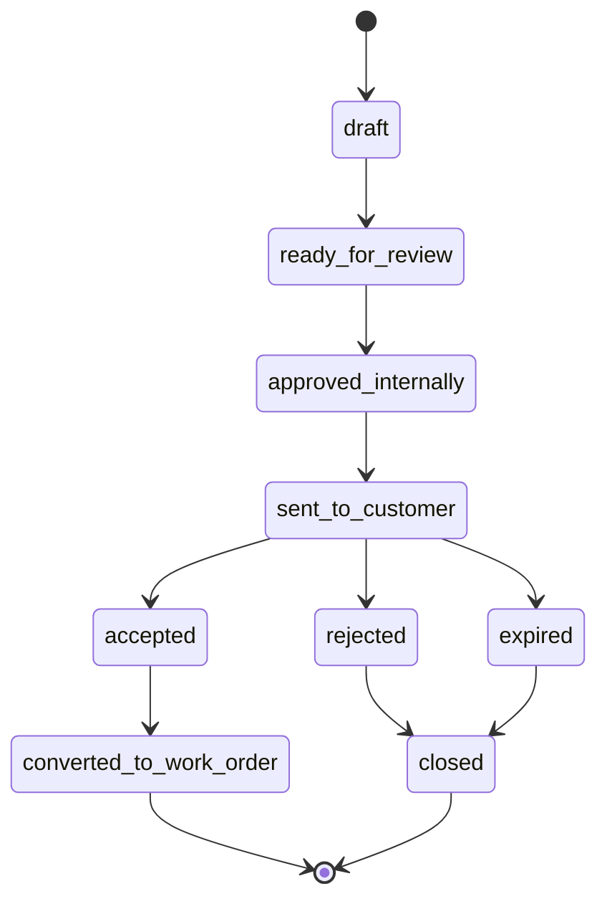

---

# 7. DecisionRecord

`DecisionRecord` registra decisiones del cliente, staff o sistema sobre cualquier entidad relevante del flujo.

Reemplaza el concepto limitado de `QuoteDecision`.

## 7.1. Tipos de decisión

```text
appointment_confirmation
concept_approval
quote_approval
delivery_acceptance
manual_override
```

## 7.2. Decisión sobre factibilidad reformulada

```json
{
  "_id": "dec_001",
  "businessSlug": "bateylate",
  "caseId": "case_byl_001",
  "entity": {
    "type": "assessment_report",
    "id": "ar_byl_001"
  },
  "decisionType": "concept_approval",
  "decision": "accepted",
  "decidedBy": {
    "type": "customer",
    "customerId": "cus_byl_001",
    "staffUserId": null
  },
  "evidence": {
    "channel": "whatsapp",
    "messageId": "msg_001",
    "rawText": "Sí, me gusta la propuesta reformulada."
  },
  "notes": "Cliente acepta decoración simplificada.",
  "decidedAt": "2026-07-01T16:00:00.000Z",
  "createdAt": "2026-07-01T16:00:00.000Z"
}
```

## 7.3. Aprobación de cotización

```json
{
  "_id": "dec_002",
  "businessSlug": "turagua",
  "caseId": "case_tur_001",
  "entity": {
    "type": "quote",
    "id": "quote_tur_001"
  },
  "decisionType": "quote_approval",
  "decision": "accepted",
  "decidedBy": {
    "type": "staff_on_behalf_of_customer",
    "customerId": "cus_tur_001",
    "staffUserId": "worker_chief_001"
  },
  "evidence": {
    "channel": "phone_call",
    "messageId": null,
    "rawText": null
  },
  "notes": "Cliente confirmó por llamada. Registrado por jefe de taller.",
  "decidedAt": "2026-07-02T17:00:00.000Z"
}
```

---

# 8. WorkOrder

`WorkOrder` representa ejecución.

En Turagua:

> Vehículo admitido al taller.

En BateYLate:

> Pedido admitido a línea de producción.

## 8.1. Reglas

* No hay `WorkOrder` sin `Quote` aprobada.
* Una WorkOrder puede invocar una o más Quotes.
* Una Quote aprobada puede estar asociada a una WorkOrder.
* WorkOrder tiene tareas.
* WorkOrder tiene estado visible al cliente y estado interno.
* WorkOrder debe alimentar dashboard, taller, mensajes e historial.

## 8.2. Modelo

```json
{
  "_id": "wo_001",
  "businessSlug": "turagua",
  "verticalType": "vehicle_service",
  "caseId": "case_001",
  "customerId": "cus_001",
  "managedEntityId": "me_001",
  "quoteIds": ["quote_001"],
  "workOrderNumber": "WO-TUR-2026-0001",
  "type": "workshop_service",
  "status": "in_workshop",
  "customerFacingStatus": "Tu vehículo ya ingresó al taller.",
  "admission": {
    "admittedAt": "2026-07-02T17:30:00.000Z",
    "admittedBy": "worker_001",
    "location": "Bahía 1",
    "checklist": {
      "fuelLevel": "1/2",
      "mileageKm": 80210,
      "externalConditionNotes": "Rayón leve en puerta derecha.",
      "photoAttachmentIds": ["att_admission_001"]
    }
  },
  "assignment": {
    "teamId": "team_mechanics",
    "workerIds": ["worker_001"]
  },
  "dates": {
    "plannedStart": "2026-07-02T18:00:00.000Z",
    "startedAt": null,
    "plannedEnd": "2026-07-02T20:00:00.000Z",
    "completedAt": null,
    "deliveredAt": null
  },
  "financial": {
    "approvedAmountCents": 28000,
    "currency": "PEN",
    "paymentStatus": "pending"
  },
  "internalNotes": "Priorizar entrega hoy.",
  "createdAt": "2026-07-02T17:30:00.000Z"
}
```

## 8.3. WorkOrderTask

```json
{
  "_id": "wot_001",
  "businessSlug": "turagua",
  "workOrderId": "wo_001",
  "caseId": "case_001",
  "title": "Cambio de pastillas delanteras",
  "description": "Retirar pastillas antiguas, instalar nuevas y probar frenado.",
  "status": "pending",
  "taskType": "mechanical_service",
  "assignedTeamId": "team_mechanics",
  "assignedWorkerId": "worker_001",
  "estimatedDurationMinutes": 90,
  "startedAt": null,
  "completedAt": null,
  "evidenceAttachmentIds": [],
  "sortOrder": 1
}
```

## 8.4. WorkOrder BateYLate

```json
{
  "_id": "wo_byl_001",
  "businessSlug": "bateylate",
  "verticalType": "custom_orders",
  "caseId": "case_byl_001",
  "customerId": "cus_202",
  "managedEntityId": "me_101",
  "quoteIds": ["quote_byl_001"],
  "workOrderNumber": "WO-BYL-2026-0001",
  "type": "bakery_production",
  "status": "in_production",
  "customerFacingStatus": "Tu pedido ya ingresó a producción.",
  "admission": {
    "admittedAt": "2026-07-01T16:30:00.000Z",
    "admittedBy": "worker_master_baker",
    "location": "Mesa de producción",
    "checklist": {
      "designApproved": true,
      "deliveryDateConfirmed": true,
      "advancePaymentConfirmed": true
    }
  },
  "assignment": {
    "teamId": "team_bakery",
    "workerIds": ["worker_master_baker"]
  },
  "dates": {
    "plannedStart": "2026-07-03T09:00:00.000Z",
    "plannedEnd": "2026-07-05T14:00:00.000Z",
    "completedAt": null,
    "deliveredAt": null
  }
}
```

### Tasks BateYLate

```json
[
  {
    "_id": "wot_byl_001",
    "workOrderId": "wo_byl_001",
    "title": "Preparar masa",
    "status": "pending",
    "estimatedDurationMinutes": 60,
    "sortOrder": 1
  },
  {
    "_id": "wot_byl_002",
    "workOrderId": "wo_byl_001",
    "title": "Hornear",
    "status": "pending",
    "estimatedDurationMinutes": 90,
    "sortOrder": 2
  },
  {
    "_id": "wot_byl_003",
    "workOrderId": "wo_byl_001",
    "title": "Decorar con diseño floral",
    "status": "pending",
    "estimatedDurationMinutes": 120,
    "sortOrder": 3
  },
  {
    "_id": "wot_byl_004",
    "workOrderId": "wo_byl_001",
    "title": "Empacar y preparar entrega",
    "status": "pending",
    "estimatedDurationMinutes": 30,
    "sortOrder": 4
  }
]
```

---

# 9. TimelineEvent

Esta entidad es indispensable.

Resuelve:

* Historia Técnica;
* Historia Clínica legacy;
* trazabilidad;
* auditoría;
* debugging;
* explicación al cliente;
* eventos Temporal;
* cambios de estado.

## Modelo

```json
{
  "_id": "evt_001",
  "businessSlug": "turagua",
  "caseId": "case_001",
  "customerId": "cus_001",
  "managedEntityId": "me_001",
  "entity": {
    "type": "quote",
    "id": "quote_001"
  },
  "eventType": "quote.created",
  "title": "Cotización creada",
  "description": "Se creó la cotización Q-TUR-2026-0001 por S/ 280.00.",
  "visibility": "internal",
  "actor": {
    "type": "user",
    "id": "worker_001",
    "name": "Técnico Principal"
  },
  "metadata": {
    "amountCents": 28000,
    "currency": "PEN",
    "quoteNumber": "Q-TUR-2026-0001"
  },
  "createdAt": "2026-07-02T16:00:00.000Z"
}
```

## Eventos mínimos

```json
[
  "case.created",
  "interaction.received",
  "appointment.scheduled",
  "appointment.confirmation_requested",
  "appointment.confirmed",
  "appointment.cancelled",
  "assessment.started",
  "assessment.completed",
  "assessment_report.created",
  "assessment_report.ready_for_quote",
  "quote.draft_created",
  "quote.sent",
  "quote.accepted",
  "quote.rejected",
  "decision.recorded",
  "workorder.created",
  "workorder.admitted",
  "workorder.started",
  "workorder.task_completed",
  "workorder.completed",
  "workorder.delivered",
  "notification.sent",
  "attachment.uploaded",
  "status.changed"
]
```

## Timeline por Case

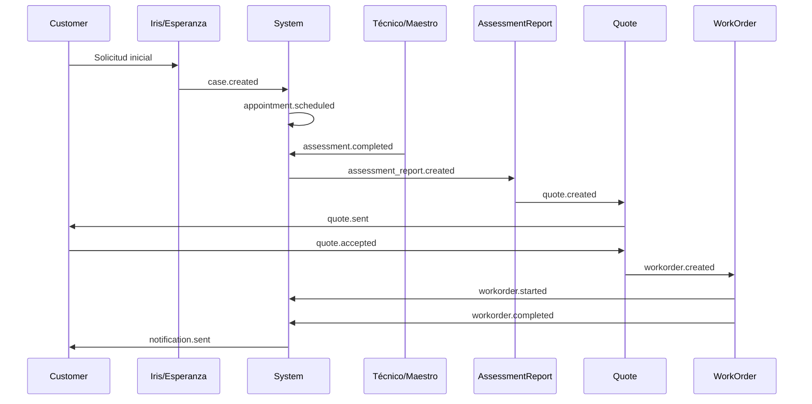

---

# 10. Notification

No todo mensaje es conversación. Algunos son notificaciones de sistema.

```json
{
  "_id": "notif_001",
  "businessSlug": "turagua",
  "caseId": "case_001",
  "customerId": "cus_001",
  "channel": "whatsapp",
  "type": "appointment_confirmation",
  "status": "sent",
  "recipient": {
    "phone": "51955479450"
  },
  "content": {
    "templateKey": "appointment_confirmation_turagua",
    "text": "Hola Ronald, tu cita de evaluación para el 2 de julio a las 3:00 p.m. está confirmada."
  },
  "provider": {
    "name": "twilio",
    "messageId": "SM123"
  },
  "sentAt": "2026-07-01T11:00:00.000Z",
  "deliveredAt": null,
  "readAt": null
}
```

---

# 11. Attachment

`Attachment` representa archivos, evidencias, imágenes, PDFs, referencias visuales y documentos asociados al flujo.

No deben guardarse evidencias como URLs sueltas dentro de otros documentos. Los documentos principales deben referenciar archivos mediante IDs.

## Propósito

Permite controlar:

* visibilidad;
* propietario;
* entidad relacionada;
* tipo de archivo;
* origen;
* permisos;
* miniatura;
* historial;
* asociación con Case, AssessmentReport, Quote o WorkOrder.

## Modelo recomendado

```json
{
  "_id": "att_001",
  "businessSlug": "turagua",
  "caseId": "case_tur_001",
  "customerId": "cus_tur_001",
  "managedEntityId": "me_vehicle_001",
  "entity": {
    "type": "assessment_report",
    "id": "ar_tur_001"
  },
  "attachmentType": "diagnostic_evidence",
  "mimeType": "image/jpeg",
  "url": "https://cdn.example.com/brakes.jpg",
  "thumbnailUrl": "https://cdn.example.com/brakes-thumb.jpg",
  "filename": "brakes.jpg",
  "visibility": "internal",
  "uploadedBy": {
    "type": "worker",
    "id": "worker_001"
  },
  "metadata": {
    "source": "mobile_upload",
    "description": "Foto de pastillas delanteras"
  },
  "createdAt": "2026-07-02T15:40:00.000Z"
}
```

## Regla de referencia

Reemplazar:

```json
"evidenceUrls": ["https://..."]
```

Por:

```json
"evidenceAttachmentIds": ["att_001"]
```

Y reemplazar:

```json
"photos": ["https://..."]
```

Por:

```json
"photoAttachmentIds": ["att_001", "att_002"]
```

---

# 12. Status Model

Los estados no deben ser strings sueltos.

Debe existir una máquina de estados real apoyada por `StatusProfile`.

## 12.1. StatusProfile

```json
{
  "_id": "status_vehicle_service_v1",
  "businessSlug": "turagua",
  "verticalType": "vehicle_service",
  "entity": "case",
  "statuses": [
    {
      "key": "lead",
      "label": "Lead",
      "group": "intake",
      "description": "Contacto inicial todavía no agendado."
    },
    {
      "key": "appointment_scheduled",
      "label": "Cita agendada",
      "group": "appointment",
      "description": "Evaluación agendada pero no necesariamente confirmada."
    },
    {
      "key": "appointment_confirmed",
      "label": "Cita confirmada",
      "group": "appointment",
      "description": "Cliente confirmó asistencia."
    },
    {
      "key": "evaluating",
      "label": "Evaluando",
      "group": "assessment",
      "description": "Vehículo en evaluación."
    },
    {
      "key": "assessment_report_ready",
      "label": "Diagnóstico listo",
      "group": "assessment",
      "description": "Reporte de evaluación listo para cotizar."
    },
    {
      "key": "quote_draft",
      "label": "Cotización en preparación",
      "group": "quote",
      "description": "Diagnóstico listo, cotización en elaboración."
    },
    {
      "key": "quote_sent",
      "label": "Cotización enviada",
      "group": "quote",
      "description": "Cotización enviada al cliente."
    },
    {
      "key": "quote_approved",
      "label": "Cotización aprobada",
      "group": "quote",
      "description": "Cliente aprobó el presupuesto."
    },
    {
      "key": "work_order_created",
      "label": "Orden creada",
      "group": "fulfillment",
      "description": "Orden de trabajo creada."
    },
    {
      "key": "in_workshop",
      "label": "En taller",
      "group": "fulfillment",
      "description": "Vehículo ingresado al taller."
    },
    {
      "key": "delivered",
      "label": "Entregado",
      "group": "closed",
      "description": "Trabajo finalizado y entregado."
    }
  ],
  "transitions": [
    {
      "from": "lead",
      "to": "appointment_scheduled",
      "requires": ["customerId", "managedEntityId"]
    },
    {
      "from": "appointment_scheduled",
      "to": "appointment_confirmed",
      "requires": ["appointment.confirmed"]
    },
    {
      "from": "appointment_confirmed",
      "to": "evaluating",
      "requires": ["vehicle.present_or_photo_assessment_started"]
    },
    {
      "from": "evaluating",
      "to": "assessment_report_ready",
      "requires": ["assessmentReport.completed"]
    },
    {
      "from": "assessment_report_ready",
      "to": "quote_draft",
      "requires": ["assessmentReport.result.canProceedToQuote"]
    },
    {
      "from": "quote_draft",
      "to": "quote_sent",
      "requires": ["quote.hasLines", "quote.totalCents"]
    },
    {
      "from": "quote_sent",
      "to": "quote_approved",
      "requires": ["decisionRecord.quote_approval.accepted"]
    },
    {
      "from": "quote_approved",
      "to": "work_order_created",
      "requires": ["workOrder.created"]
    },
    {
      "from": "work_order_created",
      "to": "in_workshop",
      "requires": ["workOrder.admittedAt"]
    },
    {
      "from": "in_workshop",
      "to": "delivered",
      "requires": ["workOrder.completedAt", "workOrder.deliveredAt"]
    }
  ]
}
```

## 12.2. State machine Turagua

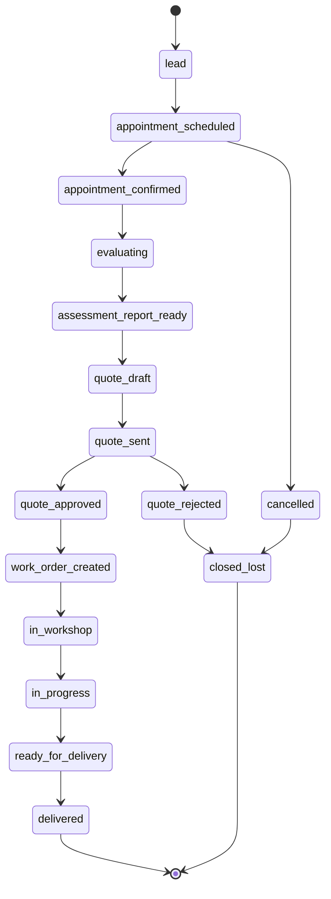

## 12.3. State machine BateYLate

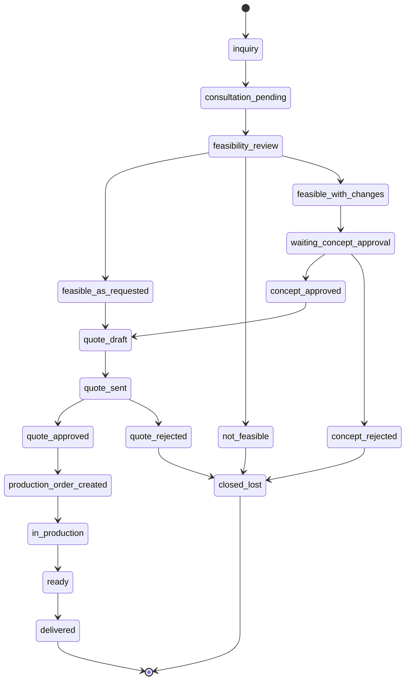

---

# 13. Modelo de datos completo por vertical

## 13.1. Turagua completo

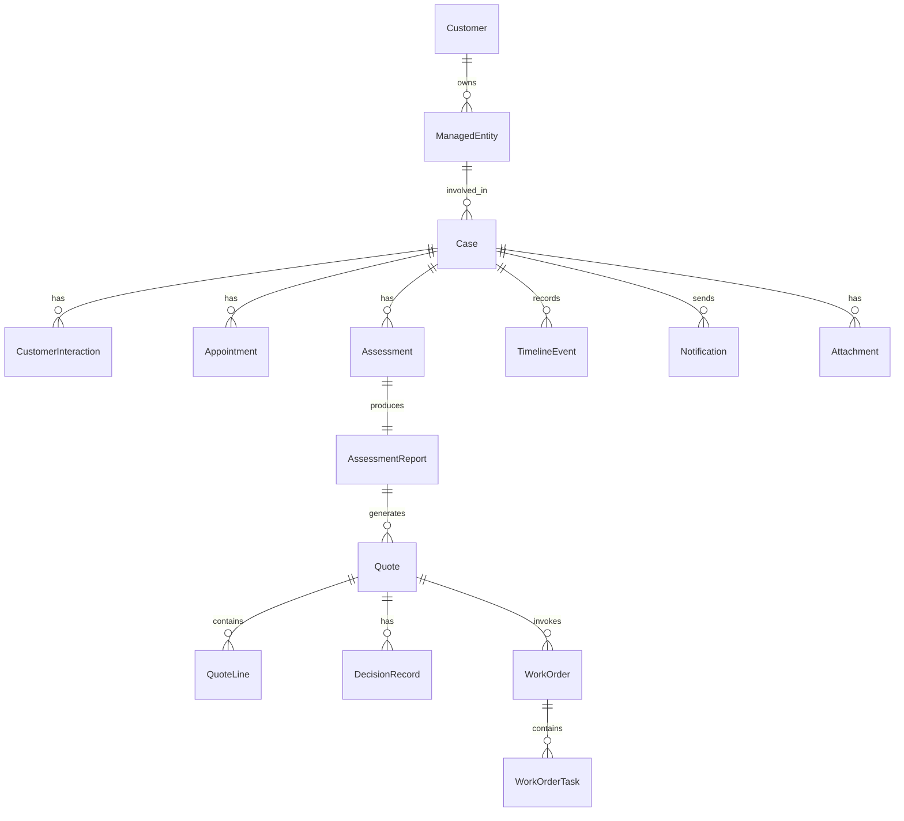

### Flujo Turagua

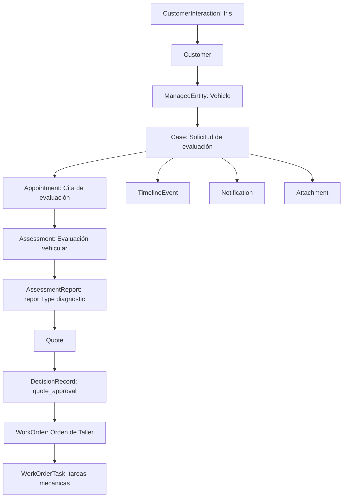

### Ejemplo flujo JSON Turagua resumido

```json
{
  "customer": {
    "id": "cus_001",
    "name": "Ronald Zavaleta",
    "phone": "51955479450"
  },
  "managedEntity": {
    "id": "me_001",
    "type": "vehicle",
    "summary": "Toyota Yaris 2020 ABC-123"
  },
  "case": {
    "id": "case_001",
    "caseNumber": "TUR-2026-0001",
    "status": "quote_sent",
    "intent": "Ruido al frenar"
  },
  "appointment": {
    "id": "appt_001",
    "type": "onsite_assessment",
    "status": "confirmed",
    "scheduledStart": "2026-07-02T15:00:00.000Z"
  },
  "assessmentReport": {
    "id": "ar_tur_001",
    "reportType": "diagnostic",
    "status": "ready_for_quote",
    "summary": "Pastillas delanteras desgastadas"
  },
  "quote": {
    "id": "quote_001",
    "status": "sent_to_customer",
    "totalCents": 28000
  },
  "workOrder": null
}
```

---

## 13.2. BateYLate completo

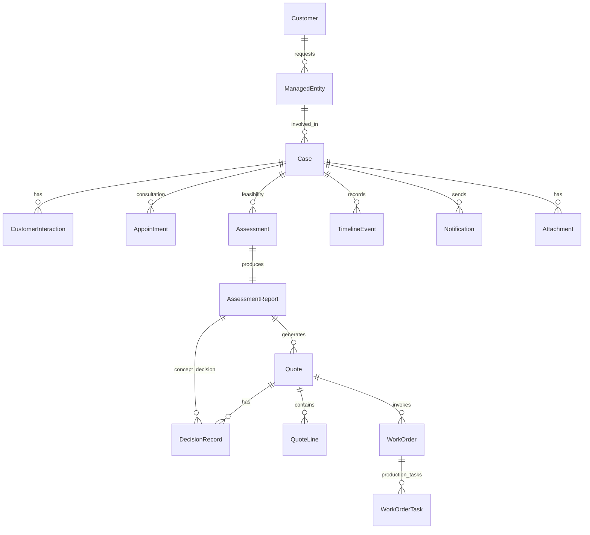

### Flujo BateYLate

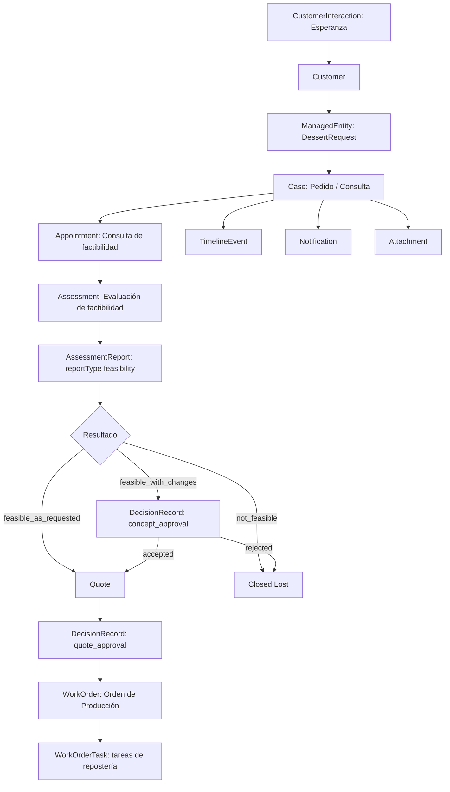

### Ejemplo flujo JSON BateYLate resumido

```json
{
  "customer": {
    "id": "cus_202",
    "name": "Amy",
    "phone": "51999999999"
  },
  "managedEntity": {
    "id": "me_101",
    "type": "dessert_request",
    "summary": "Torta temática de masas internacionales"
  },
  "case": {
    "id": "case_byl_001",
    "caseNumber": "BYL-2026-0001",
    "status": "feasible_with_changes",
    "intent": "Celebración gastronómica y cumpleaños"
  },
  "assessmentReport": {
    "id": "ar_byl_001",
    "reportType": "feasibility",
    "result": "feasible_with_changes",
    "requiresCustomerConceptApproval": true
  },
  "quote": null,
  "workOrder": null
}
```

---

# 14. Relación con modelo legacy actual

No se debe hacer una migración destructiva.

## 14.1. Estado actual

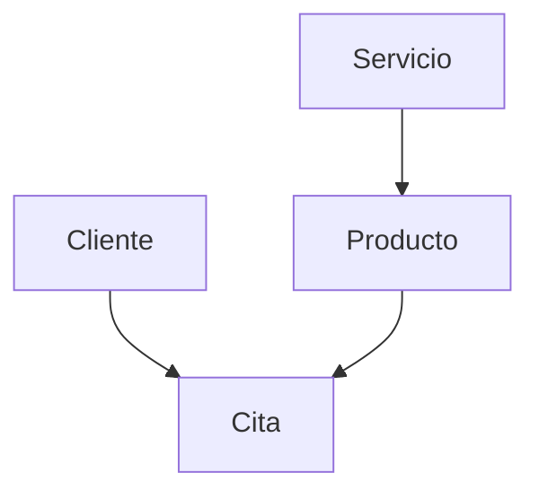

## 14.2. Estado intermedio recomendado

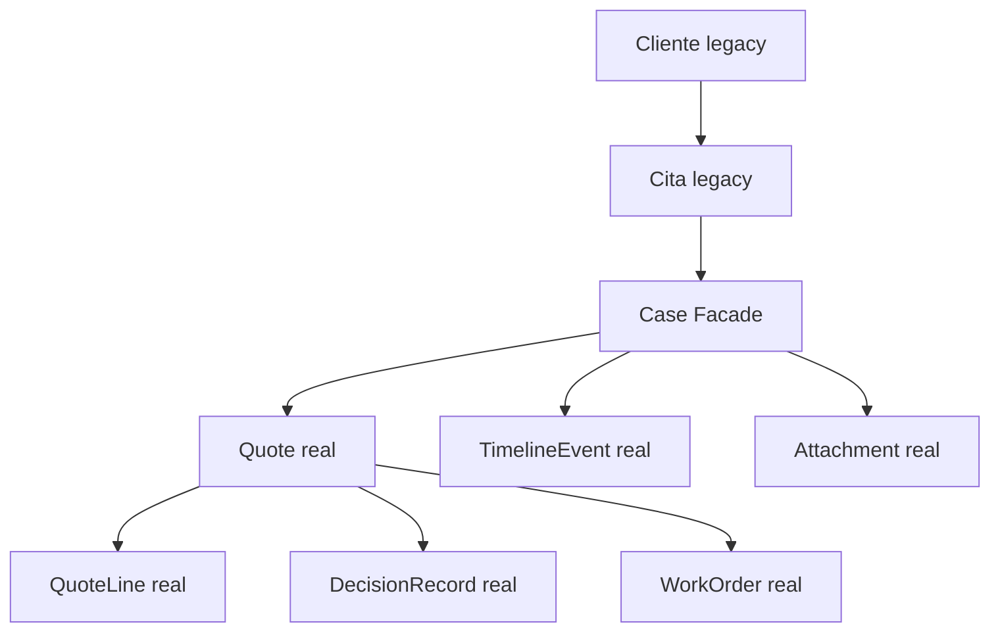

## 14.3. Estado objetivo

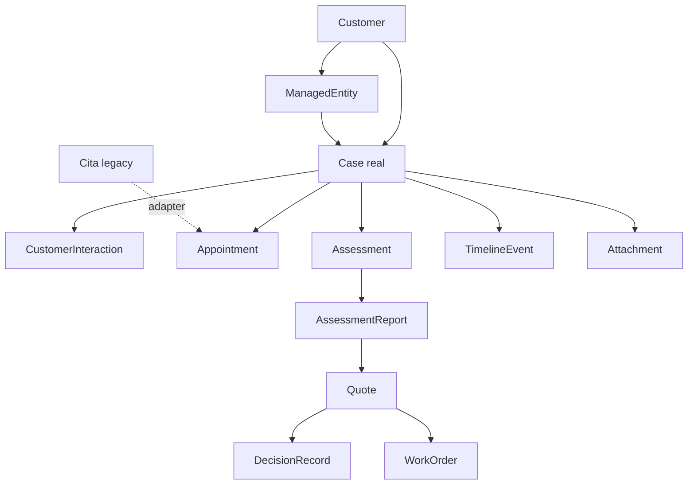

---

# 15. Índices Mongo recomendados

## Customer

```json
{
  "indexes": [
    { "businessSlug": 1, "contact.phones.normalized": 1 },
    { "businessSlug": 1, "document.value": 1 },
    { "businessSlug": 1, "whatsapp.lids": 1 },
    { "businessSlug": 1, "name": "text" }
  ]
}
```

## ManagedEntity

```json
{
  "indexes": [
    { "businessSlug": 1, "customerId": 1 },
    { "businessSlug": 1, "type": 1 },
    { "businessSlug": 1, "data.plate": 1 },
    { "businessSlug": 1, "displayName": "text", "summary": "text" }
  ]
}
```

## Case

```json
{
  "indexes": [
    { "businessSlug": 1, "caseNumber": 1 },
    { "businessSlug": 1, "customerId": 1 },
    { "businessSlug": 1, "managedEntityId": 1 },
    { "businessSlug": 1, "status": 1 },
    { "businessSlug": 1, "createdAt": -1 },
    { "businessSlug": 1, "importantDates.scheduledAt": 1 }
  ]
}
```

## CustomerInteraction

```json
{
  "indexes": [
    { "businessSlug": 1, "caseId": 1, "createdAt": -1 },
    { "businessSlug": 1, "customerId": 1, "createdAt": -1 },
    { "businessSlug": 1, "channel": 1 },
    { "businessSlug": 1, "intent.detectedIntent": 1 }
  ]
}
```

## AssessmentReport

```json
{
  "indexes": [
    { "businessSlug": 1, "caseId": 1 },
    { "businessSlug": 1, "assessmentId": 1 },
    { "businessSlug": 1, "reportType": 1 },
    { "businessSlug": 1, "status": 1 },
    { "businessSlug": 1, "result.classification": 1 }
  ]
}
```

## Quote

```json
{
  "indexes": [
    { "businessSlug": 1, "quoteNumber": 1 },
    { "businessSlug": 1, "caseId": 1 },
    { "businessSlug": 1, "customerId": 1 },
    { "businessSlug": 1, "status": 1 },
    { "businessSlug": 1, "validUntil": 1 }
  ]
}
```

## DecisionRecord

```json
{
  "indexes": [
    { "businessSlug": 1, "caseId": 1 },
    { "businessSlug": 1, "entity.type": 1, "entity.id": 1 },
    { "businessSlug": 1, "decisionType": 1 },
    { "businessSlug": 1, "decision": 1 },
    { "businessSlug": 1, "decidedAt": -1 }
  ]
}
```

## WorkOrder

```json
{
  "indexes": [
    { "businessSlug": 1, "workOrderNumber": 1 },
    { "businessSlug": 1, "caseId": 1 },
    { "businessSlug": 1, "customerId": 1 },
    { "businessSlug": 1, "status": 1 },
    { "businessSlug": 1, "dates.plannedStart": 1 }
  ]
}
```

## TimelineEvent

```json
{
  "indexes": [
    { "businessSlug": 1, "caseId": 1, "createdAt": -1 },
    { "businessSlug": 1, "customerId": 1, "createdAt": -1 },
    { "businessSlug": 1, "managedEntityId": 1, "createdAt": -1 },
    { "businessSlug": 1, "eventType": 1, "createdAt": -1 }
  ]
}
```

## Attachment

```json
{
  "indexes": [
    { "businessSlug": 1, "caseId": 1, "createdAt": -1 },
    { "businessSlug": 1, "entity.type": 1, "entity.id": 1 },
    { "businessSlug": 1, "attachmentType": 1 },
    { "businessSlug": 1, "visibility": 1 }
  ]
}
```

## WorkTeam

```json
{
  "indexes": [
    { "businessSlug": 1, "active": 1 },
    { "businessSlug": 1, "type": 1 }
  ]
}
```

## WorkTeamScheduleRule

```json
{
  "indexes": [
    { "businessSlug": 1, "teamId": 1, "weekday": 1, "active": 1 }
  ]
}
```

## WorkTeamScheduleOverride

```json
{
  "indexes": [
    { "businessSlug": 1, "teamId": 1, "date": 1, "active": 1 }
  ]
}
```

## ResourceReservation

```json
{
  "indexes": [
    { "businessSlug": 1, "teamId": 1, "status": 1, "startAt": 1 },
    { "businessSlug": 1, "appointmentId": 1 },
    {
      "keys": { "businessSlug": 1, "teamId": 1, "slotKeys": 1 },
      "unique": true,
      "partialFilterExpression": {
        "status": { "$in": ["held", "booked"] }
      }
    }
  ]
}
```

El índice parcial sobre `slotKeys` protege contra doble reserva de una misma unidad de capacidad cuando el estado bloqueante es `held` o `booked`.

---

# 16. Reglas de integridad

Estas reglas deben existir como validaciones de servicio, no solo en Mongoose.

## Reglas globales

```json
[
  {
    "rule": "case_requires_customer",
    "description": "Todo Case debe tener customerId."
  },
  {
    "rule": "case_requires_business_slug",
    "description": "Toda entidad operacional debe tener businessSlug."
  },
  {
    "rule": "assessment_report_requires_assessment",
    "description": "Todo AssessmentReport debe originarse desde un Assessment."
  },
  {
    "rule": "quote_requires_case",
    "description": "Toda Quote debe pertenecer a un Case."
  },
  {
    "rule": "quote_source_must_be_assessment_report",
    "description": "Toda Quote debe originarse desde un AssessmentReport válido, salvo offerings estándar con quote directa permitida por CatalogOffering."
  },
  {
    "rule": "quote_line_requires_quote",
    "description": "Toda QuoteLine debe pertenecer a una Quote."
  },
  {
    "rule": "decision_record_required_for_customer_decisions",
    "description": "Toda aprobación, rechazo, confirmación o aceptación conceptual debe registrarse como DecisionRecord."
  },
  {
    "rule": "work_order_requires_approved_quote",
    "description": "No se puede crear WorkOrder sin al menos una Quote aprobada."
  },
  {
    "rule": "status_transition_must_be_valid",
    "description": "Todo cambio de estado debe pasar por statusMachine."
  },
  {
    "rule": "timeline_event_on_state_change",
    "description": "Todo cambio de estado debe generar TimelineEvent."
  },
  {
    "rule": "attachments_are_referenced_by_id",
    "description": "Las evidencias y archivos deben referenciarse como Attachment IDs, no como URLs sueltas."
  },
  {
    "rule": "customer_interaction_persists_ai_context",
    "description": "Toda interacción relevante de Iris o Esperanza debe persistirse como CustomerInteraction."
  },
  {
    "rule": "resource_reservation_blocks_capacity",
    "description": "Toda cita con horario debe crear una ResourceReservation para bloquear capacidad real del equipo."
  },
  {
    "rule": "resource_reservation_requires_team",
    "description": "Toda ResourceReservation debe apuntar a un WorkTeam activo."
  },
  {
    "rule": "availability_uses_schedule_and_overrides",
    "description": "La disponibilidad se calcula desde WorkTeamScheduleRule, WorkTeamScheduleOverride y ResourceReservation; AvailabilitySlot queda como compatibilidad legacy."
  },
  {
    "rule": "only_active_reservations_block_capacity",
    "description": "Solo ResourceReservation con estado held o booked bloquea micro-slots."
  },
  {
    "rule": "slot_granularity_defaults_to_15_minutes",
    "description": "La unidad mínima recomendada para agenda operativa es 15 minutos salvo configuración explícita del equipo u offering."
  }
]
```

## Reglas Turagua

```json
[
  {
    "rule": "turagua_case_requires_vehicle",
    "description": "Un Case de Turagua debe tener ManagedEntity tipo vehicle."
  },
  {
    "rule": "turagua_quote_requires_diagnostic_assessment_report",
    "description": "La cotización de Turagua debe originarse desde un AssessmentReport con reportType=diagnostic y canProceedToQuote=true."
  },
  {
    "rule": "turagua_workorder_admission_requires_vehicle_checklist",
    "description": "Para ingresar al taller debe existir checklist de admisión."
  }
]
```

## Reglas BateYLate

```json
[
  {
    "rule": "bateylate_quote_requires_feasibility_assessment_report",
    "description": "La cotización de BateYLate debe originarse desde un AssessmentReport con reportType=feasibility y clasificación feasible_as_requested o feasible_with_changes aprobada."
  },
  {
    "rule": "bateylate_reformulated_feasibility_requires_concept_approval",
    "description": "Factibilidad reformulada requiere aprobación conceptual del cliente antes de cotizar."
  },
  {
    "rule": "bateylate_workorder_requires_delivery_date",
    "description": "Orden de producción debe tener fecha de entrega comprometida."
  }
]
```

---

# 17. Nombres de modelos Mongoose sugeridos

Para el repo actual, el modelo objetivo debería expresarse así:

```text
backend/models/BusinessProfile.js
backend/models/Customer.js
backend/models/ManagedEntity.js
backend/models/Case.js
backend/models/CustomerInteraction.js
backend/models/Appointment.js
backend/models/Assessment.js
backend/models/AssessmentReport.js
backend/models/CatalogOffering.js
backend/models/Quote.js
backend/models/QuoteLine.js
backend/models/DecisionRecord.js
backend/models/WorkOrder.js
backend/models/WorkOrderTask.js
backend/models/TimelineEvent.js
backend/models/Notification.js
backend/models/Attachment.js
backend/models/WorkTeam.js
backend/models/WorkTeamScheduleRule.js
backend/models/WorkTeamScheduleOverride.js
backend/models/ResourceReservation.js
```

## Legacy temporal

Mantener separado:

```text
backend/models/Cliente.js
backend/models/Cita.js
backend/models/Servicio.js
backend/models/Producto.js
backend/models/Team.js
backend/models/Trabajador.js
```

Estos últimos no desaparecen de golpe. Se adaptan.

## Orden realista de creación

```text
1. CustomerInteraction
2. Attachment
3. Quote
4. QuoteLine
5. DecisionRecord
6. TimelineEvent
7. WorkOrder
8. WorkOrderTask
9. ManagedEntity
10. Assessment
11. AssessmentReport
12. Case real
13. Appointment real
14. CatalogOffering real / adapter sobre Servicio y Producto
15. BusinessProfile persistente
16. WorkTeam
17. WorkTeamScheduleRule
18. WorkTeamScheduleOverride
19. ResourceReservation
```

## Motivo del orden

```text
- CustomerInteraction y Attachment son baratos y desbloquean Iris/Esperanza + evidencias.
- Quote y QuoteLine siguen siendo críticos.
- DecisionRecord reemplaza a QuoteDecision.
- TimelineEvent debe registrar todo.
- WorkOrder viene después de quote aprobada.
- AssessmentReport reemplaza a los reportes verticales separados.
- BusinessProfile persistente puede esperar porque ya existe configuración por archivo.
- WorkTeam y sus reglas desbloquean agenda real por capacidad.
- ResourceReservation evita doble booking y separa cita comercial de ocupación operacional.
```

---

# 18. Recomendación final del Modelo de Datos

El modelo correcto de VertikALL debe tener esta forma mental:

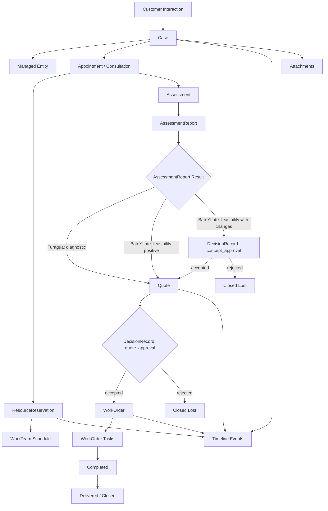

La tesis final del modelo es:

> **VertikALL no debe modelar “citas”. Debe modelar casos operativos que pueden tener interacciones, citas, evaluaciones, reportes de evaluación, cotizaciones, decisiones, órdenes de trabajo, evidencias, notificaciones e historial.**

La tesis para multi-negocio es:

> **Cada vertical cambia la entidad gestionada, los campos, los nombres, las reglas y los workflows; pero todos comparten el mismo esqueleto: Customer → Case → ManagedEntity → CustomerInteraction → Appointment/Consultation → Assessment → AssessmentReport → Quote → DecisionRecord → WorkOrder → Timeline.**

## Lista final corregida

```text
BusinessProfile
Customer
ManagedEntity
Case
CustomerInteraction
Appointment
Assessment
AssessmentReport
CatalogOffering
Quote
QuoteLine
DecisionRecord
WorkOrder
WorkOrderTask
TimelineEvent
Notification
Attachment
WorkTeam
WorkTeamScheduleRule
WorkTeamScheduleOverride
ResourceReservation
```

Con esta versión, el modelo queda preparado para:

```text
Turagua
BateYLate
mecánicas
lavaderos
reparación técnica
veterinarias
belleza
médicos
ginecólogos
ópticas
catering
pedidos personalizados
```

Y mantiene el principio correcto:

> **Cada vertical cambia campos, nombres, reglas y flujos; pero todas comparten la misma columna vertebral: Customer → Case → Assessment → AssessmentReport → Quote → DecisionRecord → WorkOrder → Timeline.**
