Perfecto. Aquí va el **ADR-002** igual, solo sustituyendo **Compliance Lite / Compliance** por **GoDigital Core**.

````markdown
# ADR-002 — Lite Thread Platform Boundary

## 1. Title

**ADR-002 — Lite Thread Platform Boundary for VtkALL Demo Packs**

## 2. Status

```text
Proposed / Design Decision
````

Este ADR define una frontera arquitectónica de plataforma.
No implica todavía implementación completa de Odoo, CRM Lite, ERP Lite, GoDigital Core ni Automation Core.
Sí establece las reglas que deben guiar `demo_test`, `Demo_Pack_0`, `Demo_Pack_1`, `Demo_Pack_2` y futuros packs.

## 3. Date

```text
2026-07-09
```

## 4. Context

VtkALL ya no debe entenderse como una colección de demos aisladas. Debe evolucionar hacia una plataforma de verticales operativas livianas sobre una capa mayor de gestión empresarial.

Hasta ahora, `demo_test` funciona como laboratorio técnico para validar APIs, consola manual, agenda, disponibilidad, casos, entidades gestionadas y workflows. El modelo de datos v3 ya separa claramente la cita visible al cliente de la reserva real de capacidad: **Appointment agenda al cliente; ResourceReservation bloquea capacidad real del equipo**. Además, la disponibilidad ya no depende de slots precargados sino de `WorkTeam`, reglas, overrides y reservas. 

El mapa de workflows también consolidó una regla central: cada caso debe tratarse como un proceso durable, no como suma de pantallas CRUD. Toda tarea repetitiva, con espera humana, reintentos, timers, notificaciones, vencimientos o auditoría debe ejecutarse bajo Temporal. Pero Temporal no decide reglas de negocio; orquesta reglas ya validadas por servicios backend. 

El contrato operativo existente mantiene la frontera principal:

```text
Frontend presents and collects.
Backend validates and persists.
Temporal orchestrates.
MongoDB is the source of truth.
```

Ese contrato ya separa responsabilidades entre Backend/Codex y Frontend/Antigravity, y prohíbe que el frontend sea autoridad sobre reglas de negocio, capacidad, doble reserva, estados internos o persistencia. 

Con la introducción del **Lite Thread**, se agrega una lectura superior:

```text
Odoo 17
  ↓
Odoo Adapter
  ↓
CRM Lite / ERP Lite / GoDigital Core
  ↓
Automation Core / Temporal
  ↓
Demo_Pack_0
  ↓
Demo_Pack_#
```

## 5. Problem

Sin una frontera formal, existen riesgos importantes:

```text
1. Que Demo_Pack_1 / Turagua se convierta en un mini-ERP propio.
2. Que Demo_Pack_2 / BateYLate duplique lógica de clientes, agenda o cotización.
3. Que cada pack implemente su propia integración con Odoo.
4. Que Temporal quede acoplado a cada vertical en vez de vivir en una capa transversal.
5. Que demo_test sea confundido con producto final.
6. Que nuevos packs nazcan directamente desde demo_test y no desde una plantilla madre estable.
7. Que GoDigital Core contamine packs verticales.
8. Que frontend, backend y workflows compartan límites ambiguos.
9. Que Odoo sea reemplazado accidentalmente por modelos internos incompletos.
10. Que la plataforma pierda reutilización y escale como colección de demos.
```

El problema arquitectónico principal es este:

> VtkALL necesita separar plataforma, plantilla, vertical, integración, automatización y operación sin frenar el avance de los Demo Packs.

## 6. Decision

Se adopta formalmente el **Lite Thread Platform Boundary**.

La arquitectura objetivo queda definida así:

```text
Odoo 17
  ↓
Odoo Adapter
  ↓
CRM Lite / ERP Lite / GoDigital Core
  ↓
Automation Core
  ↓
Demo_Pack_0
  ↓
Demo_Pack_#
```

La decisión madre:

> **Los Demo Packs no son mini-ERPs. Son verticales operativas Lite construidas sobre capacidades reutilizables de plataforma.**

## 7. Architecture Boundary

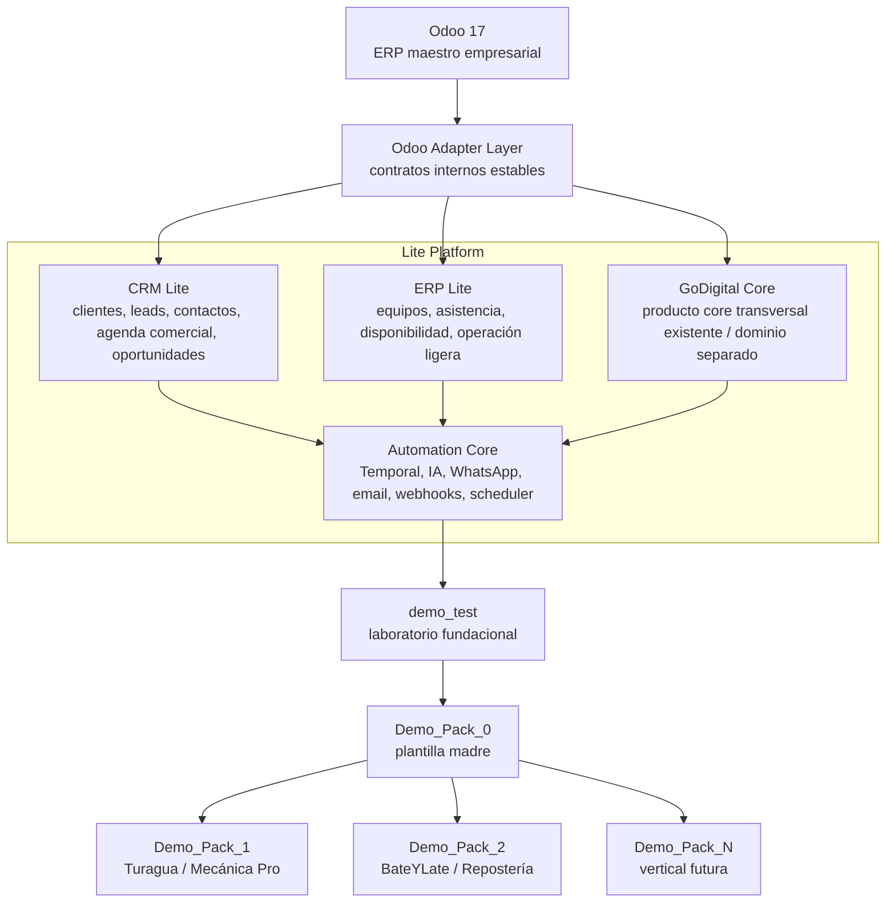

## 8. Layer Responsibilities

### 8.1 Odoo 17

Odoo es el **ERP maestro empresarial**.

Responsable de conservar la verdad empresarial final:

```text
clientes oficiales
contactos
oportunidades
cotizaciones formales
productos
servicios
empleados
asistencia
facturación
inventario
contabilidad
documentos empresariales
```

Odoo no debe ser reemplazado por VtkALL.

VtkALL simplifica la experiencia operativa sobre Odoo; no compite con Odoo.

---

### 8.2 Odoo Adapter

El `Odoo Adapter` es la única vía permitida para comunicarse con Odoo.

Responsable de aislar a VtkALL de:

```text
XML-RPC
JSON-RPC
modelos internos de Odoo
cambios de versión
errores de integración
módulos opcionales
diferencias de configuración
contratos externos inestables
```

Expone contratos internos estables hacia los Lite.

Permitido:

```text
CRM Lite → Odoo Adapter → Odoo
ERP Lite → Odoo Adapter → Odoo
GoDigital Core → Odoo Adapter → Odoo
Automation Core → Odoo Adapter → Odoo
```

Prohibido:

```text
Demo_Pack_1 → Odoo directo
Demo_Pack_2 → Odoo directo
Frontend → Odoo directo
Temporal Workflow → Odoo directo sin Activity/Adapter
```

---

### 8.3 CRM Lite

CRM Lite es la capa de experiencia comercial simple.

Responsable de:

```text
leads
clientes
contactos
agenda comercial
oportunidades
seguimiento
interacciones del agente IA
WhatsApp comercial
cotización comercial lite
historial comercial
```

En Demo_Pack_1 se expresa como:

```text
registro de cliente
registro de vehículo
solicitud de evaluación
cita de diagnóstico
presupuesto/cotización
seguimiento de estado
```

En Demo_Pack_2 se expresa como:

```text
registro de cliente
solicitud de postre
consulta de factibilidad
cotización
aprobación
seguimiento de pedido
```

El modelo de casos de uso ya confirma que la plataforma soporta el ciclo completo: interacción, cliente, entidad gestionada, caso, evaluación/factibilidad, cotización, aprobación, orden de trabajo, ejecución, cierre e historial. 

---

### 8.4 ERP Lite

ERP Lite es la capa de operación interna liviana.

Responsable de:

```text
equipos de trabajo
personal operativo
asistencia simple
disponibilidad
horarios
capacidad
asignación operativa
tablero interno
inputs previos hacia Odoo
```

ERP Lite no reemplaza recursos humanos, nómina, contabilidad ni inventario completo de Odoo.

Para Turagua, ERP Lite se refleja en:

```text
mecánicos
bahías
frontdesk
lavado/detailing
carga operativa
cupos disponibles
asignación de trabajo
```

Los wireframes de administración ya reflejan esta lectura: el Resumen Operativo debe mostrar citas, confirmaciones, cupos vendibles, carga de mecánicos/bahías, urgencias reales y demanda reciente, sin depender de métricas decorativas ni scroll. 

---

### 8.5 GoDigital Core

GoDigital Core es un dominio separado dentro de la plataforma.

Responsable de encapsular capacidades transversales que no deben contaminar directamente a los Demo Packs.

Regla:

> Ningún Demo Pack debe contener lógica propia de GoDigital Core de forma directa.

Permitido:

```text
Demo_Pack_# → GoDigital Core → Odoo Adapter / proveedor externo
```

Prohibido:

```text
Demo_Pack_1 → GoDigital Core directo sin contrato interno
Demo_Pack_2 → lógica GoDigital Core hardcodeada
Frontend → validaciones GoDigital Core como autoridad final
```

---

### 8.6 Automation Core

Automation Core es la capa transversal de procesos durables.

Responsable de:

```text
Temporal workflows
IA
WhatsApp
email
webhooks
scheduler
timers
reintentos
señales humanas
notificaciones
recordatorios
auditoría operacional
```

Temporal vive aquí.

Temporal no vive dentro de Demo_Pack_1, Demo_Pack_2 ni Demo_Pack_N.

Regla:

> Toda tarea repetitiva, durable, auditable, con espera humana, reintentos o timers debe pasar por Automation Core.

El documento de workflows ya define que todo workflow operativo relevante debe tener `caseId`, emitir `TimelineEvent`, usar Activities para integraciones/escrituras, esperar señales humanas cuando corresponda y aplicar compensación e idempotencia. 

---

### 8.7 demo_test

`demo_test` es laboratorio fundacional.

No es producto final.

Debe servir para probar:

```text
flujos
UI
consola manual
landing
agente IA
agenda
dashboard
workflows
integración Temporal
integración futura Odoo Adapter
contratos backend/frontend
modelo base reusable
```

Regla:

> `demo_test` puede experimentar, pero no debe convertirse en la base directa de packs comerciales futuros.

---

### 8.8 Demo_Pack_0

`Demo_Pack_0` será la plantilla madre estable.

Debe nacer cuando `demo_test` madure.

Responsable de contener:

```text
estructura base frontend
estructura base backend
contratos API comunes
componentes UI comunes
flujo base Customer → ManagedEntity → Case
agenda base
timeline base
patrones de error
patrones de workflow
integración con Lite Platform
```

Regla:

> Ningún pack futuro debe nacer directamente desde `demo_test`.
> Todo pack futuro debe nacer desde `Demo_Pack_0`.

---

### 8.9 Demo_Pack_#

Cada Demo Pack es una vertical específica.

Ejemplos:

```text
Demo_Pack_1 → Turagua / Mecánica Pro
Demo_Pack_2 → BateYLate / Repostería
Demo_Pack_3 → Médico
Demo_Pack_4 → Veterinaria
Demo_Pack_N → vertical futura
```

Cada pack contiene lógica vertical, no lógica transversal.

## 9. Allowed Dependencies

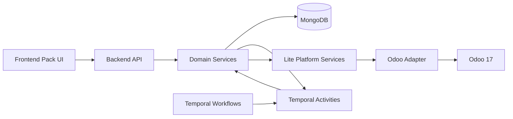

Permitido:

```text
Frontend → Backend API
Backend API → Domain Services
Domain Services → MongoDB
Temporal Workflow → Activities
Activities → Backend Domain Services
Domain Services → Lite Services
Lite Services → Odoo Adapter
Odoo Adapter → Odoo
Demo_Pack_# → Demo_Pack_0 shared primitives
Demo_Pack_# → Lite Platform capabilities
```

## 10. Forbidden Dependencies

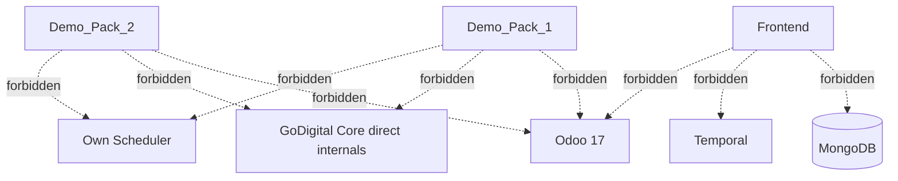

Prohibido:

```text
Demo_Pack_1 → Odoo directo
Demo_Pack_2 → Odoo directo
Demo_Pack_N → Odoo directo
Frontend → MongoDB directo
Frontend → Temporal directo
Frontend → Odoo directo
Pack vertical → XML-RPC / JSON-RPC directo
Pack vertical → GoDigital Core directo sin contrato interno
Pack vertical → scheduler propio
Pack vertical → motor propio de workflows
Pack vertical → lógica genérica de clientes duplicada
Pack vertical → lógica genérica de empleados duplicada
Pack vertical → cálculo definitivo de disponibilidad
Pack vertical → bloqueo directo de capacidad
```

## 11. demo_test / Demo_Pack_0 / Demo_Pack_# Separation

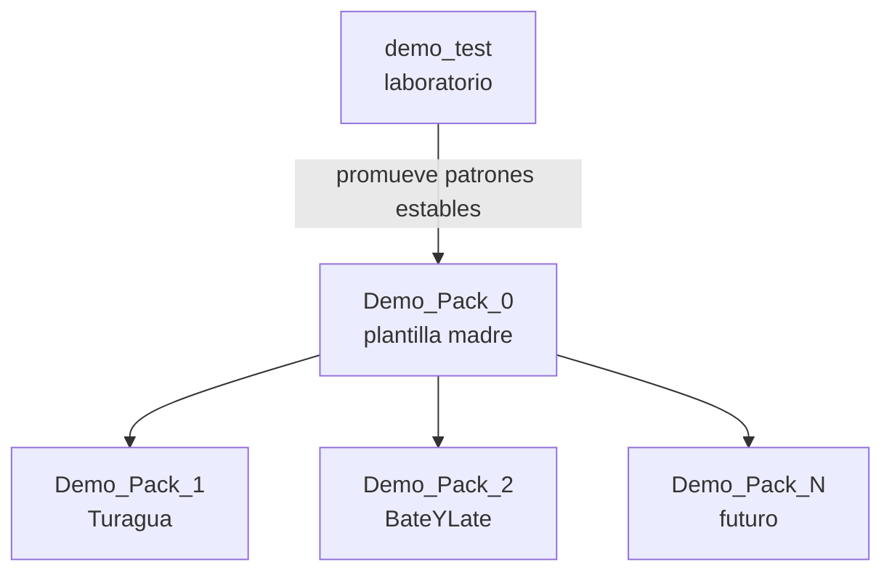

### demo_test

```text
Puede experimentar.
Puede tener mocks.
Puede tener consola manual.
Puede probar contratos.
Puede validar el flujo base.
No es producto.
No debe ser vendido como vertical.
No debe ser padre directo de nuevos packs.
```

### Demo_Pack_0

```text
Contiene lo reusable.
Estabiliza patrones.
Es la plantilla madre.
Define el starting point de packs futuros.
```

### Demo_Pack_#

```text
Contiene verticalización.
Contiene lenguaje del negocio.
Contiene campos específicos.
Contiene estados específicos.
Consume capacidades de plataforma.
No duplica plataforma.
```

## 12. Odoo Adapter Rule

La regla es absoluta:

> Ningún Lite, Demo Pack, Frontend ni Workflow debe hablar directamente con Odoo.

Toda comunicación con Odoo pasa por Adapter.

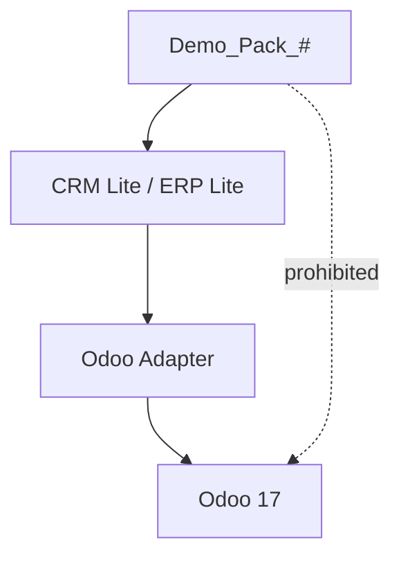

### Razones

```text
1. Evita acoplamiento a modelos internos Odoo.
2. Evita que cada pack implemente XML-RPC/JSON-RPC.
3. Permite versionar contratos internos.
4. Permite simular Odoo en demo_test.
5. Permite migrar Odoo 17 a otra versión sin romper packs.
6. Permite aplicar reglas de compatibilidad.
7. Permite centralizar errores y reintentos.
```

### Contratos sugeridos del Adapter

```text
CustomerAdapterContract
ContactAdapterContract
OpportunityAdapterContract
QuoteAdapterContract
ProductAdapterContract
EmployeeAdapterContract
AttendanceAdapterContract
InvoiceReadinessAdapterContract
```

No necesariamente deben implementarse ahora, pero deben guiar el diseño.

## 13. Temporal / Automation Core Rule

Temporal se ubica en Automation Core.

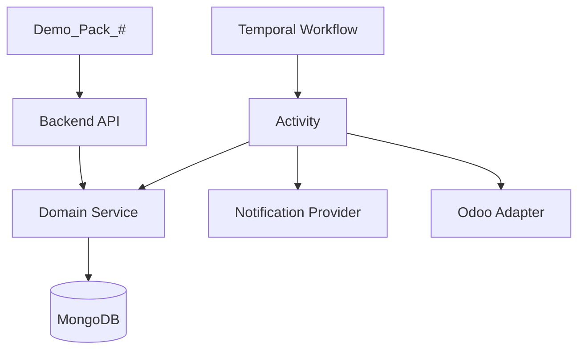

Reglas:

```text
1. Temporal no decide reglas de negocio.
2. Temporal orquesta reglas validadas por backend.
3. Temporal no escribe directo a MongoDB fuera de Activities/domain services.
4. Toda Activity que escribe debe ser idempotente.
5. Todo workflow operativo relevante debe tener caseId.
6. Todo workflow debe emitir TimelineEvent en hitos relevantes.
7. Toda espera humana debe modelarse como signal o timer.
8. Toda reserva de capacidad fallida debe tener compensación.
```

### Workflows canónicos dentro de Automation Core

```text
CustomerInquiryWorkflow
AppointmentSchedulingWorkflow
AssessmentIntakeWorkflow
DiagnosticAssessmentWorkflow
FeasibilityAssessmentWorkflow
QuoteWorkflow
CustomerDecisionWorkflow
WorkOrderLifecycleWorkflow
NotificationWorkflow
CaseTimelineAuditWorkflow
```

Estos workflows pueden aplicarse a Pack 1 y Pack 2 con variaciones verticales. Pack 1 usa diagnóstico técnico; Pack 2 usa factibilidad repostera. Ambos comparten el patrón proceso → evaluación → cotización → decisión → orden → ejecución. 

## 14. CRM Lite / ERP Lite / GoDigital Core Boundaries

### 14.1 CRM Lite Boundary

CRM Lite puede conocer:

```text
Customer
CustomerInteraction
Lead
Case comercial
Appointment comercial
Opportunity
Quote comercial lite
Notification comercial
```

CRM Lite no debe conocer:

```text
WorkTeam internals profundos
inventario contable completo
GoDigital Core internals
XML-RPC Odoo
```

---

### 14.2 ERP Lite Boundary

ERP Lite puede conocer:

```text
WorkTeam
Worker
ScheduleRule
ScheduleOverride
ResourceReservation
Attendance lite
Operational assignment
WorkOrderTask
Capacity view
```

ERP Lite no debe conocer:

```text
pricing final tributario
facturación oficial
contabilidad
GoDigital Core internals
chat prompts de agente IA
```

---

### 14.3 GoDigital Core Boundary

GoDigital Core puede conocer:

```text
capacidades transversales de GoDigital
contratos internos de GoDigital
contexto requerido por plataforma
validaciones propias del core
integraciones propias del core
```

GoDigital Core no debe conocer:

```text
UI flow específico de Turagua
UI flow específico de BateYLate
diagnóstico mecánico
decoración de tortas
layout de admin
```

---

### 14.4 Automation Core Boundary

Automation Core puede conocer:

```text
workflowId
caseId
businessSlug
signals
timers
activities
notifications
retry policy
compensation
timeline event emission
```

Automation Core no debe ser dueño de:

```text
validación final del negocio
persistencia directa sin domain service
lógica visual
lógica de Odoo sin Adapter
```

## 15. Pack-Specific Boundaries

### 15.1 Demo_Pack_1 / Turagua

Debe contener lógica vertical de mecánica:

```text
vehículo
placa
marca
modelo
kilometraje
tipo de servicio vehicular
diagnóstico técnico
fotos del vehículo
orden de taller
estado del taller
bahía
mecánico
historial mecánico
comunicación de avance vehicular
```

No debe contener:

```text
XML-RPC Odoo
GoDigital Core directo sin contrato interno
motor de workflows
scheduler propio
lógica genérica de clientes
lógica genérica de empleados
cálculo final de disponibilidad fuera del backend/plataforma
```

### 15.2 Demo_Pack_2 / BateYLate

Debe contener lógica vertical de repostería:

```text
solicitud de postre
tipo de postre
ocasión
porciones
sabores
restricciones
referencias visuales
fecha deseada
consulta de factibilidad
maestro repostero
reformulación
orden de producción
estado de producción
```

No debe contener:

```text
XML-RPC Odoo
GoDigital Core directo sin contrato interno
motor de workflows
scheduler propio
lógica genérica de clientes
lógica genérica de empleados
```

Pack 2 debe mantener la compuerta de factibilidad: no todo pedido se cotiza; primero se evalúa si puede hacerse, si requiere reformulación o si debe rechazarse. 

## 16. Consequences

### Positive Consequences

```text
1. Los packs dejan de crecer como demos aisladas.
2. Odoo queda protegido como ERP maestro.
3. El Adapter centraliza integración.
4. Temporal se vuelve capacidad transversal.
5. Demo_Pack_0 puede convertirse en plantilla real.
6. Pack 1 y Pack 2 comparten proceso sin perder verticalidad.
7. GoDigital Core queda separado desde el inicio.
8. Frontend mantiene una frontera clara.
9. Backend mantiene autoridad de reglas.
10. El modelo Case-centered gana estabilidad.
```

### Negative Consequences

```text
1. Habrá más capas conceptuales que documentar.
2. Algunas implementaciones rápidas deberán esperar frontera correcta.
3. El equipo debe resistir la tentación de conectar directo a Odoo.
4. Habrá que definir contratos Adapter antes de integración real.
5. Demo_Pack_0 necesitará curaduría, no simple copia de demo_test.
```

### Neutral Consequences

```text
1. demo_test seguirá existiendo.
2. MongoDB sigue siendo fuente de verdad operativa del laboratorio.
3. Odoo puede entrar más adelante.
4. Temporal puede seguir integrándose por fases.
5. CRM Lite / ERP Lite / GoDigital Core pueden iniciar como módulos conceptuales antes de ser servicios separados.
```

## 17. Risks

### Risk 1 — Overengineering

Riesgo:

```text
Convertir el PoC en una plataforma demasiado grande antes de validar operación real.
```

Mitigación:

```text
Implementar por fases.
Mantener demo_test como laboratorio.
Solo promover a Demo_Pack_0 lo que ya demostró reutilización.
```

---

### Risk 2 — Odoo coupling

Riesgo:

```text
Conectar un pack directo a Odoo por velocidad.
```

Mitigación:

```text
Crear Adapter mínimo incluso si al inicio usa mocks.
Agregar guardrails contra imports/conexiones directas.
```

---

### Risk 3 — Temporal misuse

Riesgo:

```text
Usar Temporal para consultas simples o reglas de negocio.
```

Mitigación:

```text
Temporal solo para procesos durables.
Backend valida.
Temporal orquesta.
```

---

### Risk 4 — Demo_Pack_0 becomes dumping ground

Riesgo:

```text
Mover todo lo común a Demo_Pack_0 sin criterio.
```

Mitigación:

```text
Solo promover patrones usados por al menos dos verticales o claramente fundacionales.
```

---

### Risk 5 — GoDigital Core contamination

Riesgo:

```text
Hardcodear lógica de GoDigital Core dentro de Pack 1/2.
```

Mitigación:

```text
Consumir GoDigital Core mediante contratos internos.
Evitar contaminación vertical.
```

## 18. Migration Notes

### Phase 0 — Current state

```text
demo_test existe como laboratorio.
Pack 1 tiene wireframes y consola/admin.
Pack 2 tiene diseño conceptual.
Modelo v3 define Case, Appointment, ResourceReservation y WorkTeams.
Temporal workflows están mapeados.
ContractMK1 define frontera frontend/backend/Temporal/MongoDB.
```

### Phase 1 — Formalize Lite Thread

```text
Crear ADR-002.
Crear carpeta docs/architecture/lite-thread.
Documentar Odoo Adapter como frontera obligatoria.
Documentar CRM Lite / ERP Lite / GoDigital Core como dominios.
```

### Phase 2 — Protect demo_test

```text
Mantener demo_test como laboratorio.
No venderlo como producto.
No crear nuevos packs desde demo_test.
Preparar promoción selectiva a Demo_Pack_0.
```

### Phase 3 — Extract Demo_Pack_0

```text
Extraer layout base.
Extraer consola base.
Extraer contratos API base.
Extraer flujo Customer → ManagedEntity → Case.
Extraer agenda base.
Extraer timeline base.
Extraer patrones de error.
```

### Phase 4 — Rebase Pack 1 and Pack 2 conceptually

```text
Pack 1 consume Demo_Pack_0 + vertical mecánica.
Pack 2 consume Demo_Pack_0 + vertical repostería.
Ambos consumen CRM Lite / ERP Lite / Automation Core.
```

### Phase 5 — Introduce Odoo Adapter

```text
Crear Adapter interface.
Crear mock adapter.
Crear adapter real Odoo 17.
Prohibir conexión directa desde packs.
```

### Phase 6 — GoDigital Core

```text
Crear contratos internos para GoDigital Core.
Consumir GoDigital Core desde Lite Platform.
Evitar contaminación vertical.
```

## 19. Mermaid Diagrams

### 19.1 Full target architecture

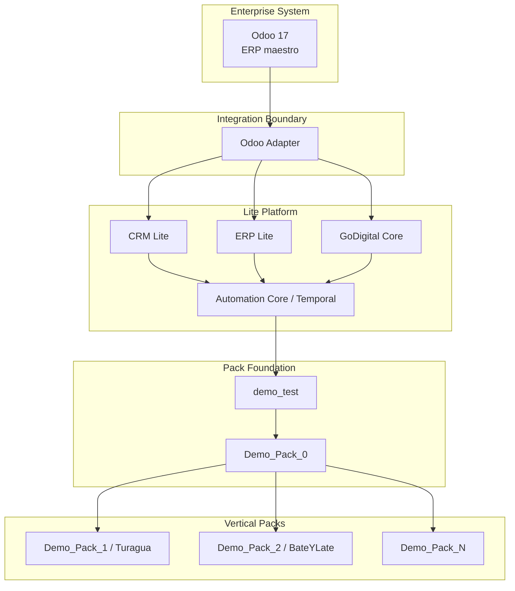

### 19.2 Pack 1 flow under Lite Thread

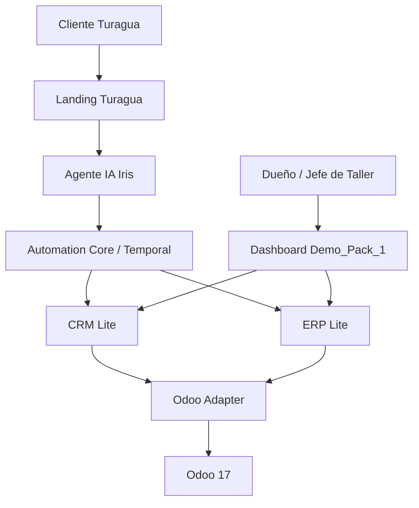

### 19.3 Pack 2 flow under Lite Thread

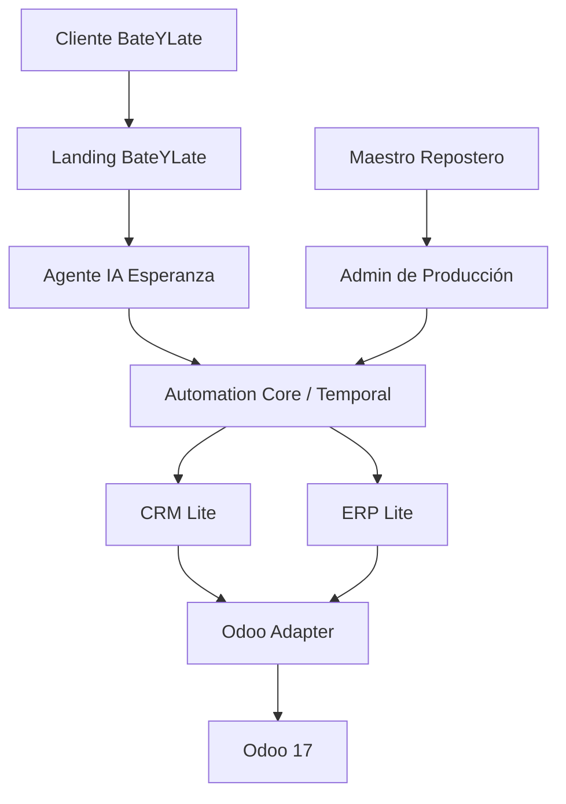

### 19.4 Canonical operational process

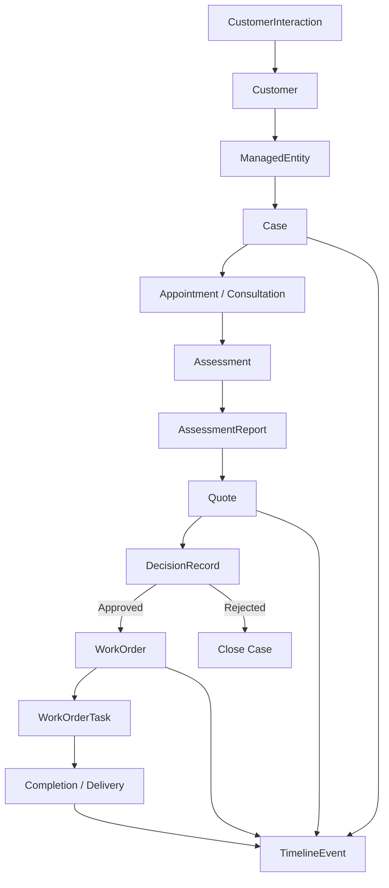

### 19.5 Scheduling boundary

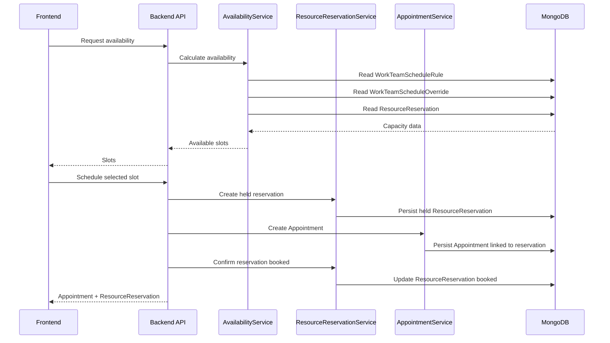

## 20. Final Invariants

Estas reglas no deben romperse:

```text
1. Odoo es el ERP maestro empresarial.
2. VtkALL simplifica Odoo; no lo reemplaza.
3. Ningún Demo Pack habla directo con Odoo.
4. Toda integración con Odoo pasa por Odoo Adapter.
5. CRM Lite, ERP Lite y GoDigital Core son dominios separados.
6. Temporal vive en Automation Core.
7. Temporal orquesta; no decide reglas de negocio.
8. Frontend presenta y recolecta.
9. Backend valida y persiste.
10. MongoDB es fuente de verdad operativa del laboratorio.
11. demo_test es laboratorio, no producto final.
12. Demo_Pack_0 es plantilla madre.
13. Todo pack futuro nace desde Demo_Pack_0.
14. Cada Demo Pack contiene solo lógica vertical.
15. Toda lógica reusable sube a Demo_Pack_0 o Lite Platform.
16. Appointment agenda al cliente.
17. ResourceReservation bloquea capacidad real.
18. Availability se calcula desde WorkTeamScheduleRule, WorkTeamScheduleOverride y ResourceReservation.
19. Toda tarea repetitiva, durable o auditable pasa por Temporal.
20. GoDigital Core no contamina packs verticales.
```

## 21. Decision Summary

```text
ADR-002 acepta Lite Thread como frontera arquitectónica de plataforma.

La arquitectura oficial pasa a ser:

Odoo 17
  ↓
Odoo Adapter
  ↓
CRM Lite / ERP Lite / GoDigital Core
  ↓
Automation Core / Temporal
  ↓
Demo_Pack_0
  ↓
Demo_Pack_#

demo_test queda como laboratorio fundacional.
Demo_Pack_0 será la plantilla madre.
Demo_Pack_1 y Demo_Pack_2 serán verticales operativas Lite.
```

**Conclusión:** VtkALL deja de ser “website + chatbot + dashboard” y pasa a ser una plataforma de operación vertical ligera, con Odoo como maestro empresarial, Temporal como motor durable, GoDigital Core como dominio separado dentro de la plataforma y Demo_Pack_0 como base reusable para verticales futuras.

```
```
