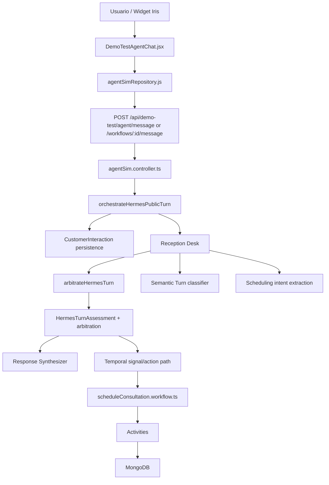
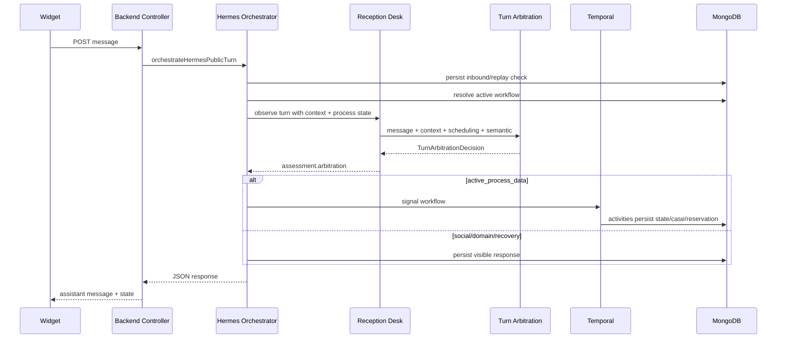
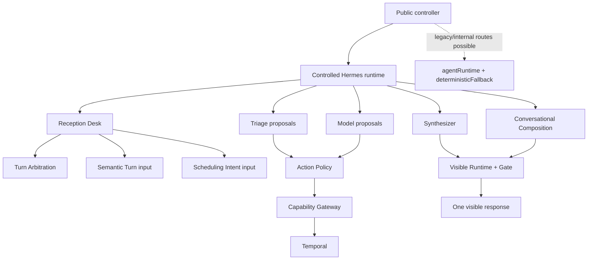
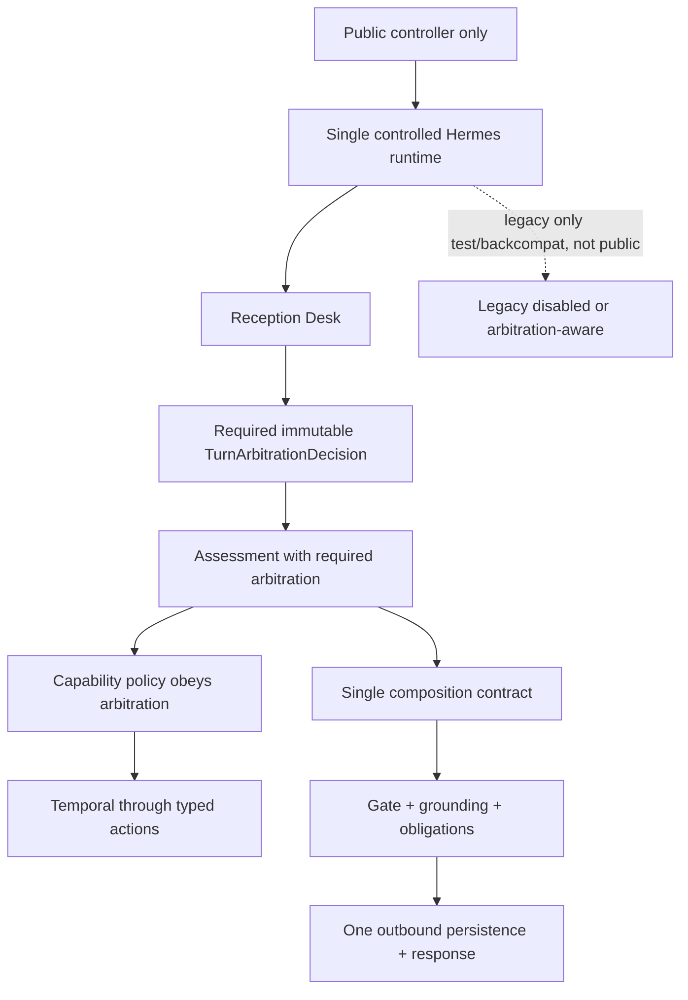

# HERMES_TEMPORAL_FULL_AUDIT

Fecha: 2026-07-30  
Workspace auditado: `C:\Users\eduar\OneDrive\Escritorio\Proyectos\demo_test`  
Rama: `feat/introduce-front-mock`  
HEAD: `1dc1b4df3e32005036dcdb604e001c0b2621af62`  
Modo: auditoria tecnica de solo lectura. No se modifico codigo, prompts, tests ni dependencias.

## 0. Estado Ejecutivo

Veredicto: HERMES-FIX-09 esta bien encaminado en arquitectura por lectura estatica, pero no queda cerrado en runtime ejecutable porque `npm` y `docker` no estan disponibles en PATH dentro de esta sesion. La validacion HTTP/widget/Temporal real queda pendiente.

Estado por eje:

| Eje | Estado | Evidencia |
| --- | --- | --- |
| Arbitraje unico por turno | IMPLEMENTED | `hermesReceptionDesk.service.ts` calcula `arbitrateHermesTurn` y guarda `assessment.arbitration`. |
| Prioridad identidad/proceso/social | IMPLEMENTED | `hermesTurnArbitration.service.ts` resuelve `active_process_data` antes que `identity_recovery`, y `identity_recovery` antes que dominio/social cuando no hay proceso activo. |
| Telefono contextual | IMPLEMENTED | `activeProcess && provide_customer_data` gana a identificador de continuidad; sin proceso activo gana `identity_recovery`. |
| Synthesizer sin reclasificacion | MOSTLY IMPLEMENTED | No llama a `classifyHermesSemanticTurn`, pero conserva fallback por `primaryIntent === 'off_domain'` si falta `arbitration`. |
| Grounding de hechos | PARTIAL IMPLEMENTED | Existe `mayStateAsReportedFact`, pero su aplicacion observada es localizada, no una barrera general de factualidad. |
| Temporal workflow | IMPLEMENTED BY STATIC READ | Hay workflow, signals, queries, worker y activities; no se ejecuto por bloqueo de entorno. |
| Frontend widget -> backend | IMPLEMENTED BY STATIC READ | Widget usa `agentSimRepository.openMessage/message` hacia `/api/demo-test/agent/...`. |
| Build/test/runtime | NOT VERIFIED | `where.exe npm` y `where.exe docker` no encontraron binarios. |

Hallazgos bloqueantes/P1:

| Severidad | Hallazgo | Impacto |
| --- | --- | --- |
| BLOCKER / VALIDATION GAP | Current working tree not runtime-validated. | No se puede afirmar que el widget/HTTP/Docker/Temporal real este usando el codigo inspeccionado ni que el smoke pase fuera de tests estaticos. No demuestra por si mismo un defecto productivo P0. |
| P1 | `HermesTurnAssessment.arbitration` sigue siendo opcional en el contrato. | La invariante productiva depende de disciplina de construccion, no del tipo. Si una capa recibe assessment sin arbitraje, reaparecen caminos de fallback. |
| P1 | Existe runtime/fallback legacy con clasificacion propia. | Si alguna bandera o ruta alterna vuelve a usar `agentRuntime`/`deterministicFallback`, puede reaparecer arbitraje competidor fuera de HERMES-FIX-09. |
| P1 | Grounding de hechos no es transversal. | Reduce el bug de frenos, pero no prueba que toda afirmacion factual pase por una politica general. |
| P1 | `h14` no prueba el endpoint publico real del widget. | `h14` usa Express local y `/api/v1/agent-sim/message`; no demuestra `/api/demo-test/agent/message` ni `/api/demo-test/agent/workflows/:workflowId/message`. |
| P1 | Temporal signal puede committear antes de persistir respuesta visible. | Si API cae despues del signal y antes del outbound visible, la seguridad del retry depende de conservar un `messageId` estable; el widget no lo demuestra por lectura. |
| P1/P2 | Propuestas de accion originadas por modelo no estan probadas como estrictamente arbitration-bound. | `applyActionPolicy` filtra triage; las `modelProposals` se concatenan despues. Gateway valida allowedActions, pero no se demostro validacion por lane autoritativo para cada propuesta. |

## A. Alcance y Fuentes Auditadas

DOCUMENTED:

- `docs/contracts/ContractMK1 (2).md` documenta el principio: Frontend presenta/colecta, Backend valida/persiste, Temporal orquesta, MongoDB es fuente de verdad. Lineas 58-61.
- `docs/architecture/ADR-002.md` repite el limite Frontend/Backend/Temporal/MongoDB y exige workflows durables para procesos con espera humana, reintentos, timers o auditoria. Lineas 30-40 y 347.
- `docs/use-cases/USE_CASES_VTKALL_DEMO_PACK_1_2.md` define Iris, CustomerInteraction, Customer, Case y Appointment para flujo publico.
- `docs/data-model/DATA_MODEL_VTKALL_DataModel-0_v3_timeslots.md` define Case como raiz, Appointment como cita visible, ResourceReservation como bloqueo real, AvailabilitySlot legacy.

NOT VERIFIED:

- No se encontro un archivo exacto llamado `ContractMK1.md`; el equivalente presente es `docs/contracts/ContractMK1 (2).md`.
- No se encontro un archivo exacto llamado `ADR-002 Temporal X Lite.txt`; el equivalente presente es `docs/architecture/ADR-002.md`.
- No se encontraron en workspace los documentos exactos `DESIGN_VTKALL_DEMO_PACK_1_+TMF.md`, `DESIGN_VTKALL_DEMO_PACK_2_+TMF.md`, `FRONTEND_EVOLUTION_REPORT_F0_F7.md`, el reporte visual/style guide ni la revision detallada del agente mencionados en el prompt.

IMPLEMENTED:

- Codigo backend, frontend, docker-compose, modelos, servicios Hermes y Temporal fueron inspeccionados por lectura estatica.

NOT VERIFIED:

- No se ejecuto `npm run build`.
- No se ejecuto `npm run hermes:h09:semantic-routing`.
- No se ejecuto `npm run test:h14`.
- No se ejecuto `docker compose up -d --build api`.
- No se ejecuto smoke HTTP/widget real.

Motivo: `where.exe npm` y `where.exe docker` no encontraron binarios en PATH.

## B. Contrato Esperado

DOCUMENTED:

- El frontend no debe crear capacidad ni reglas de negocio. `ContractMK1 (2).md` lineas 58-61 y 243-251.
- El backend debe validar, persistir, calcular disponibilidad, crear `ResourceReservation`, crear `Appointment`, emitir `TimelineEvent` e integrar Temporal. `ContractMK1 (2).md` lineas 87-91.
- `Appointment` agenda al cliente; `ResourceReservation` bloquea capacidad real. `ContractMK1 (2).md` lineas 184-195.
- `Appointment` debe referenciar `ResourceReservation`; el backend no debe crear una cita agendada sin reserva valida. `ContractMK1 (2).md` lineas 191-200.
- `AvailabilitySlot` no debe ser fuente futura de verdad. `ContractMK1 (2).md` linea 195; data model lineas 945-952.
- Temporal orquesta, pero no decide reglas de negocio; las escrituras/integraciones van por activities/backend. `ADR-002.md` lineas 32, 347 y 603-604.

## C. Arquitectura Real Observada



IMPLEMENTED:

- Frontend widget genera `conversationId` y usa `agentSimRepository.openMessage` cuando no hay `workflowId`, y `agentSimRepository.message` cuando lo hay. `frontend/components/landing/DemoTestAgentChat.jsx` lineas 37-39 y 75-86.
- `agentSimRepository` envia `agentOpenMessage` y `agentMessage(workflowId)` por `apiRequest`. `frontend/lib/api/agentSimRepository.js` lineas 44-50.
- Endpoints frontend apuntan a `/api/demo-test/agent/message` y `/api/demo-test/agent/workflows/:workflowId/message`. `frontend/lib/api/endpoints.js` lineas 8-15.
- Backend registra rutas equivalentes: `router.post('/message', openMessage)` y `router.post('/workflows/:workflowId/message', message)`. `backend/src/routes/agentSim.routes.ts` lineas 16-24.
- Controller llama a `orchestrateHermesPublicTurn`. `backend/src/controllers/agentSim.controller.ts` lineas 164 y 184.
- `orchestrateHermesPublicTurn` resuelve workflow activo para una conversacion inicial y redirige a continuation si existe. `backend/src/agent/hermes/orchestration/hermesTurnOrchestrator.service.ts` lineas 1573-1589.
- En continuation, carga estado Temporal antes de manejar el turno. `hermesTurnOrchestrator.service.ts` lineas 1592-1605.

## D. Contradicciones Frontend/Backend/Temporal

IMPLEMENTED:

- El frontend no manipula directamente Temporal ni MongoDB; solo invoca APIs backend.
- `docker-compose.yml` configura API con Mongo, Temporal y Ollama; worker Temporal usa el mismo build backend. Lineas 96-180.
- Frontend en Docker recibe `NEXT_BACKEND_INTERNAL_URL=http://api:${API_PORT:-4000}`. `docker-compose.yml` lineas 187-204.

P1 / NOT VERIFIED:

- El widget publico usa `/api/demo-test/...`, mientras `frontend/next.config.mjs` solo reescribe `/api/v1/:path*`. En navegador, `apiClient.js` puede usar base publica/fallback directo, pero sin runtime no se verifico que el widget siempre reciba JSON valido en los despliegues actuales. Evidencia: endpoints `/api/demo-test` en `frontend/lib/api/endpoints.js` y rewrite `/api/v1` en `frontend/next.config.mjs` lineas 9-10.
- El error reportado por usuario "La respuesta del servidor no es JSON valido" queda plausible si la llamada cae en una ruta HTML/404/proxy no JSON. La correccion previa de fallback ayuda, pero no se probo HTTP real.

## E. Temporal y Runtime

IMPLEMENTED:

- `backend/src/temporal/client.ts` crea `Connection` y `Client` con `getTemporalConnectionOptions`.
- `backend/src/temporal/worker.ts` usa `NativeConnection`, conecta DB, crea Worker con `TASK_QUEUE`, `workflowsPath` y `activities`. Lineas 7-17.
- `backend/package.json` define `temporal:worker` como `tsx src/temporal/worker.ts`. Linea 84.
- Workflow `scheduleConsultation.workflow.ts` define queries y signals: `getScheduleConsultationState`, `getScheduleConsultationProcessContext`, `selectCatalogOffering`, `submitCustomerData`, `requestSlots`, `selectSlot`, `cancelWorkflow`. Lineas 24-30.
- Workflow espera estado terminal con `condition(() => terminalStatuses.includes(state.status))`. Linea 229.
- El ID de workflow se genera en `agentSim.service.ts` con `Date.now()` y `crypto.randomUUID()` fuera del workflow. Linea 63.

IMPLEMENTED / DETERMISM:

- No se observo `Date.now`, `Math.random`, `randomUUID`, `new Date` o timers dentro de `backend/src/temporal/workflows/scheduleConsultation.workflow.ts`.
- Se observo `new Date()` en activities, lo cual es valido porque corre fuera del sandbox determinista del workflow. `scheduleConsultation.activities.ts` lineas 90 y 189.

BLOCKER / CURRENT-CUT VALIDATION GAP:

- No se pudo iniciar Temporal, worker ni API.
- No se pudo validar conexion a `temporal:7233`.
- No se pudo inspeccionar history real, replays, signals duplicadas, retries ni durable state.
- Esto no contradice evidencia historica del proyecto de conectividad Temporal/task queue/probes dentro de Docker. La limitacion especifica es que el working tree actual posterior a FIX-09 no fue revalidado en runtime.

## F. Persistencia y Source of Truth

IMPLEMENTED:

- `workflowData.service.ts` valida customer data, reutiliza Customer por telefono normalizado, crea Customer, ManagedEntity, Case, ResourceReservation, Appointment y TimelineEvent.
- `teamAvailability.service.ts` y `demoTest/availability.service.ts` leen `ResourceReservation` para calcular disponibilidad; el comentario de `availability.service.ts` declara `AvailabilitySlot` legacy only.
- `appointment.service.ts` exige `ResourceReservation` y valida que `scheduledStart/scheduledEnd` coincidan con la reserva antes de crear Appointment. Lineas 15-75.
- `ResourceReservation.model.ts` indexa por `businessSlug/teamId/status/startAt`, `appointmentId` y `slotKeys/status`. Lineas 53-55.
- `IdempotencyRecord.model.ts` tiene indice unico `{ businessSlug, scope, idempotencyKey }`. Linea 80.
- `executeIdempotentCommand` calcula fingerprint, lease, manejo de comandos en progreso y resultado cacheado. `idempotentCommand.service.ts` lineas 248-324.

RISKS:

- No se verifico atomicidad MongoDB/transaccional de la secuencia completa reserva -> cita -> confirmacion. Hay compensacion visible en `workflowData.service.ts`, pero sin test runtime no se comprobo doble booking concurrente.
- Numeracion de Case basada en `countDocuments + 1` aparece en `workflowData.service.ts` linea 149 y `case.service.ts` lineas 55-60; sin indice unico fuerte por `caseNumber`, puede haber colision bajo concurrencia.

## G. Hermes Agent Internals

IMPLEMENTED:

- `hermesReceptionDesk.service.ts` importa `classifyHermesSemanticTurn` y `arbitrateHermesTurn`, pero la decision final de turno se construye una vez con `arbitrateHermesTurn`. Lineas 17-18 y 197-221.
- `assessment` resultante incluye `primaryIntent`, `secondaryIntents`, datos extraidos, `arbitration` y `recommendedDecision`. Lineas 233-273.
- `hermesTurnArbitration.service.ts` implementa orden autoritativo:
  - seguridad
  - pregunta lateral en proceso activo
  - dato esperado por proceso activo
  - recuperacion de identidad sin proceso activo
  - conversacion de dominio
  - accion/reserva
  - social
  - clarificacion
  - external/off-domain
- Lineas clave: 70-103 para proceso vs identidad; 150-156 para social; 168-174 para external/off-domain.

P1:

- `HermesTurnAssessment.arbitration` es opcional en el contrato. `backend/src/agent/hermes/contracts/hermesTurnAssessment.contract.ts` linea 86. Esto permite que capas posteriores reciban assessments sin decision autoritativa.

P1:

- El sintetizador no reclasifica con `classifyHermesSemanticTurn`, pero conserva decision por fallback si falta `arbitration`: `if (input.turnAssessment.arbitration?.lane === 'clearly_external' || primaryIntent === 'off_domain')`. `hermesResponseSynthesizer.service.ts` lineas 324-326.

P1:

- Existe `deterministicFallback` legacy que llama a `classifyHermesSemanticTurn` y puede producir `off_domain` por su cuenta. `backend/src/agent/fallback/deterministicFallback.ts` lineas 330-353. `agentRuntime.ts` lo sigue usando en varias rutas. Si ese runtime vuelve a estar activo para widget o fallback post-commit, se reintroduce arbitraje competidor.

## H. Frontend

IMPLEMENTED:

- `DemoTestAgentChat.jsx` mantiene `workflowState`, decide open vs continuation, y muestra fallback visible si la llamada falla. Lineas 75-90.
- `apiClient.js` intenta parsear JSON, produce `INVALID_API_RESPONSE` ante payload no JSON y agrega fallback browser URL cuando aplica. Lineas 25-72.
- `next.config.mjs` define rewrite interno a backend para `/api/v1`. Lineas 2 y 9-10.

RISKS:

- El widget usa endpoints `/api/demo-test`, que no estan cubiertos por el rewrite `/api/v1`. Si `NEXT_PUBLIC_DEMO_TEST_API_BASE_URL` no apunta correctamente al backend, el navegador puede recibir HTML en lugar de JSON.
- `conversationId` se genera con `Date.now()` y `Math.random()` en frontend. Es aceptable para session local, pero no es estable entre recargas ni idempotente por si mismo. La idempotencia real depende del backend/messageId.

## I. Infraestructura

DOCUMENTED / IMPLEMENTED BY CONFIG:

- `docker-compose.yml` declara `mongo`, `temporal-postgresql`, `temporal`, `temporal-ui`, `ollama`, `api`, `temporal-worker`, `frontend`.
- API depende de Mongo healthy, Temporal started y Ollama started. Lineas 155-161.
- Worker depende de API healthy y Temporal started. Lineas 178-184.
- API healthcheck consulta `/api/v1/admin/health`. Lineas 162-166.

NOT VERIFIED:

- `docker compose ps`
- imagenes construidas
- logs de API/worker
- variables efectivas
- que el contenedor `demo_test_api` este ejecutando el workspace actual
- que Ollama tenga modelo disponible

## J. Seguridad, Idempotencia y Observabilidad

IMPLEMENTED:

- Hay middleware de execution context aplicado a `/api/demo-test` y `/api/v1`. `backend/src/app.ts` lineas 37-38.
- Hay idempotencia operacional con `IdempotencyRecord` e indice unico.
- Persistencia de mensajes usa `messageId + conversationId` para replay/conflict handling. `agentConversation.service.ts` lineas 149-177.
- `recordAgentConversationTurn` registra inbound y visible agent messages. `agentConversation.service.ts` lineas 223-258.

RISKS:

- No se verificaron politicas de redaccion de PII en logs ni telemetry. Hay persistencia intencional de telefono/datos del cliente en Mongo como parte del producto, pero logs/runtime no fueron auditados dinamicamente.
- No se verifico rate limiting, autenticacion publica del widget ni proteccion contra abuso de endpoints de agente.

## K. Tests Existentes

IMPLEMENTED:

- `backend/package.json` contiene suites H04-H07, H09, H13, H14 y Temporal H06B. Lineas 26-75.
- `hermes:h09:semantic-routing` existe y apunta a `src/agent/hermes/tests/h09SemanticRouting.test.ts`. Linea 61.
- `test:h14` existe y apunta a `src/agent/hermes/tests/h14RuntimeInvariants.test.ts`. Linea 63.
- H09 cubre:
  - frenos sin sintomas inventados
  - `Raspado`
  - `Holaaaa`
  - `Mi numero es 933075200`
  - `A nombre de Pepelucho`
  - telefono en proceso activo
  - falso positivo off-domain
  Evidencia: `h09SemanticRouting.test.ts` lineas 154-242.

NOT VERIFIED:

- No se ejecutaron las suites por ausencia de `npm`.
- No se verifico que los mocks representen el runtime HTTP/widget.

## L. Casos Reportados por Usuario

| Caso | Estado por lectura | Evidencia |
| --- | --- | --- |
| `Holaaaa` -> social | COVERED STATICALLY | Social lane en arbitraje lineas 150-156; test H09 lineas 198-200. |
| `Mi numero es 933075200` sin proceso -> identity_recovery | COVERED STATICALLY | Arbitraje lineas 96-103; test H09 lineas 204-206. |
| Temporal espera firstName: `A nombre de Pepelucho` | COVERED STATICALLY | Active process data lineas 79-93; test H09 lineas 219-230. |
| Temporal espera phone: `933075200` | COVERED STATICALLY | Active process data lineas 79-93; test H09 lineas 224-230. |
| Temporal espera phone: pregunta lateral | COVERED BY DESIGN | Arbitraje prioriza `side_question` lineas 70-76. No se confirmo caso textual exacto en smoke runtime. |
| Frenos sin sintomas inventados | PARTIAL COVERED | `buildAutomotiveGuidanceReply` lista senales generales; test H09 lineas 154-168. Grounding transversal no probado. |

## M. Topologia Funcional



## N. Hallazgos Detallados

### B-01 Runtime no validado

Estado: NOT VERIFIED  
Evidencia: `where.exe npm` y `where.exe docker` no encontraron binarios.  
Impacto: no se puede cerrar el corte con certeza operativa. El smoke real solicitado sigue pendiente.  
Recomendacion: ejecutar en entorno con Node/Docker disponibles:

```bash
npm run build
npm run hermes:h09:semantic-routing
npm run test:h14
docker compose up -d --build api
```

Luego validar por HTTP/widget:

```text
Holaaaa
Mi numero es 933075200
Quiero revisar mis frenos
Raspado, quiero revision
A nombre de Pepelucho
```

### P1-01 `assessment.arbitration` opcional

Estado: IMPLEMENTED WITH RISK  
Evidencia: contrato opcional en `hermesTurnAssessment.contract.ts` linea 86.  
Impacto: la invariante "una decision por turno" no esta codificada como requisito de tipo.  
Recomendacion: cuando se retiren fixtures antiguos, hacer `arbitration` obligatorio y fallar rapido si Reception Desk no lo produce.

### P1-02 Fallback legacy puede reintroducir clasificador competidor

Estado: IMPLEMENTED LEGACY RISK  
Evidencia: `deterministicFallback` llama `classifyHermesSemanticTurn` y decide `off_domain`; `agentRuntime.ts` lo consume.  
Impacto: si una bandera o ruta antigua queda activa, HERMES-FIX-09 no gobierna todos los turnos visibles.  
Recomendacion: confirmar por runtime/flags que el widget publico solo pasa por `orchestrateHermesPublicTurn` + Reception Desk, o adaptar legacy para consumir `TurnArbitrationDecision`.

### P1-03 Fact grounding parcial

Estado: PARTIAL IMPLEMENTED  
Evidencia: `mayStateAsReportedFact` revisa mensaje actual, ultimos 6 mensajes user y memory facts; el uso observado esta en el bloque de frenos del synthesizer.  
Impacto: el bug de "frenar fuerte" queda reducido para ese flujo, pero no existe evidencia de una politica general para todas las respuestas tecnicas.  
Recomendacion: elevar grounding a contrato de redaccion o post-check general para afirmaciones factuales.

### P1-04 `h14` no prueba el endpoint publico del widget

Estado: VALIDATION GAP  
Evidencia: la matriz de pruebas muestra que `h14` levanta un servidor Express local y consulta `/api/v1/agent-sim/message`; el widget real usa `/api/demo-test/agent/message` y `/api/demo-test/agent/workflows/:workflowId/message`.  
Impacto: `h14 PASS` no equivale a `widget/runtime publico PASS`; puede dejar sin detectar errores de proxy, controller real, shape de payload, JSON no valido o runtime publico.  
Recomendacion: agregar smoke real contra `/api/demo-test/agent/message` y la ruta continuation del widget.

### P1-05 Signal Temporal puede commitear antes de persistencia visible

Estado: DISTRIBUTED COMMIT RISK  
Evidencia: `executeAuthorizedHermesActions` envia start/continue antes de reconstruir contexto, sintetizar, pasar gate y persistir visible. `replayControlledVisibleResponse` solo recupera respuestas outbound ya persistidas.  
Impacto: si API cae despues del signal y antes de persistir respuesta visible, Temporal puede avanzar durablemente mientras el cliente ve error y reintenta. La seguridad del retry depende de un `messageId` estable que el widget no demuestra por lectura.  
Recomendacion: validar con prueba operacional de caida entre signal y visible persistence; exigir `messageId` estable desde frontend o una idempotencia de turno servidor-side.

### P1/P2-06 Propuestas de accion del modelo no estan probadas como arbitration-bound

Estado: IMPLEMENTED WITH POLICY GAP  
Evidencia: `applyActionPolicy` filtra propuestas de triage; luego el orquestador concatena `...modelProposals`. `modelProposalsFromUnderstanding` solo revisa `shouldAdvanceWorkflow`, capability `continue_schedule_consultation`, workflowId, action permitida y datos no vacios. El gateway valida `allowedActions` del proceso, pero no se observo una validacion explicita contra `assessment.arbitration.lane` por cada propuesta originada por modelo.  
Impacto: un modelo podria intentar avanzar Temporal durante pregunta lateral, ambiguedad o una respuesta que no deberia mutar proceso. El gateway reduce el riesgo, pero no demuestra alineacion con la decision autoritativa de turno.  
Recomendacion: cada proposal, incluido origen modelo, deberia pasar por una politica que reciba `TurnArbitrationDecision` y rechace acciones incompatibles con lane/recommendedDecision.

### P2-01 Rewrite frontend no cubre `/api/demo-test`

Estado: CONFIG RISK  
Evidencia: widget usa `/api/demo-test/agent/...`; `next.config.mjs` reescribe solo `/api/v1`.  
Impacto: en ciertos despliegues, puede reaparecer respuesta HTML/no JSON si `NEXT_PUBLIC_DEMO_TEST_API_BASE_URL` no esta configurado para navegador.  
Recomendacion: validar con browser devtools/HTTP smoke que `/api/demo-test/agent/message` devuelve JSON desde el origen publico.

### P2-02 Numeracion de Case por conteo

Estado: CONCURRENCY RISK  
Evidencia: `countDocuments + 1` para `caseNumber`.  
Impacto: bajo concurrencia puede duplicar numeros si no existe indice unico y retry.  
Recomendacion: usar secuencia atomica o idempotency key por caso cuando se endurezca produccion.

## Invariantes Auditadas

| Invariante | Estado |
| --- | --- |
| Reception Desk calcula decision una vez | PASS STATIC |
| Semantic/scheduling alimentan, no gobiernan prioridad final | PASS STATIC |
| Synthesizer no llama clasificador semantic | PASS STATIC |
| Off-domain es conclusion tardia | PASS STATIC |
| Telefono cambia significado segun proceso activo | PASS STATIC |
| Temporal workflow no usa fuentes no deterministas dentro del workflow | PASS STATIC |
| MongoDB como fuente de verdad | PASS STATIC |
| Runtime HTTP/widget real | NOT VERIFIED |
| Docker/worker/API real | NOT VERIFIED |

## Evidencia de Arbol Sucio

El workspace esta dirty. Esto no invalida la auditoria, pero significa que el estado auditado es el working tree local, no necesariamente el commit `HEAD`.

Archivos relevantes modificados o no trackeados:

- `backend/package.json`
- `backend/src/agent/hermes/contracts/hermesTurnAssessment.contract.ts`
- `backend/src/agent/hermes/orchestration/hermesReceptionDesk.service.ts`
- `backend/src/agent/hermes/orchestration/hermesResponseSynthesizer.service.ts`
- `backend/src/agent/hermes/routing/hermesSemanticTurn.service.ts`
- `backend/src/agent/hermes/tests/h09SemanticRouting.test.ts`
- `backend/src/agent/hermes/orchestration/hermesFactGrounding.service.ts`
- `backend/src/agent/hermes/orchestration/hermesTurnArbitration.service.ts`

## Cierre

Conclusion: por lectura estatica, la correccion HERMES-FIX-09 ya no parece una coleccion de excepciones sino un arbitraje centralizado. El corte no debe recibir mas codigo antes de validacion ejecutable. El bloqueo real es operativo: falta demostrar build, suites H09/H14, compose y smoke HTTP/widget sobre el runtime que el usuario usa.

---

# Segunda Pasada Integral

Esta seccion amplia la auditoria original para cubrir el alcance de inventario punto por punto. Mantiene la misma regla de evidencia: `DOCUMENTED`, `IMPLEMENTED`, `INFERRED`, `NOT VERIFIED` y `RISK`.

## O. Inventario de Componentes Hermes

| Componente | Archivo | Responsabilidad | Entradas | Salidas | Dependencias | Llamado por | Llama a | Estado mutable | Fuente de verdad | Riesgos |
| --- | --- | --- | --- | --- | --- | --- | --- | --- | --- | --- |
| Public orchestrator | `backend/src/agent/hermes/orchestration/hermesTurnOrchestrator.service.ts` | Orquestar turno visible controlado, replay, persistencia, triage, acciones, composicion, gate, memoria y respuesta al widget. | `businessSlug`, `conversationId`, `workflowId`, `userMessage`, `messageId`, `correlationId`, `route`, `initialState`. | Payload visible con `message`, `workflowId`, `state`, `runtimeTrace`. | Reception Desk, Temporal capability gateway, memory, candidate synthesis, conversational model, visible runtime, persistence. | `agentSim.controller.ts`. | `observeHermesReceptionDeskTurn`, `interpretHermesTurn`, `executeAuthorizedHermesActions`, `composeHermesReply`, `resolveHermesVisibleRuntime`. | Telemetry local, memoria conversacional, CustomerInteraction. | MongoDB + Temporal state para proceso. | Mezcla propuestas de triage y modelo; rutas legacy aun existen; retry HTTP despues de signal puede duplicar si messageId no se conserva. |
| Reception Desk | `hermesReceptionDesk.service.ts` | Construir assessment unico del turno desde contexto, semantic, scheduling, preguntas y arbitraje. | Mensaje, contexto read-only, processState. | `HermesTurnAssessment`, `HermesDispatchPlan`. | Semantic Turn, Scheduling Intent, Turn Arbitration, context builder. | Orchestrator. | `classifyHermesSemanticTurn`, `inferHermesSchedulingIntent`, `arbitrateHermesTurn`. | No muta negocio; persiste plan si se invoca persist. | Contexto read-only + processState. | `arbitration` se vuelve opcional al cruzar contrato. |
| Turn Arbitration | `hermesTurnArbitration.service.ts` | Resolver una sola `TurnArbitrationDecision` con prioridad proceso/identidad/dominio/social/external. | Mensaje, contexto, schedulingIntent, semantic, activeProcess, missingData, questions. | Lane, primaryIntent, recommendedDecision, reasonCode. | Regex de seguridad, continuidad y social; resummaries. | Reception Desk. | No llama servicios externos. | Ninguno. | Assessment derivado del turno. | Regla central no exigida por tipo downstream. |
| Semantic Turn | `routing/hermesSemanticTurn.service.ts` | Clasificar dominio/intencion semantica y construir replies tecnicos deterministas. | Mensaje, contexto. | `HermesSemanticTurn`, respuestas QA/domain. | `callModelJson`, listas de terminos automotrices/catalogo. | Reception Desk, fallback legacy, tests/evals. | Modelo conversacional; `buildAutomotiveGuidanceReply`. | Ninguno persistente. | Mensaje + contexto. | Puede competir si se usa fuera de Reception Desk; contiene ramas tecnicas especificas. |
| Scheduling Intent | `scheduling/hermesSchedulingIntent.service.ts` | Extraer intencion de reserva/datos/slot/fecha/pregunta lateral. | Mensaje, contexto, processState. | `HermesSchedulingIntent` con `extracted`. | Regex, contexto de awaiting, slots visibles. | Reception Desk. | Parsers locales. | Ninguno. | Temporal process awaiting + mensaje. | Regex puede sobre/infra extraer; side questions dependen de patrones. |
| Triage | `hermesTriage.service.ts` | Convertir assessment+plan en propuestas de capabilities y catalog match. | Assessment, dispatch plan, skill result, runtimeResult. | Triage result, proposals. | Catalog matching, extracted data. | Orchestrator. | No Temporal directo; produce proposals. | Puede persistir triage. | Assessment. | Corta side questions, pero propuestas de modelo se suman despues en orquestador. |
| Skill Dispatch | `hermesSkillDispatch.service.ts` | Enviar plan a subagente/specialist read-only o safe fallback. | Dispatch plan. | Invocation/result. | Registry, projected context. | Orchestrator. | Subagent handlers. | Persiste invocation/result. | Dispatch plan. | Fallback de skill no debe convertirse en decision de turno. |
| Response Synthesizer | `hermesResponseSynthesizer.service.ts` | Crear candidato visible determinista/semiestructurado desde assessment y estado. | Assessment, skill result, context, activeProcessSummary, knownFacts. | `HermesResponseCandidate`. | Fact grounding, semantic reply builders, catalog formatting. | Orchestrator. | `buildAutomotiveGuidanceReply`, `buildExternalDomainReply`, `mayStateAsReportedFact`. | Ninguno directo. | Assessment + Temporal authoritative state + context. | Fallback `primaryIntent === off_domain`; grounding parcial/local. |
| Conversational Turn | `hermesConversationalTurn.service.ts` | Interpretacion y composicion con modelo JSON, obligaciones y retry compacto. | Mensaje, contexto proyectado, deterministicReply. | Understanding, reply, obligations, coverage, provider/model. | Ollama/Gemini, inference gate, circuit breaker, metrics, projectors. | Orchestrator, semantic classifier. | `callModelJson`, providers HTTP. | Metricas in-memory, circuit state in-memory. | Context projection + deterministicReply. | JSON invalido/timeout; provider fallback no probado en runtime. |
| Coherence Gate / Repair | `hermesConversationalCoherenceGate.service.ts` | Validar reply visible contra idioma, dominio, obligaciones y contradicciones; reparar conservadoramente. | User message, reply, context, candidate. | accepted, rejectionReasons, repairedText. | Response obligations, semantic helpers, repair builders. | Visible Runtime. | `buildExternalDomainReply`, `buildAutomotiveGuidanceReply`. | Ninguno. | Candidate + contexto. | No es fact-grounding universal; reparaciones contienen conocimiento codificado. |
| Visible Runtime | `hermesVisibleRuntime.service.ts` | Decidir si sale Hermes o legacy y aplicar gate/repair/fallback. | RuntimeResult, candidate, context, selectedSkill, route. | VisibleRuntimeDecision. | QA validator, canary, coherence gate. | Orchestrator. | `validateHermesQaVisibleReply`, `evaluateHermesConversationalCoherence`. | Ninguno persistente. | Candidate + action committed flag. | Puede caer a legacy pre-commit; post-commit fallback depende de config. |
| Context Builder | `context/hermesContextBuilder.service.ts` | Construir contexto read-only de negocio, catalogo, cliente, entidad, caso, proceso, historia y memoria. | businessSlug, conversationId, workflowId, ids, processState. | `HermesReadOnlyContext`. | Readers por dominio, memory service, budget. | Reception Desk, Orchestrator. | Business/Catalog/Customer/Case/ManagedEntity/Process readers. | Lee memoria; no deberia mutar. | MongoDB + Temporal processState. | Contexto obsoleto si se usa antes de action; por eso orquestador reconstruye despues. |
| Model Context Projector | `context/hermesModelContextProjector.service.ts` | Compactar contexto para interpretacion/composicion con budget. | ReadOnlyContext, processState, userMessage. | Projection JSON + stats. | Budget service. | Conversational Turn. | No externo. | Ninguno. | Contexto read-only. | Puede dropear facts/historial bajo budget. |
| Conversation Memory | `memory/hermesConversationMemory.service.ts` | Leer/aplicar summary, salient facts, last question, active topic. | businessSlug, conversationId, patch. | Memory document/version. | `HermesConversationMemory` model. | Context builder, orchestrator. | MongoDB. | Mongo document. | MongoDB. | Parche no fatal puede fallar y dejar contexto pobre. |
| Composition Metrics | `model/hermesCompositionMetrics.service.ts` | Medir intento, exito, timeout, gate rejection, fallback, repair, p50/p95/p99. | Turn metric. | Snapshot in-memory/log. | Ninguna. | Orchestrator. | console.log. | Array in-memory max 500. | Proceso Node. | No durable; se pierde al reiniciar. |
| Model Metrics | `model/hermesModelMetrics.service.ts` | Medir llamadas a modelo por provider/stage/outcome/latencia/context stats. | Model metric. | Snapshot in-memory/log. | Ninguna. | Conversational Turn. | console.log. | Array in-memory max 500. | Proceso Node. | No durable; no correlacion historica tras restart. |
| Circuit Breaker | `model/hermesModelCircuitBreaker.service.ts` | Abrir/cerrar circuitos por provider/model ante timeout/rate/connection/provider errors. | Provider/model/outcome. | Circuit state/snapshot. | Env threshold/cooldown. | Conversational Turn. | console.warn. | Map in-memory. | Proceso Node. | Se resetea al reiniciar; no compartido entre replicas. |
| Inference Gate | `model/hermesInferenceGate.service.ts` | Limitar concurrencia y cola de inferencia. | Solicitud de lease. | Lease o rechazo queue. | Env max concurrent/queue/wait. | Conversational Turn. | Timers locales. | Queue y contador in-memory. | Proceso Node. | No distribuido entre replicas; queue timeout genera fallback. |
| Safe Legacy Fallback | `backend/src/agent/fallback/deterministicFallback.ts` | Runtime deterministico previo para reservas/QA. | AgentContext, userMessage. | AgentDecision. | Semantic Turn, servicios/capabilities legacy. | `agentRuntime.ts`, algunas pruebas. | `classifyHermesSemanticTurn`. | Puede consultar/persistir via runtime. | Contexto legacy. | Clasificador competidor si se activa. |

## P. Arquitectura Actual vs Objetivo

ACTUAL por lectura estatica:



TARGET recomendado:



Diferencias formales:

| Tema | Actual | Objetivo |
| --- | --- | --- |
| Arbitraje | Central en Reception Desk, opcional en contrato. | Obligatorio e inmutable en `HermesTurnAssessment`. |
| Legacy | Sigue compilado y usado por `agentRuntime`/tests. | No participa en ruta publica o consume decision ya resuelta. |
| Propuestas de accion | Triage + modelo se combinan. | Toda propuesta debe declarar lane/arbitration que la autoriza. |
| Synthesizer | Obedece arbitration pero conserva fallback por primaryIntent. | No decide external/process/recovery si no hay arbitration; falla rapido. |
| Grounding | Helpers locales + gate parcial. | Politica transversal de allowed facts / possible claims / authoritative sources. |
| Metricas | In-memory/log. | Durable o exportadas con correlacion por turn/workflow. |
| Shutdown | Sin hooks observados. | API y worker con SIGTERM graceful, server.close, worker shutdown y DB disconnect. |

## Q. Contrato Hermes - Temporal Funcion por Funcion

| Pregunta | Funcion observada | Estado | Detalle |
| --- | --- | --- | --- |
| Quien decide iniciar workflow | `proposalsFrom` en `hermesTriage.service.ts`, luego `applyActionPolicy` en orchestrator | IMPLEMENTED | `start_booking` sin proceso activo produce `start_schedule_consultation`; policy permite si `workflowAdvanceAllowed`. |
| Quien impide iniciar dos workflows | `orchestrateHermesPublicTurn` + `resolveActiveWorkflowForConversation` | IMPLEMENTED / RISK | En ruta initial, si hay workflow activo pasa a continuation. No se probo carrera concurrente entre dos primeros mensajes. |
| Quien consulta estado | `agentSim.service.ts:getWorkflowState`, `getWorkflowProcessContext`; orchestrator consulta al entrar en continuation | IMPLEMENTED | Queries Temporal `getScheduleConsultationState` y `getScheduleConsultationProcessContext`. |
| Quien transforma waitingFor | `processContextFor` en workflow y `summarizeProcessContext`/context builder | IMPLEMENTED | Workflow expone `awaiting.type`, `requiredFields`, `nextRecommendedField`, `allowedActions`. |
| Quien envia signal | `agentCapabilityGateway.continueProcess` via `executeAuthorizedHermesActions`; bajo nivel `agentSim.service.ts:signalWorkflow` | IMPLEMENTED | `signalWorkflow` obtiene estado anterior, envia signal y espera cambio. |
| Quien decide no enviar signal | `hermesTriage.service.ts:proposalsFrom` y `applyActionPolicy` | IMPLEMENTED | Side questions y preguntas no transaccionales no producen proposals. |
| Quien retoma campo pendiente | `processContextFor` + `nextAwaitingPrompt` + `turnAssessment.awaiting` | IMPLEMENTED | El estado authoritative se reconstruye tras action y alimenta candidate. |
| Quien persiste workflowId | `CustomerInteraction` via `recordInboundMessage`, `persistControlledVisibleReply`, system events; Temporal state en workflow | IMPLEMENTED | Orchestrator usa `authoritativeWorkflowId` y lo guarda con mensajes visibles/internos. |
| Que pasa si API cae despues de signal | No hay confirmacion runtime | RISK | Temporal procesaria signal durablemente; HTTP podria fallar antes de respuesta. Retry del cliente debe usar mismo messageId para replay. Widget actual no evidencia messageId explicito. |
| Que pasa si Temporal procesa y falla respuesta HTTP | No verificado | RISK | `replayControlledVisibleResponse` solo funciona si ya se persistio visible. Si cae entre signal y visible persistence, puede avanzar estado sin respuesta visible. |

## Q2. MCP Status In Current Public Path

Estado: **ACTIVE BUT WRAPPED**.

IMPLEMENTED:

- La ruta publica observada entra por `agentSim.controller.ts` y `orchestrateHermesPublicTurn`.
- El orquestador no llama directamente a herramientas MCP; llama a `agentCapabilityGateway`.
- `agentCapabilityGateway` importa `temporalMcpClient` y usa:
  - `getScheduleConsultationContext` para contexto de proceso;
  - `startScheduleConsultation` para iniciar workflow;
  - `continueScheduleConsultation` para enviar acciones.
- `temporalMcpClient` invoca `vtkallTemporalMcpServer.execute(...)`.
- `vtkallTemporalMcpServer` expone solo tres tools permitidas: `start_schedule_consultation`, `continue_schedule_consultation`, `get_schedule_consultation_context`.
- El server MCP delega en `temporalAgentBridge`, que finalmente llama servicios Temporal (`startScheduleConsultation`, `signalWorkflow`, `getWorkflowState`, `getWorkflowProcessContext`).

Conclusion:

```text
Widget/controller publico
→ Hermes controlled runtime
→ agentCapabilityGateway
→ temporalMcpClient
→ vtkallTemporalMcpServer
→ temporalAgentBridge
→ Temporal service/client
```

MCP no fue reemplazado por completo; esta envuelto por `agentCapabilityGateway`. Tampoco parece ser una dependencia directa de Reception Desk, Semantic Turn o Synthesizer. El riesgo arquitectonico actual no es "MCP ausente", sino que la politica de acciones debe quedar garantizada antes de cruzar el gateway.

## R. Inventario Temporal Completo

| Item | Valor observado |
| --- | --- |
| Workflow | `ScheduleConsultationWorkflow` |
| Archivo | `backend/src/temporal/workflows/scheduleConsultation.workflow.ts` |
| Task queue | `vtkall-demo-test-schedule-consultation` en `backend/src/temporal/types.ts` linea 1 |
| Workflow ID | `schedule-consultation-${Date.now()}-${crypto.randomUUID().slice(0, 8)}` generado por API cliente en `agentSim.service.ts` linea 63 |
| Inputs | `{ businessSlug, conversationId?, agentRole? }` |
| Estado interno | `workflowId`, `businessSlug`, `status`, `nextAction`, `agentInstruction`, `catalog`, `selectedOffering`, `requiredFields`, `customerData`, `availableSlots`, `selectedSlotId`, `selectedTeamId`, `durationMinutes`, `reservationId`, `appointment`, `errors` |
| Queries | `getScheduleConsultationState`, `getScheduleConsultationProcessContext` |
| Signals | `selectCatalogOffering`, `submitCustomerData`, `requestSlots`, `selectSlot`, `cancelWorkflow` |
| Updates | Ningun `defineUpdate` observado |
| Wait condition | Espera estados terminales `APPOINTMENT_BOOKED`, `FAILED_SERVICE_NOT_IN_CATALOG`, `FAILED_SLOT_UNAVAILABLE`, `CANCELLED` |
| Cancelacion | Signal `cancelWorkflow`; no se observo compensation especifica si ya hay reserva en progreso |
| continueAsNew | No observado |
| Versionado | No se observo `patched`, `deprecatePatch`, version gates ni compatibilidad explicita de workflow history |
| Timeouts lectura | Activities catalog/requiredFields/availability/validate: `startToCloseTimeout: 30 seconds`, `maximumAttempts: 3` |
| Timeout reserva | `reserveAppointmentActivity`: `startToCloseTimeout: 30 seconds`, `maximumAttempts: 1` |
| Non-retryable errors | No se observaron `ApplicationFailure.nonRetryable` ni `nonRetryableErrorTypes` |
| Historial | Workflow puede permanecer abierto hasta terminal; no se observo `continueAsNew`, timers de abandono ni expiracion |

Activities:

| Activity | Entrada | Salida | Persistencia | Retry | Riesgos |
| --- | --- | --- | --- | --- | --- |
| `fetchCatalogActivity` | `businessSlug` | Catalog offerings publicos | Lee Mongo | 3 intentos | Si catalogo vacio, workflow queda en seleccion con lista vacia; comportamiento visible depende synthesizer. |
| `fetchRequiredFieldsActivity` | `businessSlug`, `catalogOfferingId` | `REQUIRED_FIELDS` | Lee CatalogOffering | 3 intentos | `CATALOG_OFFERING_NOT_FOUND` retrya aunque probablemente no transitorio. |
| `fetchAvailabilityActivity` | `businessSlug`, `catalogOfferingId`, `preferredDate?` | Slots | Lee catalogo y availability service | 3 intentos | Usa `new Date()` en activity para fecha default; correcto determinismo, pero puede variar entre retry. |
| `validateCustomerDataActivity` | customerData | valid/missing/errors | No persistencia | 3 intentos | Validacion local; nombres/telefono minima. |
| `reserveAppointmentActivity` | businessSlug, offeringId, slot, customerData, workflowId | customer, managedEntity, case, appointment, reservation, slot | Escribe Customer, ManagedEntity, Case, Appointment, ResourceReservation, TimelineEvent via servicios | 1 intento | Correcto evitar retry automatico de reserva; requiere idempotencia interna para recuperacion manual. |
| `formatStateForAgentActivity` | state | state | No usada por workflow observado | default si se invoca | Activity exportada pero no proxy usada en workflow. |

## S. Diez Escenarios A-J Trazados

Los escenarios se alinean con el encargo original:

```text
A Social
B Recuperacion
C Ambiguedad
D Pregunta tecnica
E Nueva evidencia
F Dato Temporal
G Pregunta lateral
H Timeout de composicion
I Mensaje duplicado
J Reinicio/SIGTERM
```

| ID | Escenario | Estado previo | Arbitration | Semantic intent | Delta/obligations | Accion | Temporal | Persistencia | Composicion/gate/fallback | Respuesta esperada | Estado posterior | Riesgos |
| --- | --- | --- | --- | --- | --- | --- | --- | --- | --- | --- | --- | --- |
| A | `Holaaaa` | Sin workflow activo | `social` | `social_conversation` por social signal | Obligacion social breve | No action | No start/signal | Inbound + visible | Candidate social; gate valida | Saludo natural sin repetir excesivo | Sin proceso | Si cae a legacy/off_domain, bug regresivo. |
| B | `Mi numero es 933075200` sin proceso | Sin workflow activo | `identity_recovery` | Puede no ser automotriz, pero no gobierna | Recuperar continuidad | `recoverIdentityForConversation` antes de RD; no booking | No start/signal salvo propuesta separada | Link customer/case si encontrado; messages | Synthesizer branch identity | Encontrado/no encontrado, no rechazo | Conversacion vinculada o continua abierta | Si telefono entra por off_domain, prioridad rota. |
| C | Ambiguedad `Quiero revision de dientes` | Sin workflow | `clarification` o `clearly_external` final | uncertain/off_domain segun classifier | Preguntar o declinar suave | No booking | No Temporal | Inbound + visible | Gate evita catalog pivot automotriz falso | No asumir automotriz; pedir aclaracion o explicar alcance | Sin proceso | Si palabra revision dispara booking automotriz, falso positivo. |
| D | Pregunta tecnica `Como saber que mis frenos fallan?` | Sin workflow | `domain_conversation` | `automotive_qa` | Responder senales generales sin hechos inventados | No action | No Temporal | Inbound + visible | Synth/guidance general; gate anti off-domain | Lista posibilidades como posibilidades | Sin proceso | Grounding no transversal; rama tecnica aun especializada. |
| E | Nueva evidencia `Raspado, quiero revision` | Historial habla de frenos | `action_or_booking` | Automotive symptom + service request | Nuevo hecho raspado + reserva | Start booking con catalog match si exacto | `startScheduleConsultation`; posible submit data si extraida | WorkflowId persistido | Gate valida no off-domain | Reconoce raspado e inicia/pide servicio/datos | Workflow activo | Si catalog match ambiguo, debe clarificar. |
| F | Dato Temporal `A nombre de Pepelucho` / `933075200` | `WAITING_FOR_CUSTOMER_DATA`, awaiting nombre o phone | `active_process_data` | `active_process_data` o scheduling data | Extraer dato compatible | `continue_schedule_consultation` con `submit_customer_information` si hay datos | Signal `submitCustomerData` | Inbound, triage, system, visible con workflowId | Rebuild context, prompt siguiente campo | Captura dato y continua | Sigue esperando faltantes o valida datos | No debe competir con off_domain ni identity recovery. |
| G | Pregunta lateral `Cuanto demora la revision?` mientras espera phone | `WAITING_FOR_CUSTOMER_DATA`, awaiting phone | `active_process_side_question` | `active_process_question` | Responder duracion, mantener awaiting | No proposal por `proposalsFrom` lineas 188-195 | No signal | Inbound + visible; no state mutation | Gate puede reparar con "mantenemos reserva en pausa..." | Responde duracion y recuerda telefono pendiente | Sigue awaiting phone | Riesgo P1: modelProposals no probadas como arbitration-bound. |
| H | Timeout de composicion | Cualquier estado | Depende RD si semantic/model falla; catch no fatal en orchestrator | Puede degradar a deterministic/candidate | Mantener obligacion minima | Acciones desde triage pueden seguir si RD ok | Temporal solo si policy tiene proposal | Metric timeout/fallback in-memory | `composeHermesReply` falla -> candidate fallback -> visible runtime | Respuesta deterministica segura | Estado segun acciones ya ejecutadas | Si timeout ocurre antes de RD semantic, puede perder assessment; no probado. |
| I | Mensaje duplicado / confirmacion slot duplicada | MessageId repetido o slot signal repetido | Primer turno normal; replay deberia responder existente | Igual primer turno | Evitar doble visible/doble reserva | `replayControlledVisibleResponse` si visible messageId existe | Idempotency interna schedule key; `reserveAppointmentActivity` no retrya | `findConversationMessageByMessageId`, IdempotencyRecord | Replay visible si persistido | Misma respuesta | Sin doble booking esperado | Widget no evidencia messageId estable; si retry usa nuevo id, replay no aplica. |
| J | Reinicio/SIGTERM durante turno | Inflight API/worker | Decision ya tomada o no segun punto de corte | N/A | Preservar durabilidad y evitar doble visible/action | Puede quedar antes/despues de action | Temporal durable si signal llego; activity retry segun policy | Visible puede no persistirse si cae antes del outbound | Retry depende de replay/messageId | Cliente puede ver error/fallback y reintentar | Estado puede haber avanzado sin respuesta visible | Riesgo directo Hermes-Temporal: commit antes de response visible. |

## T. Matriz de Fallos y Degradacion

| Falla | Detecta | Reintento | Cliente ve | Estado queda | Recuperacion | Riesgo duplicacion |
| --- | --- | --- | --- | --- | --- | --- |
| Ollama caido | `fetch`/connection error en `callModelJson` | Provider order/circuit; fallback candidate | Respuesta deterministica si candidate existe | Sin mutacion salvo acciones autorizadas | Circuit cooldown, provider alterno si configurado | Bajo si no hay action; medio si action ya ejecuto y composition falla |
| Ollama timeout | AbortController + outcome timeout | Composition retry compacto si habilitado; circuit threshold | Candidate/fallback visible | Igual | Metricas in-memory, circuit | Bajo/medio |
| JSON invalido modelo | `parseJsonObjectWithOutcome` | Provider alterno o retry composicion | Candidate deterministico | Igual | Prompt/retry | Bajo |
| Temporal caido | `getTemporalClient`, query/start/signal fallan | No observado retry API propio fuera Temporal client | Error API o fallback segun catch | No workflow nuevo o state desconocido | Reintentar cuando Temporal vuelva | Medio si start/signal tuvo efecto pero HTTP fallo |
| Worker caido | Temporal acepta start/signal pero no avanza activity | API wait loops devuelven estado sin cambio tras timeout polling | Puede ver espera/estado anterior | Workflow pendiente | Worker restart por compose `unless-stopped` | Bajo para start; medio si usuario reintenta con nuevo messageId |
| Mongo caido | connectDB, activities, context readers | Mongoose/timeouts; no retry global observado | 500 o respuesta degradada si context catch | No persistencia o persistencia parcial | Restart Mongo/API | Medio en reserva si falla tras alguna escritura fuera transaccion |
| Activity failure catalog | Workflow retry max 3 | Temporal retries | Puede quedar failed service/catalog o esperando | State con error si handler captura; algunas errors throw | Corregir catalogo/retry signal | Bajo |
| Activity failure reserva | No retry automatico | maximumAttempts 1 | Slot no disponible/error visible | Workflow vuelve `WAITING_FOR_SLOT_SELECTION` en catch | Pedir otro slot | Bajo si idempotency ok; medio si falla despues de Appointment antes de response |
| API reiniciada | Docker restart policy / client error | Cliente retry manual/browser | Error no JSON o fallback widget | Temporal puede seguir | Replay si messageId estable y visible persistido | Medio |
| SIGTERM API | Docker/OS | No graceful handler observado | Conexion cortada | Inflight puede quedar a medias | Container restart | Medio entre signal y visible persistence |
| SIGTERM worker | Temporal worker run finally disconnectDB | No explicit signal handler; Temporal worker likely handles internally but not verified | API waiting/poll timeout | Workflow task reentregable | Worker restart | Bajo para deterministic workflow; medio para non-idempotent activity boundary |
| Frontend retry | Widget catch | No automatic idempotency observed | Mensaje fallback "Te leo..." | Puede enviar nuevo request | User retries | Medio si new messageId |
| Respuesta no JSON | `apiClient.js` throws `INVALID_API_RESPONSE` | Browser fallback URL if applicable | Widget fallback error | Backend puede haber procesado | Fix proxy/base URL | Medio |

## U. SIGTERM y Lifecycle Estatico

IMPLEMENTED BY CONFIG:

- `docker-compose.yml` separa `api` y `temporal-worker`.
- Ambos usan `restart: unless-stopped`.
- API healthcheck consulta `/api/v1/admin/health`.
- Worker depende de API healthy, Temporal started y Ollama started.

RISK:

- `backend/src/server.ts` llama `app.listen` pero no conserva server ni registra `process.on('SIGTERM')`/`SIGINT`; no hay `server.close()` ni `disconnectDB()` en shutdown de API.
- `backend/src/temporal/worker.ts` usa `try/finally` alrededor de `worker.run()` y `disconnectDB()`, pero no registra handler explicito para SIGTERM/SIGINT. Temporal Worker podria manejar shutdown internamente, pero no fue verificado.
- `backend/Dockerfile` usa `CMD ["npm", "start"]`; `npm` como PID 1 puede afectar propagacion de señales segun runtime. No verificado en contenedor.
- No se observo `stop_grace_period` en compose.

Diagnostico estatico del posible SIGTERM:

| Hipotesis | Evidencia | Estado |
| --- | --- | --- |
| Docker reinicia API por healthcheck fallido | API tiene healthcheck; restart unless-stopped | POSSIBLE, no logs |
| SIGTERM por rebuild/up -d | Compose rebuild recrea contenedor | POSSIBLE |
| Worker recibe SIGTERM al depender de API unhealthy/recreate | `depends_on` existe, pero no demuestra detencion automatica por unhealthy | NOT DEMONSTRATED; verificar eventos Docker y configuracion efectiva antes de asociarlo a `depends_on` |
| Proceso Node no cierra conexiones graciosamente | Sin handlers API | STATIC RISK |
| Temporal activity interrumpida | Worker separado; activity puede reintentarse segun policy | RISK mitigado por idempotency/reserve maxAttempts 1 |

## V. Matriz Real de Tests

| Suite/script | Nivel | Mocks | Express real | Mongo real | Temporal real | Ollama/model real | Endpoint widget real | Que prueba | Que no prueba |
| --- | --- | --- | --- | --- | --- | --- | --- | --- | --- |
| `hermes:h09:semantic-routing` | Service/static routing | Context fixtures, deterministic fallback refs | No | No requerido por lectura | No | Puede usar semantic/model fallback segun env; no ejecutado | No | Casos Holaaaa, telefono, Pepelucho, frenos, off-domain false positive | HTTP, Docker, real widget, Temporal signal |
| `test:h14` | Mixed invariants + local Express microserver | Deterministic fallback/context mocks | Si, server local en test para `/api/v1/agent-sim/message` | No evidencia Mongo | No | No | No `/api/demo-test` widget path | Runtime invariants, phone parser, non-JSON-ish route behavior parcial | Compose, real controller `/api/demo-test`, Temporal |
| `h06gOrchestration` | Orchestrator integration with overrides | `installHermesTurnOrchestratorTestOverrides` | No | Mocks | Mocks | Mocks | No | Orquestador publico con dependencies controladas | Runtime real |
| `h07r1Acceptance` | Orchestrator acceptance | Scenario deps | No | Probable mocks | Mocks/service injected | Mocks | No | Flujos multi-turn de orchestrator | Docker/HTTP real |
| `h06fE2EVisible/Shadow` | HTTP-ish Hermes E2E | Test server fixtures | Si local | Mongo fixture via h06fFixtures | No evidencia Temporal real en esta lectura | Mock Hermes client likely | No widget browser | Persistencia visible/shadow via API local | Docker, Temporal worker |
| `h04*` | Persistence/context | Test utilities | No | Si Mongo si env disponible | No | No | No | Read/write context/memory/shadow | Public runtime |
| `h06bTemporal*` | Temporal readiness/bridge/start/continue | Utilidades Temporal | No | Si | Si, si entorno Temporal disponible | No | No | Temporal local, start/continue/idempotency | Widget, composition |
| `test:demo-test:api-pack` | API verification | External API base | Si contra server existente | Mongo inspection | Segun scenario | No | No | Contract API + Mongo replay | Hermes FIX-09 specifics |
| `test:demo-test:idempotency` | Service persistence | No/mongo fixtures | No | Si | No | No | No | Idempotency service and records | Temporal signal duplicate |

NOT VERIFIED:

- Ninguna suite fue ejecutada en esta sesion por ausencia de `npm`.
- La matriz se basa en imports/lectura estatica; no en resultados.

## W. Composicion, Repair, Fallback y Metricas

Modelo/composicion:

- `callModelJson` usa provider order por `HERMES_CONVERSATIONAL_PROVIDER_ORDER`: `gemini-first` o default `ollama-first`.
- Ollama usa `temperature: 0.15`, `num_predict` desde `HERMES_MODEL_OLLAMA_NUM_PREDICT` con fallback 256.
- Gemini usa `temperature: 0.15`.
- Timeouts separados: interpretacion usa `HERMES_MODEL_INTERPRETATION_TIMEOUT_MS`; composicion usa `HERMES_MODEL_COMPOSITION_TIMEOUT_MS`.
- Composition tiene retry compacto si `HERMES_CONVERSATIONAL_COMPOSITION_RETRY_ENABLED !== 'false'`.
- Contexto de modelo pasa por `projectHermesInterpretationContext` y `projectHermesCompositionContext` con stats de budget/drop.

Repair/gate:

- `resolveHermesVisibleRuntime` valida candidate visible, QA visible reply, coherence, y usa repairedText si pasa validacion.
- Si hay accion ya committed y no se permite fallback legacy post-commit, conserva runtime Hermes con fallback deterministico para evitar doble ejecucion legacy.
- `evaluateHermesConversationalCoherence` detecta locale mismatch, contradicciones de identidad/MAF, off-domain falso positivo, obligaciones faltantes/contradichas y repeticiones.

Metricas:

- `hermesModelMetrics` registra provider/model/stage/outcome/latency/timeout/attempt/fallback/circuit/context/runtime y calcula p50/p95/p99.
- `hermesCompositionMetrics` registra attempted/succeeded/timedOut/rejectedByGate/fallback/repair/retry y p50/p95/p99.
- Ambas metricas son arrays in-memory max 500 y logs; no se observo persistencia Mongo/Prometheus/exportador.

RISK:

- Tras restart se pierden snapshots y circuit state.
- En despliegue multi-replica, inference gate/circuit/metrics no son globales.
- El gate no demuestra grounding factual universal; valida categorias concretas.

## X. Fact-Grounding Detallado

Definicion practica observada:

| Tipo de afirmacion | Fuente autoritativa actual | Validacion observada | Riesgo |
| --- | --- | --- | --- |
| Hecho reportado por usuario | Mensaje actual, ultimos 6 user messages, memory salientFacts | `mayStateAsReportedFact(pattern)` | Solo si el caller usa un pattern. |
| Precio/duracion/catalogo | `context.catalog` | Candidate/synth usa catalogo; obligation coverage valida respuesta a pregunta | Si modelo compone fuera de catalogo, gate no prueba todos los numeros. |
| Disponibilidad/slot | Temporal state/availableSlots | `visibleSlotPrompt`, actionDisclosure | Modelo podria parafrasear; gate QA no es validador completo de slots. |
| Identidad recuperada | `readOnlyContext.customer` y `knownFacts.recovered*` | Branch identity recovery | PII/log no auditado dinamicamente. |
| Estado de reserva | Temporal authoritative state tras action | Candidate usa `authoritativeState` | Si API cae entre signal y response, cliente no ve estado. |
| Hecho tecnico general | Semantic reply builders/model | Coherence checks especificos | No hay allowedFacts tecnico general. |

Puntos de escape potencial:

- `buildAutomotiveGuidanceReply` tiene reglas tecnicas codificadas fuera de `mayStateAsReportedFact`.
- `composeHermesReply` puede generar texto natural desde contexto + deterministicReply; gate valida contradicciones conocidas, no toda afirmacion.
- `deterministicFallback` legacy no usa el nuevo helper transversal.
- Respuestas de catalogo/precio/duracion dependen de que el contexto tenga datos y de que el modelo no invente al componer.

## Y. Concurrencia, Duplicados e Idempotencia

| Caso | Mecanismo observado | Gap |
| --- | --- | --- |
| Replay visible mismo messageId | `replayControlledVisibleResponse` busca outbound `messageId` antes de procesar | Widget no evidencia messageId estable en request; si backend genera distinto en retry, replay no aplica. |
| Inbound duplicate/conflict | `recordAgentConversationMessage` usa `messageId + conversationId` y hash/conflict | No se ejecuto prueba real. |
| Doble primer mensaje inicia dos workflows | `resolveActiveWorkflowForConversation` antes de start | Race si dos requests simultaneos no ven workflow aun; no hay lock observado. |
| Doble signal slot | `scheduleConsultation` usa idempotencyKey derivada de case/offering/team/start/duration/type | Si segunda signal llega despues de booked, workflow terminal no acepta nuevas acciones normales; no probado. |
| Activity retry reserva | `maximumAttempts: 1` | Evita retry automatico, pero falla HTTP post-signal requiere recuperacion manual/replay. |
| Case number concurrente | `countDocuments + 1` | Riesgo de duplicado sin secuencia atomica/indice unico. |
| Metrics concurrentes | Arrays/Map in-memory | No distribuido entre replicas. |

## Z. Ampliacion del Veredicto

La version ampliada permite afirmar con mayor precision:

> HERMES-FIX-09 esta centralizado en la ruta publica observada por lectura estatica, siempre que el trafico use `orchestrateHermesPublicTurn` y que `assessment.arbitration` exista. Temporal esta integrado como workflow real con signals/queries/activities, retries diferenciados y persistencia por services backend. La parte no demostrada es runtime ejecutable, concurrencia real, lifecycle Docker/SIGTERM y smoke HTTP/widget.

No permite afirmar todavia:

> El agente completo Iris/Hermes + Temporal es robusto ante todos los fallos, duplicados, reinicios, SIGTERM, timeouts, retries de frontend y despliegues Docker.

Veredicto final:

```text
Auditoria estatica Hermes:             COMPLETE
Auditoria estatica Temporal:           COMPLETE
Contrato Hermes-Temporal:              DOCUMENTED
Fallos y concurrencia:                 DOCUMENTED
Arquitectura actual vs objetivo:       DOCUMENTED
Matriz de pruebas:                     COMPLETE
Runtime del working tree actual:       NOT VERIFIED
Widget HTTP real:                      NOT VERIFIED
Docker/SIGTERM real:                   NOT VERIFIED
```

Backlog de severidad despues de congelar el informe:

```text
BLOCKER / VALIDATION GAP
Current working tree not runtime-validated.

P1
assessment.arbitration remains optional.
Legacy runtime can reclassify independently.
Fact grounding is partial, not transversal.
h14 does not test the real widget endpoint.
Temporal signal may commit before visible-response persistence.
Model-originated action proposals are not proven strictly arbitration-bound.

P2
Frontend /api/demo-test proxy configuration risk.
Case number concurrency.
No graceful shutdown demonstrated.
Metrics and circuit state are process-local and non-durable.
No workflow versioning, abandonment timeout or continueAsNew.
```

Pendientes minimos para cerrar integralmente:

1. Ejecutar build y suites H09/H14/H06B en entorno con Node/Docker.
2. Smoke HTTP contra `/api/demo-test/agent/message`, no solo `/api/v1`.
3. Verificar trazas por turno: exactamente una `assessment.arbitration`.
4. Probar retry con mismo messageId y con messageId distinto.
5. Probar caida API entre signal Temporal y persistencia visible.
6. Probar SIGTERM API/worker durante reserva.
7. Hacer `arbitration` obligatorio cuando fixtures antiguos se migren.
8. Decidir si legacy se elimina de ruta publica o se vuelve arbitration-aware.
9. Convertir fact-grounding en politica transversal para composicion, deterministic candidate y fallback.
10. Exportar/persistir metricas si se requiere auditoria historica.
