# VtkALL — Temporal Workflow Worklist v1

## eTOM-Lite Workflow Map para Demo Pack 1 / Demo Pack 2

## 1. Tesis operativa

VtkALL debe tratar cada caso de negocio como un proceso durable, no como una suma de pantallas CRUD.

La columna vertebral será:

```text
CustomerInteraction
→ Customer
→ ManagedEntity
→ Case
→ Appointment / Consultation
→ Assessment
→ AssessmentReport
→ Quote
→ DecisionRecord
→ WorkOrder
→ WorkOrderTask
→ TimelineEvent
→ Notification
```

Toda tarea repetitiva, con espera humana, con reintentos, con estado intermedio, con notificaciones, con vencimiento o con necesidad de auditoría debe ejecutarse bajo un workflow gestionado por Temporal.

Regla madre:

```text
Temporal no decide reglas de negocio.
Temporal orquesta reglas de negocio ya validadas por servicios backend.
```

Esto mantiene la frontera ContractMK1:

```text
Frontend presents and collects.
Backend validates and persists.
Temporal orchestrates.
MongoDB is the source of truth.
```

---

## 2. Marco eTOM aplicado

eTOM se usará como marco conceptual, no como implementación telco literal.

La adaptación correcta para VtkALL es:

```text
eTOM-inspired / eTOM-lite workflow model
```

No se debe declarar todavía:

```text
TMF/eTOM compliant
```

La intención es usar eTOM para separar responsabilidades de proceso:

```text
Customer Interface Management
Selling / Inquiry Handling
Order Capture
Appointment Management
Pre-order Feasibility / Qualification
Quote Management
Order Management
Fulfillment
Assurance / Status Tracking
Billing-readiness / Payment-readiness
Customer Notification
Audit / Process History
```

En VtkALL, esto se traduce así:

```text
Atención del agente IA
→ Captura de intención
→ Creación del caso
→ Agendamiento o consulta
→ Evaluación / diagnóstico / factibilidad
→ Cotización
→ Decisión del cliente
→ Orden de trabajo / producción
→ Ejecución
→ Notificación
→ Cierre e historial
```

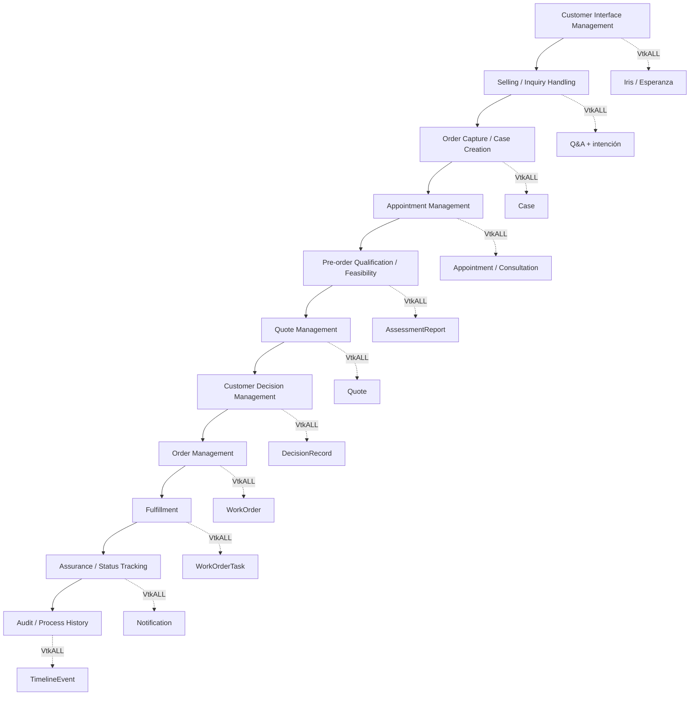
```mermaid
flowchart TD
    A[Customer Interface Management] --> B[Selling / Inquiry Handling]
    B --> C[Order Capture / Case Creation]
    C --> D[Appointment Management]
    D --> E[Pre-order Qualification / Feasibility]
    E --> F[Quote Management]
    F --> G[Customer Decision Management]
    G --> H[Order Management]
    H --> I[Fulfillment]
    I --> J[Assurance / Status Tracking]
    J --> K[Audit / Process History]

    A -. VtkALL .-> A1[Iris / Esperanza]
    B -. VtkALL .-> B1[Q&A + intención]
    C -. VtkALL .-> C1[Case]
    D -. VtkALL .-> D1[Appointment / Consultation]
    E -. VtkALL .-> E1[AssessmentReport]
    F -. VtkALL .-> F1[Quote]
    G -. VtkALL .-> G1[DecisionRecord]
    H -. VtkALL .-> H1[WorkOrder]
    I -. VtkALL .-> I1[WorkOrderTask]
    J -. VtkALL .-> J1[Notification]
    K -. VtkALL .-> K1[TimelineEvent]
```

---

## 3. Principios obligatorios para workflows Temporal

### 3.1. Todo workflow debe tener Case

Ningún workflow operativo relevante debe vivir sin `caseId`.

```text
caseId = correlación operativa principal
workflowId = correlación técnica Temporal
timelineEvent = evidencia humana/auditable
```

### 3.2. Todo workflow debe emitir eventos

Cada workflow debe registrar `TimelineEvent` en hitos relevantes.

Ejemplos:

```text
workflow.started
workflow.step.completed
workflow.waiting_customer
workflow.waiting_staff
workflow.failed
workflow.compensated
workflow.completed
```

### 3.3. Activities, no lógica dura dentro del workflow

Las integraciones y escrituras deben ser Activities:

```text
createOrReuseCustomerActivity
createManagedEntityActivity
createCaseActivity
getAvailabilityActivity
createResourceReservationActivity
createAppointmentActivity
createAssessmentActivity
createAssessmentReportActivity
createQuoteActivity
recordDecisionActivity
createWorkOrderActivity
createTimelineEventActivity
sendNotificationActivity
generatePdfActivity
```

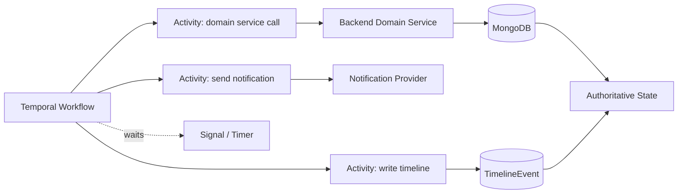
```mermaid
flowchart LR
    W[Temporal Workflow] --> A1[Activity: domain service call]
    A1 --> B[Backend Domain Service]
    B --> C[(MongoDB)]

    W --> A2[Activity: send notification]
    A2 --> N[Notification Provider]

    W --> A3[Activity: write timeline]
    A3 --> T[(TimelineEvent)]

    W -. waits .-> S[Signal / Timer]

    C --> R[Authoritative State]
    T --> R
```

### 3.4. Workflows esperan señales humanas

Toda espera de cliente, agente, técnico, maestro repostero, jefe de taller o staff debe modelarse con signals o timers.

Ejemplos:

```text
customerProvidedMinimumData
customerConfirmedAppointment
technicianSubmittedDiagnostic
masterBakerSubmittedFeasibility
customerAcceptedConcept
customerApprovedQuote
staffApprovedOnBehalfOfCustomer
workOrderTaskCompleted
```

### 3.5. Compensación explícita

Si un workflow reserva capacidad y falla antes de crear la cita, debe liberar la reserva.

Ejemplo:

```text
ResourceReservation held
→ Appointment creation fails
→ release ResourceReservation
→ write timeline event
```

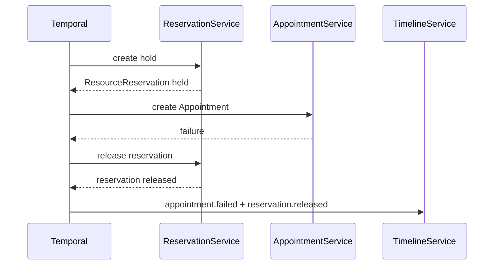
```mermaid
sequenceDiagram
    participant T as Temporal
    participant R as ReservationService
    participant A as AppointmentService
    participant L as TimelineService

    T->>R: create hold
    R-->>T: ResourceReservation held
    T->>A: create Appointment
    A-->>T: failure
    T->>R: release reservation
    R-->>T: reservation released
    T->>L: appointment.failed + reservation.released
```

### 3.6. Idempotencia obligatoria

Cada activity que escriba datos debe aceptar una clave de idempotencia.

Formato sugerido:

```text
{workflowId}:{stepName}:{businessSlug}:{caseId}
```

---

## 4. Mapa eTOM-lite de dominios VtkALL

| Dominio eTOM-lite             | En VtkALL                                        | Entidades                                  | Temporal requerido                  |
| ----------------------------- | ------------------------------------------------ | ------------------------------------------ | ----------------------------------- |
| Customer Interface Management | Conversación con Iris / Esperanza                | CustomerInteraction, Notification          | Sí                                  |
| Selling / Inquiry Handling    | Q&A, captura de intención, selección de offering | CustomerInteraction, CatalogOffering, Case | Sí, si pasa de Q&A a intención      |
| Customer / Party Management   | Registro o reutilización del cliente             | Customer                                   | Sí, cuando sea parte de flujo mayor |
| Product / Asset Context       | Vehículo o solicitud de postre                   | ManagedEntity                              | Sí, cuando sea parte de intake      |
| Appointment Management        | Cita de evaluación / consulta de factibilidad    | Appointment, ResourceReservation           | Sí                                  |
| Qualification / Feasibility   | Diagnóstico técnico o factibilidad repostera     | Assessment, AssessmentReport               | Sí                                  |
| Quote Management              | Crear, revisar, enviar y versionar cotización    | Quote, QuoteLine                           | Sí                                  |
| Customer Decision Management  | Aprobación, rechazo, aceptación conceptual       | DecisionRecord                             | Sí                                  |
| Order Management              | Crear WorkOrder desde Quote aprobada             | WorkOrder                                  | Sí                                  |
| Fulfillment                   | Ejecutar tareas internas                         | WorkOrderTask                              | Sí                                  |
| Assurance / Tracking          | Estados, bloqueos, seguimiento                   | TimelineEvent, Notification                | Sí                                  |
| Billing-readiness             | Adelanto, pago pendiente, condición comercial    | Quote, WorkOrder, Payment futuro           | Sí, cuando se implemente            |

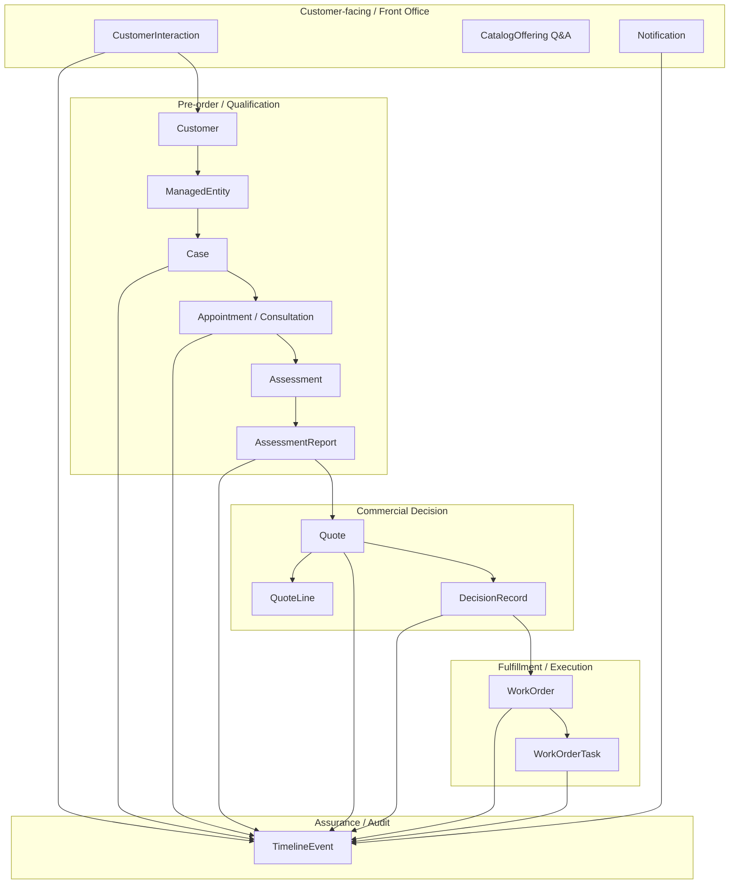
```mermaid
flowchart TB
    subgraph CustomerFacing["Customer-facing / Front Office"]
        A[CustomerInteraction]
        B[CatalogOffering Q&A]
        C[Notification]
    end

    subgraph PreOrder["Pre-order / Qualification"]
        D[Customer]
        E[ManagedEntity]
        F[Case]
        G[Appointment / Consultation]
        H[Assessment]
        I[AssessmentReport]
    end

    subgraph Commercial["Commercial Decision"]
        J[Quote]
        K[QuoteLine]
        L[DecisionRecord]
    end

    subgraph Fulfillment["Fulfillment / Execution"]
        M[WorkOrder]
        N[WorkOrderTask]
    end

    subgraph Audit["Assurance / Audit"]
        O[TimelineEvent]
    end

    A --> D
    D --> E
    E --> F
    F --> G
    G --> H
    H --> I
    I --> J
    J --> K
    J --> L
    L --> M
    M --> N

    A --> O
    F --> O
    G --> O
    I --> O
    J --> O
    L --> O
    M --> O
    N --> O
    C --> O
```

---

# 5. Workflows canónicos sugeridos

## WF-01 — `CustomerInquiryWorkflow`

### Propósito

Gestionar la interacción inicial entre cliente y agente IA.

Aplica a:

```text
Pack 1: Iris / Turagua
Pack 2: Esperanza / BateYLate
```

### eTOM-lite

```text
Customer Interface Management
Selling / Inquiry Handling
```

### Casos de uso cubiertos

```text
USE-01 Q&A del agente IA
USE-02 Registro de cliente
USE-03 Registro de entidad gestionada
USE-04 Crear caso operativo
```

### Disparadores

```text
web_chat.message_received
whatsapp.message_received
manual_console.intake_started
```

### Flujo

```text
1. Registrar CustomerInteraction.
2. Clasificar intención.
3. Si es pregunta curiosa:
   3.1 Consultar CatalogOffering.
   3.2 Responder al cliente.
   3.3 Registrar TimelineEvent opcional.
   3.4 Finalizar como inquiry_answered.
4. Si hay intención operativa:
   4.1 Solicitar datos mínimos.
   4.2 Crear o reutilizar Customer.
   4.3 Crear ManagedEntity.
   4.4 Crear Case.
   4.5 Registrar TimelineEvent.
   4.6 Derivar al workflow correspondiente.
```

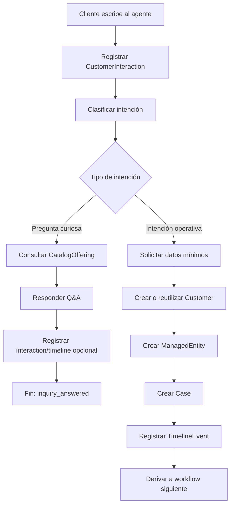
```mermaid
flowchart TD
    A[Cliente escribe al agente] --> B[Registrar CustomerInteraction]
    B --> C[Clasificar intención]
    C --> D{Tipo de intención}

    D -->|Pregunta curiosa| E[Consultar CatalogOffering]
    E --> F[Responder Q&A]
    F --> G[Registrar interaction/timeline opcional]
    G --> H[Fin: inquiry_answered]

    D -->|Intención operativa| I[Solicitar datos mínimos]
    I --> J[Crear o reutilizar Customer]
    J --> K[Crear ManagedEntity]
    K --> L[Crear Case]
    L --> M[Registrar TimelineEvent]
    M --> N[Derivar a workflow siguiente]
```

### Signals

```text
customerProvidedContactData
customerProvidedManagedEntityData
customerSelectedOffering
customerClarifiedIntent
```

### Estados sugeridos

```text
started
waiting_minimum_data
customer_identified
managed_entity_created
case_created
routed_to_next_workflow
closed_as_qa
failed
```

---

## WF-02 — `AppointmentSchedulingWorkflow`

### Propósito

Agendar citas o consultas con bloqueo real de capacidad.

Aplica a:

```text
Pack 1: cita de evaluación vehicular
Pack 2: consulta de factibilidad
```

### eTOM-lite

```text
Appointment Management
Order Capture support
Customer Notification
```

### Casos de uso cubiertos

```text
USE-05 Agendar cita/consulta
USE-06 Confirmar cita/consulta
```

### Regla crítica

```text
Appointment agenda al cliente.
ResourceReservation bloquea capacidad real.
```

### Flujo

```text
1. Recibir caseId, customerId, managedEntityId, selectedOfferingId.
2. Pedir a backend disponibilidad.
3. Entregar slots al agente o frontend.
4. Esperar selección del cliente.
5. Crear ResourceReservation en estado held.
6. Crear Appointment vinculada a ResourceReservation.
7. Confirmar ResourceReservation como booked.
8. Enviar notificación de cita.
9. Esperar confirmación del cliente si aplica.
10. Actualizar Case status.
11. Registrar TimelineEvent.
```

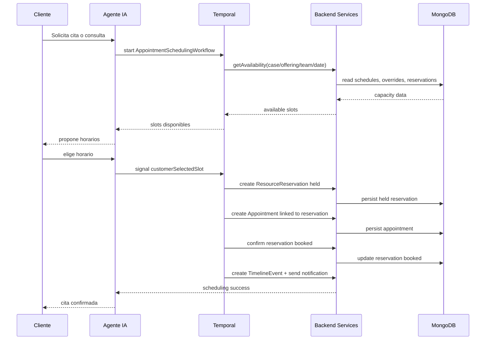
```mermaid
sequenceDiagram
    participant C as Cliente
    participant AG as Agente IA
    participant T as Temporal
    participant B as Backend Services
    participant DB as MongoDB

    C->>AG: Solicita cita o consulta
    AG->>T: start AppointmentSchedulingWorkflow
    T->>B: getAvailability(case/offering/team/date)
    B->>DB: read schedules, overrides, reservations
    DB-->>B: capacity data
    B-->>T: available slots
    T-->>AG: slots disponibles
    AG-->>C: propone horarios
    C->>AG: elige horario
    AG->>T: signal customerSelectedSlot
    T->>B: create ResourceReservation held
    B->>DB: persist held reservation
    T->>B: create Appointment linked to reservation
    B->>DB: persist appointment
    T->>B: confirm reservation booked
    B->>DB: update reservation booked
    T->>B: create TimelineEvent + send notification
    B-->>AG: scheduling success
    AG-->>C: cita confirmada
```

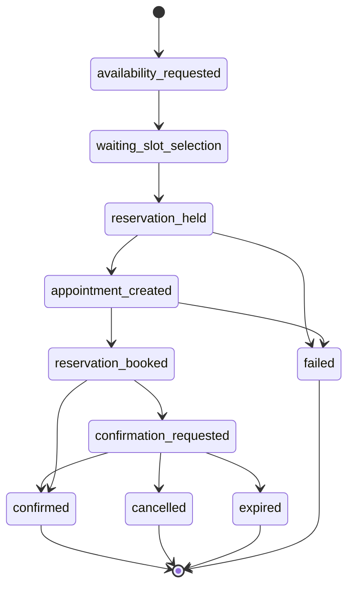
```mermaid
stateDiagram-v2
    [*] --> availability_requested
    availability_requested --> waiting_slot_selection
    waiting_slot_selection --> reservation_held
    reservation_held --> appointment_created
    appointment_created --> reservation_booked
    reservation_booked --> confirmation_requested
    confirmation_requested --> confirmed
    confirmation_requested --> cancelled
    confirmation_requested --> expired
    reservation_booked --> confirmed
    confirmed --> [*]
    cancelled --> [*]
    expired --> [*]
    reservation_held --> failed
    appointment_created --> failed
    failed --> [*]
```

### Signals

```text
customerSelectedSlot
customerConfirmedAppointment
customerRequestedReschedule
customerCancelledAppointment
```

### Timers

```text
holdExpirationTimer
appointmentReminderTimer
confirmationTimeoutTimer
```

### Compensaciones

```text
Si Appointment falla:
  release ResourceReservation

Si cliente no confirma:
  marcar appointment.pending_confirmation o cancelar según profile

Si cliente reagenda:
  cancelar reservation anterior
  crear nueva reservation
```

---

## WF-03 — `AssessmentIntakeWorkflow`

### Propósito

Preparar la evaluación técnica o factibilidad.

Aplica a:

```text
Pack 1: evaluación vehicular presencial, fotos o teléfono
Pack 2: evaluación de factibilidad con brief/referencias
```

### eTOM-lite

```text
Pre-order Qualification
Feasibility / Assessment
```

### Casos de uso cubiertos

```text
USE-07 Evaluación con fotos
USE-08 Evaluación telefónica
USE-09 Diagnóstico técnico
USE-10 Informe de factibilidad
```

### Flujo

```text
1. Validar Case.
2. Validar ManagedEntity.
3. Crear Assessment.
4. Adjuntar evidencias si existen.
5. Asignar team/worker según CatalogOffering.
6. Notificar al técnico o maestro repostero.
7. Registrar TimelineEvent.
8. Esperar inicio de evaluación.
```

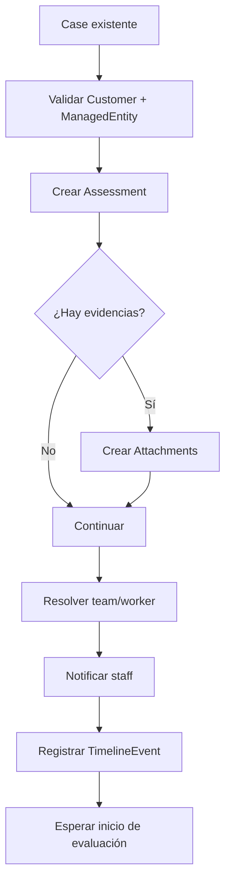
```mermaid
flowchart TD
    A[Case existente] --> B[Validar Customer + ManagedEntity]
    B --> C[Crear Assessment]
    C --> D{¿Hay evidencias?}
    D -->|Sí| E[Crear Attachments]
    D -->|No| F[Continuar]
    E --> F
    F --> G[Resolver team/worker]
    G --> H[Notificar staff]
    H --> I[Registrar TimelineEvent]
    I --> J[Esperar inicio de evaluación]
```

---

## WF-04 — `DiagnosticAssessmentWorkflow`

### Propósito

Gestionar diagnóstico técnico para Turagua / Pack 1.

### eTOM-lite

```text
Qualification
Assurance-like technical evaluation
Quote preparation
```

### Casos de uso cubiertos

```text
USE-09 Diagnóstico técnico
USE-15 Cotización formal
USE-24 Historial
USE-25 Timeline/auditoría
```

### Flujo

```text
1. Esperar diagnóstico del técnico.
2. Registrar hallazgos.
3. Adjuntar evidencias.
4. Crear AssessmentReport reportType=diagnostic.
5. Determinar si puede pasar a cotización.
6. Si canProceedToQuote=true:
   6.1 Emitir assessment_report.ready_for_quote.
   6.2 Disparar QuoteWorkflow.
7. Si no:
   7.1 Solicitar más información o cerrar sin cotización.
8. Registrar TimelineEvent.
```

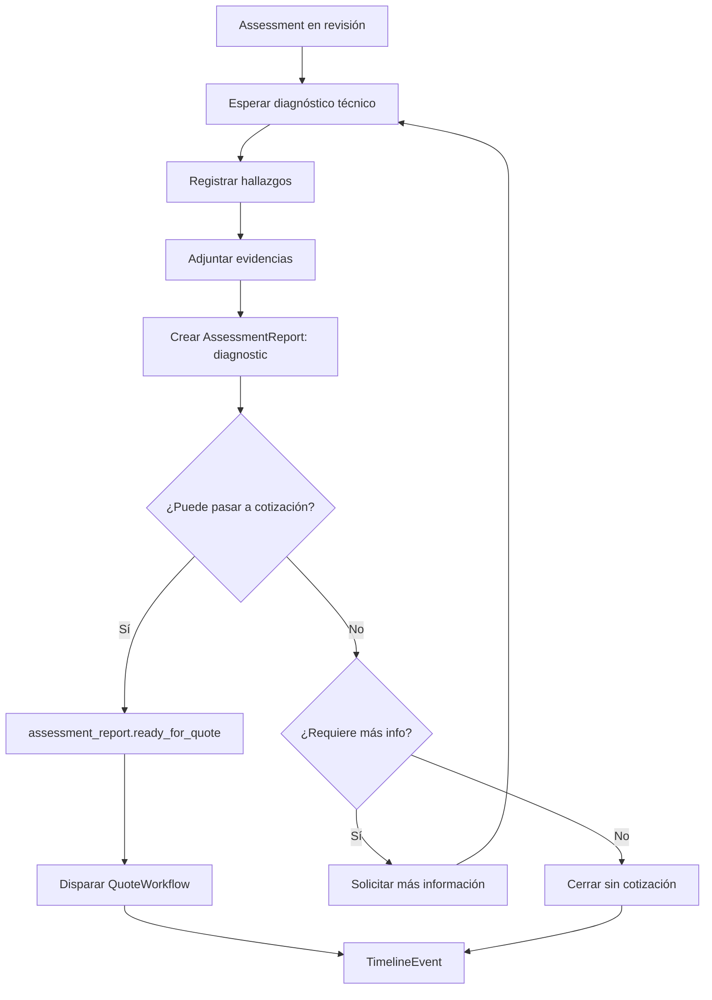
```mermaid
flowchart TD
    A[Assessment en revisión] --> B[Esperar diagnóstico técnico]
    B --> C[Registrar hallazgos]
    C --> D[Adjuntar evidencias]
    D --> E[Crear AssessmentReport: diagnostic]
    E --> F{¿Puede pasar a cotización?}
    F -->|Sí| G[assessment_report.ready_for_quote]
    G --> H[Disparar QuoteWorkflow]
    F -->|No| I{¿Requiere más info?}
    I -->|Sí| J[Solicitar más información]
    J --> B
    I -->|No| K[Cerrar sin cotización]
    H --> L[TimelineEvent]
    K --> L
```

---

## WF-05 — `FeasibilityAssessmentWorkflow`

### Propósito

Gestionar factibilidad de pedidos personalizados para BateYLate / Pack 2.

### eTOM-lite

```text
Pre-order Feasibility
Qualification
Customer negotiation support
```

### Casos de uso cubiertos

```text
USE-10 Informe de factibilidad
USE-11 Factibilidad positiva
USE-12 Factibilidad negativa
USE-13 Factibilidad reformulada
USE-14 Validación conceptual
```

### Flujo

```text
1. Esperar respuesta del maestro repostero.
2. Crear AssessmentReport reportType=feasibility.
3. Clasificar resultado:
   - feasible_as_requested
   - not_feasible
   - feasible_with_changes
4. Si feasible_as_requested:
   4.1 Marcar ready_for_quote.
   4.2 Disparar QuoteWorkflow.
5. Si not_feasible:
   5.1 Notificar al cliente.
   5.2 Cerrar Case como closed_lost o closed_without_quote.
6. Si feasible_with_changes:
   6.1 Comunicar reformulación al cliente.
   6.2 Esperar aceptación conceptual.
   6.3 Si acepta, registrar DecisionRecord concept_approval.
   6.4 Marcar ready_for_quote.
   6.5 Disparar QuoteWorkflow.
   6.6 Si rechaza, cerrar sin cotización.
```

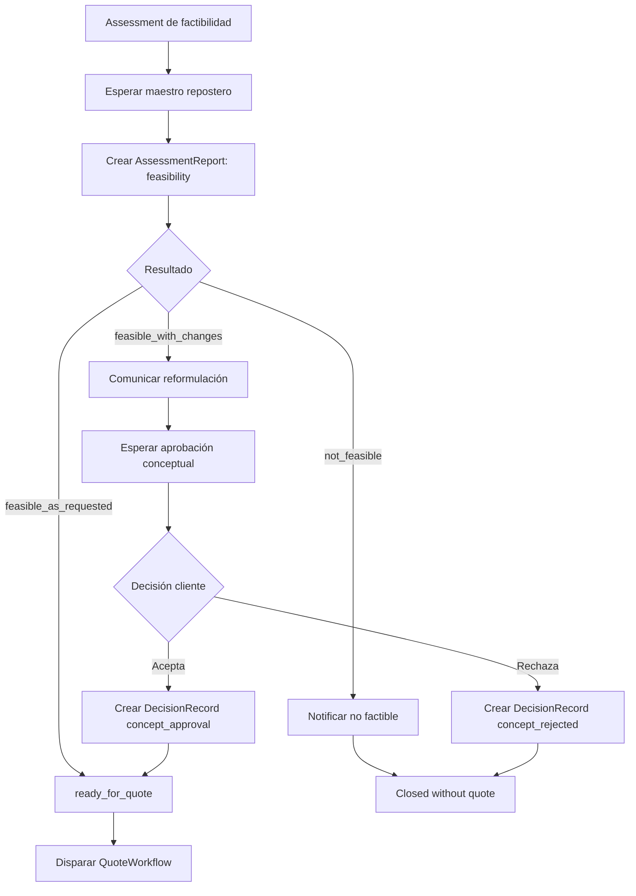
```mermaid
flowchart TD
    A[Assessment de factibilidad] --> B[Esperar maestro repostero]
    B --> C[Crear AssessmentReport: feasibility]
    C --> D{Resultado}

    D -->|feasible_as_requested| E[ready_for_quote]
    E --> F[Disparar QuoteWorkflow]

    D -->|not_feasible| G[Notificar no factible]
    G --> H[Closed without quote]

    D -->|feasible_with_changes| I[Comunicar reformulación]
    I --> J[Esperar aprobación conceptual]
    J --> K{Decisión cliente}

    K -->|Acepta| L[Crear DecisionRecord concept_approval]
    L --> E

    K -->|Rechaza| M[Crear DecisionRecord concept_rejected]
    M --> H
```

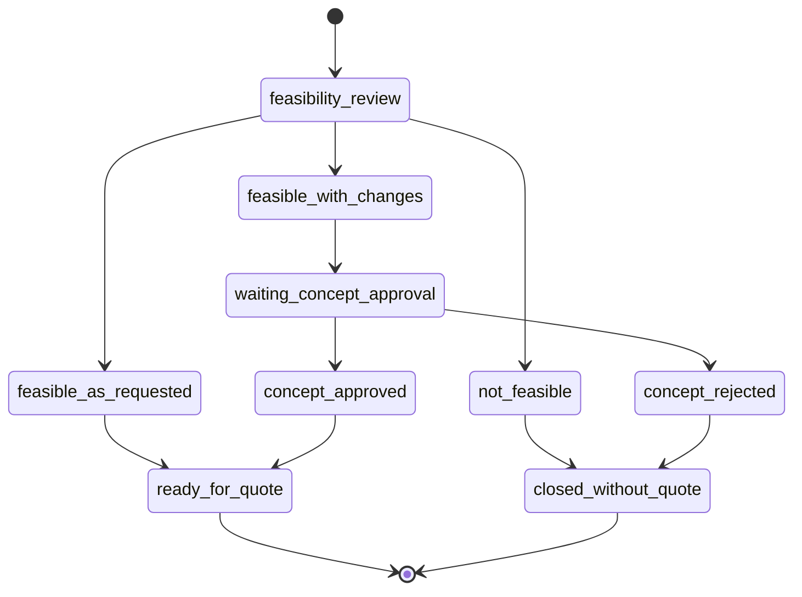
```mermaid
stateDiagram-v2
    [*] --> feasibility_review
    feasibility_review --> feasible_as_requested
    feasibility_review --> not_feasible
    feasibility_review --> feasible_with_changes

    feasible_as_requested --> ready_for_quote
    ready_for_quote --> [*]

    not_feasible --> closed_without_quote
    closed_without_quote --> [*]

    feasible_with_changes --> waiting_concept_approval
    waiting_concept_approval --> concept_approved
    waiting_concept_approval --> concept_rejected

    concept_approved --> ready_for_quote
    concept_rejected --> closed_without_quote
```

### Regla crítica

```text
No Quote para BateYLate sin factibilidad positiva o reformulación aceptada.
```

---

## WF-06 — `QuoteWorkflow`

### Propósito

Crear, revisar, enviar, versionar y dejar lista la cotización.

Aplica a:

```text
Pack 1: cotización desde diagnóstico técnico
Pack 2: cotización desde factibilidad positiva o reformulada aprobada
```

### eTOM-lite

```text
Quote Management
Order negotiation
```

### Casos de uso cubiertos

```text
USE-15 Cotización formal
USE-16 Cotización con múltiples ítems
USE-17 Presupuesto interno vs cliente
USE-18 Envío de cotización/PDF
```

### Flujo

```text
1. Validar AssessmentReport fuente.
2. Crear Quote draft.
3. Crear QuoteLines.
4. Calcular totales mediante backend service.
5. Esperar revisión interna si aplica.
6. Aprobar internamente.
7. Generar PDF si aplica.
8. Enviar cotización al cliente.
9. Registrar Notification.
10. Registrar TimelineEvent.
11. Disparar QuoteDecisionWorkflow.
```

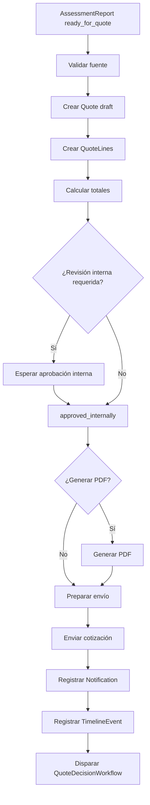
```mermaid
flowchart TD
    A[AssessmentReport ready_for_quote] --> B[Validar fuente]
    B --> C[Crear Quote draft]
    C --> D[Crear QuoteLines]
    D --> E[Calcular totales]
    E --> F{¿Revisión interna requerida?}
    F -->|Sí| G[Esperar aprobación interna]
    G --> H[approved_internally]
    F -->|No| H
    H --> I{¿Generar PDF?}
    I -->|Sí| J[Generar PDF]
    I -->|No| K[Preparar envío]
    J --> K
    K --> L[Enviar cotización]
    L --> M[Registrar Notification]
    M --> N[Registrar TimelineEvent]
    N --> O[Disparar QuoteDecisionWorkflow]
```

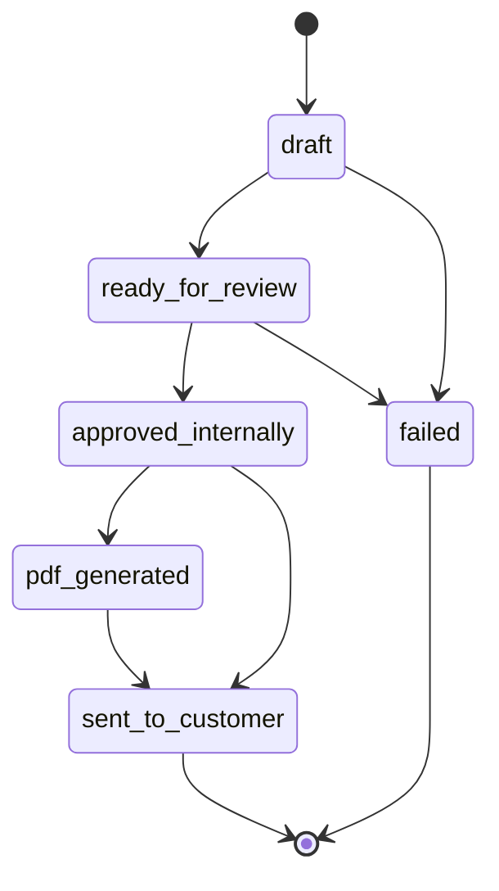
```mermaid
stateDiagram-v2
    [*] --> draft
    draft --> ready_for_review
    ready_for_review --> approved_internally
    approved_internally --> pdf_generated
    approved_internally --> sent_to_customer
    pdf_generated --> sent_to_customer
    sent_to_customer --> [*]
    draft --> failed
    ready_for_review --> failed
    failed --> [*]
```

---

## WF-07 — `QuoteDecisionWorkflow`

### Propósito

Gestionar aceptación, rechazo, expiración o aprobación asistida de cotización.

### eTOM-lite

```text
Customer Order Capture
Customer Acceptance
Order Negotiation
```

### Casos de uso cubiertos

```text
USE-19 Aprobación/rechazo
USE-20 Aprobación en nombre del cliente
USE-21 Work Order
```

### Flujo

```text
1. Esperar decisión del cliente.
2. Si acepta:
   2.1 Crear DecisionRecord quote_approval accepted.
   2.2 Marcar Quote accepted.
   2.3 Disparar WorkOrderLifecycleWorkflow.
3. Si rechaza:
   3.1 Crear DecisionRecord quote_approval rejected.
   3.2 Marcar Quote rejected.
   3.3 Cerrar o reabrir negociación según profile.
4. Si expira:
   4.1 Marcar Quote expired.
   4.2 Notificar al cliente o staff.
5. Si staff aprueba en nombre del cliente:
   5.1 Exigir evidence y notes.
   5.2 Crear DecisionRecord con decidedBy=staff_on_behalf_of_customer.
```

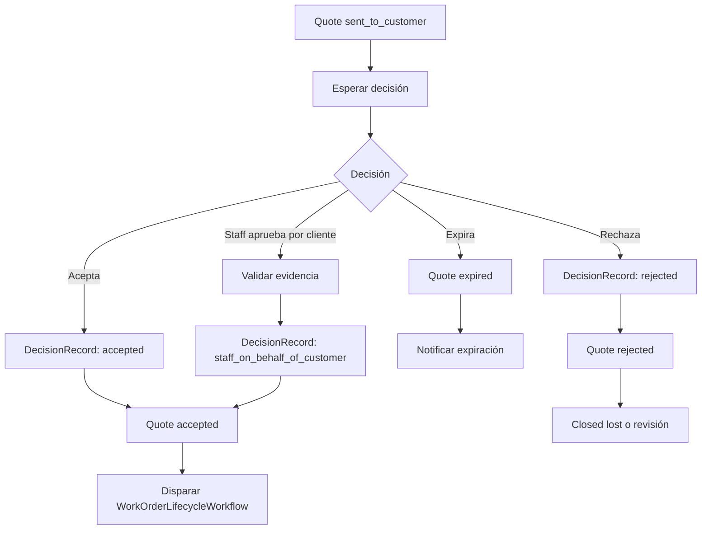
```mermaid
flowchart TD
    A[Quote sent_to_customer] --> B[Esperar decisión]
    B --> C{Decisión}

    C -->|Acepta| D[DecisionRecord: accepted]
    D --> E[Quote accepted]
    E --> F[Disparar WorkOrderLifecycleWorkflow]

    C -->|Rechaza| G[DecisionRecord: rejected]
    G --> H[Quote rejected]
    H --> I[Closed lost o revisión]

    C -->|Expira| J[Quote expired]
    J --> K[Notificar expiración]

    C -->|Staff aprueba por cliente| L[Validar evidencia]
    L --> M[DecisionRecord: staff_on_behalf_of_customer]
    M --> E
```

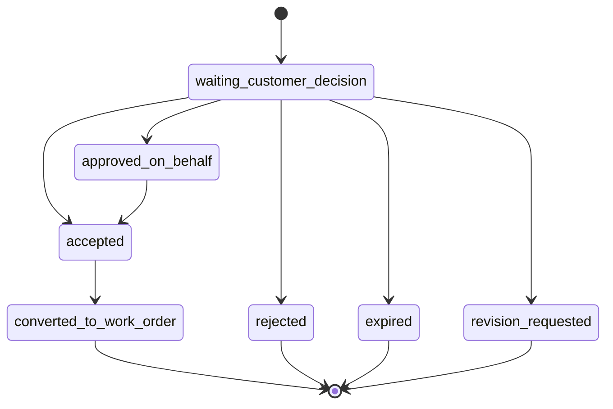
```mermaid
stateDiagram-v2
    [*] --> waiting_customer_decision
    waiting_customer_decision --> accepted
    waiting_customer_decision --> rejected
    waiting_customer_decision --> expired
    waiting_customer_decision --> revision_requested
    waiting_customer_decision --> approved_on_behalf

    approved_on_behalf --> accepted
    accepted --> converted_to_work_order
    converted_to_work_order --> [*]

    rejected --> [*]
    expired --> [*]
    revision_requested --> [*]
```

### Regla crítica

```text
Toda aceptación, rechazo o aprobación asistida debe crear DecisionRecord.
```

---

## WF-08 — `WorkOrderLifecycleWorkflow`

### Propósito

Crear y gestionar la WorkOrder desde cotización aprobada hasta cierre.

Aplica a:

```text
Pack 1: Orden de taller
Pack 2: Orden de producción
```

### eTOM-lite

```text
Order Management
Fulfillment
Work Execution
```

### Casos de uso cubiertos

```text
USE-21 Work Order
USE-22 Tareas internas
USE-23 Estado visible al cliente
USE-24 Historial
USE-25 Timeline/auditoría
```

### Flujo

```text
1. Validar Quote accepted.
2. Crear WorkOrder.
3. Crear WorkOrderTasks desde CatalogOffering o QuoteLines.
4. Asignar team/worker.
5. Registrar TimelineEvent.
6. Notificar ingreso a taller/producción.
7. Esperar admisión o inicio operativo.
8. Gestionar avance de tareas.
9. Detectar bloqueos.
10. Notificar avances relevantes.
11. Marcar WorkOrder completed.
12. Marcar delivered si aplica.
13. Cerrar Case.
```

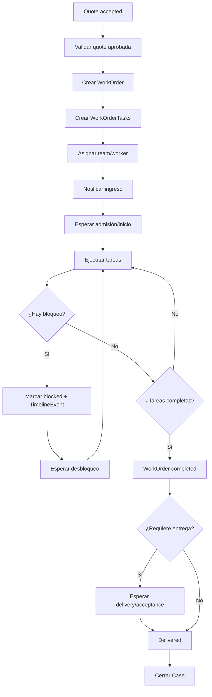
```mermaid
flowchart TD
    A[Quote accepted] --> B[Validar quote aprobada]
    B --> C[Crear WorkOrder]
    C --> D[Crear WorkOrderTasks]
    D --> E[Asignar team/worker]
    E --> F[Notificar ingreso]
    F --> G[Esperar admisión/inicio]
    G --> H[Ejecutar tareas]
    H --> I{¿Hay bloqueo?}
    I -->|Sí| J[Marcar blocked + TimelineEvent]
    J --> K[Esperar desbloqueo]
    K --> H
    I -->|No| L{¿Tareas completas?}
    L -->|No| H
    L -->|Sí| M[WorkOrder completed]
    M --> N{¿Requiere entrega?}
    N -->|Sí| O[Esperar delivery/acceptance]
    O --> P[Delivered]
    N -->|No| P
    P --> Q[Cerrar Case]
```

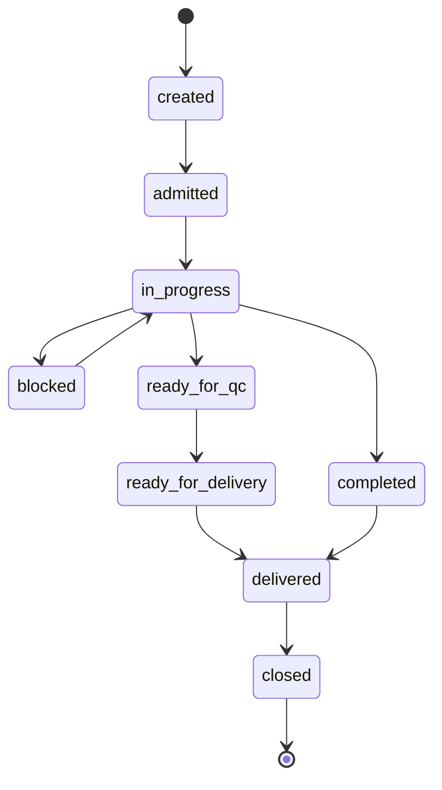
```mermaid
stateDiagram-v2
    [*] --> created
    created --> admitted
    admitted --> in_progress
    in_progress --> blocked
    blocked --> in_progress
    in_progress --> ready_for_qc
    ready_for_qc --> ready_for_delivery
    ready_for_delivery --> delivered
    in_progress --> completed
    completed --> delivered
    delivered --> closed
    closed --> [*]
```

### Reglas críticas

```text
No WorkOrder sin Quote aprobada.
Toda tarea completada debe generar TimelineEvent.
Todo bloqueo debe generar estado visible o interno.
```

---

## WF-09 — `NotificationWorkflow`

### Propósito

Gestionar notificaciones repetitivas, recordatorios, reintentos y mensajes de estado.

### eTOM-lite

```text
Customer Notification
Assurance / Status Tracking
Customer Relationship Management
```

### Casos de uso cubiertos

```text
USE-06 Confirmar cita/consulta
USE-18 Envío de cotización/PDF
USE-23 Estado visible al cliente
USE-26 Notificaciones
```

### Flujo

```text
1. Recibir notification request.
2. Resolver template.
3. Validar canal.
4. Enviar mensaje.
5. Reintentar si falla.
6. Registrar provider message id.
7. Registrar TimelineEvent.
8. Marcar delivered/read si hay webhook futuro.
```

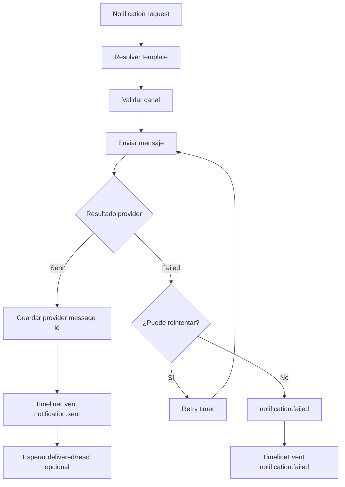
```mermaid
flowchart TD
    A[Notification request] --> B[Resolver template]
    B --> C[Validar canal]
    C --> D[Enviar mensaje]
    D --> E{Resultado provider}
    E -->|Sent| F[Guardar provider message id]
    F --> G[TimelineEvent notification.sent]
    G --> H[Esperar delivered/read opcional]

    E -->|Failed| I{¿Puede reintentar?}
    I -->|Sí| J[Retry timer]
    J --> D
    I -->|No| K[notification.failed]
    K --> L[TimelineEvent notification.failed]
```

---

## WF-10 — `CaseTimelineAuditWorkflow`

### Propósito

Garantizar historial auditable para cada Case.

### eTOM-lite

```text
Assurance
Process Tracking
Audit
```

### Casos de uso cubiertos

```text
USE-24 Historial
USE-25 Timeline/auditoría
```

### Flujo

```text
1. Escuchar eventos de dominio.
2. Normalizar TimelineEvent.
3. Persistir evento.
4. Asociar a caseId, customerId, managedEntityId y entity relacionada.
5. Exponer timeline al frontend.
```

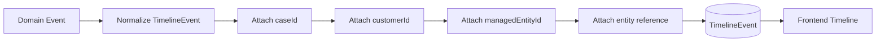
```mermaid
flowchart LR
    A[Domain Event] --> B[Normalize TimelineEvent]
    B --> C[Attach caseId]
    C --> D[Attach customerId]
    D --> E[Attach managedEntityId]
    E --> F[Attach entity reference]
    F --> G[(TimelineEvent)]
    G --> H[Frontend Timeline]
```

---

## WF-11 — `CapacityReservationWorkflow`

### Propósito

Gestionar reservas de capacidad para equipos.

### eTOM-lite

```text
Resource Management
Workforce / Capacity Management
Appointment Management
```

### Casos de uso cubiertos

```text
USE-05 Agendar cita/consulta
USE-06 Confirmar cita/consulta
USE-27 Catálogo como fuente
```

### Flujo

```text
1. Recibir teamId, durationMinutes, date/time, offeringId.
2. Calcular disponibilidad desde WorkTeamScheduleRule.
3. Aplicar WorkTeamScheduleOverride.
4. Restar ResourceReservations held/booked.
5. Crear hold.
6. Confirmar booked cuando Appointment se cree.
7. Expirar hold si no se confirma.
8. Liberar reserva ante cancelación o error.
```

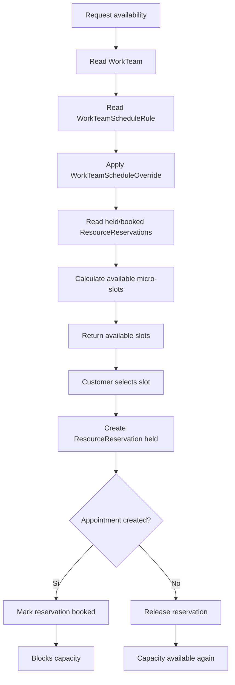
```mermaid
flowchart TD
    A[Request availability] --> B[Read WorkTeam]
    B --> C[Read WorkTeamScheduleRule]
    C --> D[Apply WorkTeamScheduleOverride]
    D --> E[Read held/booked ResourceReservations]
    E --> F[Calculate available micro-slots]
    F --> G[Return available slots]
    G --> H[Customer selects slot]
    H --> I[Create ResourceReservation held]
    I --> J{Appointment created?}
    J -->|Sí| K[Mark reservation booked]
    J -->|No| L[Release reservation]
    K --> M[Blocks capacity]
    L --> N[Capacity available again]
```

```mermaid
stateDiagram-v2
    [*] --> availability_checked
    availability_checked --> held
    held --> booked
    held --> released
    held --> expired
    booked --> cancelled
    booked --> [*]
    released --> [*]
    expired --> [*]
    cancelled --> [*]
```

### Regla crítica

```text
Solo ResourceReservation held/booked bloquea capacidad.
```

---

## WF-12 — `CatalogOfferingSyncWorkflow`

### Propósito

Mantener el catálogo como fuente comercial-operativa para agente, cotización y tareas.

### eTOM-lite

```text
Product Catalog Management
Selling Support
Fulfillment Preparation
```

### Casos de uso cubiertos

```text
USE-01 Q&A del agente IA
USE-05 Agendar cita/consulta
USE-16 Cotización con múltiples ítems
USE-22 Tareas internas
USE-27 Catálogo como fuente
```

### Flujo

```text
1. Leer CatalogOffering activo.
2. Exponer offerings visibles al agente.
3. Resolver suggestedTeamId y estimatedDurationMinutes.
4. Alimentar disponibilidad.
5. Alimentar QuoteLine.
6. Alimentar WorkOrderTask templates.
```

```mermaid
flowchart TD
    A[CatalogOffering] --> B[Agente IA Q&A]
    A --> C[Availability]
    A --> D[QuoteLine]
    A --> E[WorkOrderTask templates]

    B --> F[Cliente entiende oferta]
    C --> G[Reserva capacidad]
    D --> H[Cotización]
    E --> I[Ejecución operativa]
```

---

# 6. Workflows por vertical

## 6.1. Pack 1 — Turagua / Iris

### Flujo principal

```text
CustomerInquiryWorkflow
→ AppointmentSchedulingWorkflow
→ AssessmentIntakeWorkflow
→ DiagnosticAssessmentWorkflow
→ QuoteWorkflow
→ QuoteDecisionWorkflow
→ WorkOrderLifecycleWorkflow
→ NotificationWorkflow
→ CaseTimelineAuditWorkflow
```

```mermaid
flowchart TD
    A[Cliente conversa con Iris] --> B[CustomerInquiryWorkflow]
    B --> C[AppointmentSchedulingWorkflow]
    C --> D[AssessmentIntakeWorkflow]
    D --> E[DiagnosticAssessmentWorkflow]
    E --> F[QuoteWorkflow]
    F --> G[QuoteDecisionWorkflow]
    G --> H[WorkOrderLifecycleWorkflow]
    H --> I[NotificationWorkflow]
    H --> J[CaseTimelineAuditWorkflow]
    I --> J
```

### Reglas Pack 1

```text
No Quote sin diagnóstico listo.
No WorkOrder sin Quote aprobada.
La cita presencial debe reservar capacidad real si ocupa equipo.
La evaluación con fotos puede crear Assessment sin Appointment presencial.
Toda aceptación de cotización debe ser DecisionRecord.
Todo cambio importante debe ir a TimelineEvent.
```

---

## 6.2. Pack 2 — BateYLate / Esperanza

### Flujo principal

```text
CustomerInquiryWorkflow
→ AppointmentSchedulingWorkflow opcional
→ AssessmentIntakeWorkflow
→ FeasibilityAssessmentWorkflow
→ QuoteWorkflow
→ QuoteDecisionWorkflow
→ WorkOrderLifecycleWorkflow
→ NotificationWorkflow
→ CaseTimelineAuditWorkflow
```

```mermaid
flowchart TD
    A[Cliente conversa con Esperanza] --> B[CustomerInquiryWorkflow]
    B --> C{¿Consulta agendada?}
    C -->|Sí| D[AppointmentSchedulingWorkflow]
    C -->|No / asíncrona| E[AssessmentIntakeWorkflow]
    D --> E
    E --> F[FeasibilityAssessmentWorkflow]
    F --> G{Resultado factibilidad}
    G -->|Positiva| H[QuoteWorkflow]
    G -->|Reformulada aceptada| H
    G -->|Negativa / rechazada| X[Closed without quote]
    H --> I[QuoteDecisionWorkflow]
    I --> J[WorkOrderLifecycleWorkflow]
    J --> K[NotificationWorkflow]
    J --> L[CaseTimelineAuditWorkflow]
    K --> L
```

### Reglas Pack 2

```text
No Quote sin AssessmentReport reportType=feasibility.
Factibilidad negativa no genera Quote.
Factibilidad reformulada requiere DecisionRecord concept_approval accepted.
No Production WorkOrder sin Quote aprobada.
Toda aprobación en nombre del cliente debe guardar evidencia.
Toda entrega debe notificar estado visible al cliente.
```

---

# 7. Ejemplo detallado — Agendar cita de evaluación

Este workflow sigue el ejemplo solicitado.

### Nombre

```text
AppointmentSchedulingWorkflow
```

### Actores

```text
Cliente
Agente IA
Backend Domain Services
Temporal
MongoDB
Notification Provider
```

### Secuencia

```text
1. Cliente habla con el agente.
2. Agente registra CustomerInteraction.
3. Agente consulta rápido a Temporal indicando que comenzará un flow.
4. Temporal inicia CustomerInquiryWorkflow o AppointmentSchedulingWorkflow.
5. Temporal ejecuta activity para consultar servicios disponibles desde CatalogOffering.
6. Backend devuelve servicios disponibles.
7. Temporal entrega esa respuesta al agente.
8. Agente responde al cliente en base a los servicios.
9. Workflow queda esperando respuesta del cliente.
10. Cliente responde.
11. Agente clasifica:
    - pregunta curiosa
    - intención de agendamiento
12. Si es pregunta curiosa:
    - responder
    - registrar interaction
    - cerrar como inquiry_answered
13. Si hay posible agendamiento:
    - Temporal solicita datos mínimos necesarios.
14. Agente pide esos datos al cliente.
15. Cliente entrega datos.
16. Temporal orquesta:
    - createOrReuseCustomer
    - createManagedEntity
    - createCase
    - getAvailability
17. Agente muestra slots disponibles.
18. Cliente elige slot.
19. Temporal orquesta:
    - createResourceReservation held
    - createAppointment
    - confirm ResourceReservation booked
    - create TimelineEvent
    - sendNotification
20. Fin del flujo de agendamiento.
```

```mermaid
sequenceDiagram
    participant C as Cliente
    participant AG as Agente IA
    participant T as Temporal
    participant B as Backend
    participant DB as MongoDB
    participant N as Notificaciones

    C->>AG: Consulta sobre servicios
    AG->>T: start flow
    T->>B: getCatalogOfferings
    B->>DB: read CatalogOffering
    DB-->>B: offerings activos
    B-->>T: servicios disponibles
    T-->>AG: servicios para responder
    AG-->>C: responde con servicios

    C->>AG: quiero agendar
    AG->>T: signal scheduling_intent_detected
    T-->>AG: pedir datos mínimos
    AG-->>C: solicita datos
    C->>AG: entrega datos
    AG->>T: signal customerProvidedMinimumData

    T->>B: createOrReuseCustomer
    B->>DB: upsert Customer
    T->>B: createManagedEntity
    B->>DB: insert ManagedEntity
    T->>B: createCase
    B->>DB: insert Case

    T->>B: getAvailability
    B->>DB: schedules + overrides + reservations
    B-->>T: available slots
    T-->>AG: mostrar slots
    AG-->>C: propone horarios
    C->>AG: elige horario
    AG->>T: signal customerSelectedSlot

    T->>B: createResourceReservation held
    B->>DB: insert held reservation
    T->>B: createAppointment
    B->>DB: insert Appointment
    T->>B: confirm reservation booked
    B->>DB: update booked

    T->>B: create TimelineEvent
    B->>DB: insert TimelineEvent
    T->>N: send confirmation
    N-->>C: cita confirmada
```

### Datos mínimos sugeridos Pack 1

```text
Nombre
Teléfono
Servicio de interés
Vehículo: marca/modelo/año/placa opcional
Modalidad: presencial/fotos/teléfono
Fecha o rango deseado
```

### Datos mínimos sugeridos Pack 2

```text
Nombre
Teléfono
Tipo de postre
Ocasión
Fecha deseada
Porciones
Referencias/fotos si aplica
Restricciones
Modo de entrega o recojo
```

---

# 8. Workflows que NO deben existir como workflows independientes todavía

Para evitar sobrearquitectura, estos no deberían ser workflows separados al inicio:

```text
CustomerCreationWorkflow aislado
ManagedEntityCreationWorkflow aislado
TimelineOnlyWorkflow por cada evento
PdfOnlyWorkflow
SingleNotificationWorkflow para mensajes simples no críticos
FrontendStepWorkflow
ColorStatusWorkflow
```

Deben ser Activities o subrutinas dentro de workflows mayores.

```mermaid
flowchart TD
    A[Workflow grande con sentido de negocio] --> B[Activity: create customer]
    A --> C[Activity: create managed entity]
    A --> D[Activity: create timeline]
    A --> E[Activity: send notification]
    A --> F[Activity: generate PDF]

    X[No crear workflow aislado por cada CRUD]:::bad
    Y[No crear workflow por cada pantalla frontend]:::bad

    classDef bad fill:#ffe6e6,stroke:#cc0000,color:#660000;
```

---

# 9. Matriz de prioridad de implementación

## Fase 1 — Base durable mínima

```text
1. CustomerInquiryWorkflow
2. AppointmentSchedulingWorkflow
3. CapacityReservationWorkflow
4. CaseTimelineAuditWorkflow
```

Objetivo:

```text
Demostrar intake + caso + reserva + cita + timeline.
```

## Fase 2 — Pre-order / Assessment

```text
5. AssessmentIntakeWorkflow
6. DiagnosticAssessmentWorkflow
7. FeasibilityAssessmentWorkflow
```

Objetivo:

```text
Separar evaluación, diagnóstico y factibilidad.
```

## Fase 3 — Quote / Decision

```text
8. QuoteWorkflow
9. QuoteDecisionWorkflow
```

Objetivo:

```text
Formalizar cotización, aprobación, rechazo y expiración.
```

## Fase 4 — Fulfillment

```text
10. WorkOrderLifecycleWorkflow
11. NotificationWorkflow
```

Objetivo:

```text
Convertir cotización aprobada en ejecución real.
```

## Fase 5 — Optimización

```text
12. CatalogOfferingSyncWorkflow
13. Workflow health dashboards
14. Retry/dead-letter views
15. SLA timers
```

```mermaid
gantt
    title Roadmap de Workflows Temporal VtkALL
    dateFormat  YYYY-MM-DD
    axisFormat  %d/%m

    section Fase 1 - Base durable
    CustomerInquiryWorkflow        :a1, 2026-07-10, 3d
    AppointmentSchedulingWorkflow  :a2, after a1, 4d
    CapacityReservationWorkflow    :a3, after a1, 4d
    CaseTimelineAuditWorkflow      :a4, after a2, 2d

    section Fase 2 - Assessment
    AssessmentIntakeWorkflow       :b1, after a4, 3d
    DiagnosticAssessmentWorkflow   :b2, after b1, 3d
    FeasibilityAssessmentWorkflow  :b3, after b1, 3d

    section Fase 3 - Quote / Decision
    QuoteWorkflow                  :c1, after b2, 4d
    QuoteDecisionWorkflow          :c2, after c1, 3d

    section Fase 4 - Fulfillment
    WorkOrderLifecycleWorkflow     :d1, after c2, 5d
    NotificationWorkflow           :d2, after c2, 3d

    section Fase 5 - Optimización
    CatalogOfferingSyncWorkflow    :e1, after d1, 3d
    Workflow health dashboards     :e2, after e1, 3d
```

---

# 10. Lista final de workflows sugeridos

```text
WF-01 CustomerInquiryWorkflow
WF-02 AppointmentSchedulingWorkflow
WF-03 AssessmentIntakeWorkflow
WF-04 DiagnosticAssessmentWorkflow
WF-05 FeasibilityAssessmentWorkflow
WF-06 QuoteWorkflow
WF-07 QuoteDecisionWorkflow
WF-08 WorkOrderLifecycleWorkflow
WF-09 NotificationWorkflow
WF-10 CaseTimelineAuditWorkflow
WF-11 CapacityReservationWorkflow
WF-12 CatalogOfferingSyncWorkflow
```

```mermaid
mindmap
  root((VtkALL Temporal Workflows))
    Front Office
      CustomerInquiryWorkflow
      NotificationWorkflow
    Appointment
      AppointmentSchedulingWorkflow
      CapacityReservationWorkflow
    Assessment
      AssessmentIntakeWorkflow
      DiagnosticAssessmentWorkflow
      FeasibilityAssessmentWorkflow
    Commercial
      QuoteWorkflow
      QuoteDecisionWorkflow
    Fulfillment
      WorkOrderLifecycleWorkflow
    Audit
      CaseTimelineAuditWorkflow
    Catalog
      CatalogOfferingSyncWorkflow
```

---

# 11. Fórmula final

```text
Interaction
→ Intent
→ Case
→ Appointment / Assessment
→ Report
→ Quote
→ Decision
→ WorkOrder
→ Task Execution
→ Notification
→ Timeline
```

La versión VtkALL de eTOM-lite queda así:

```text
Customer-facing interaction
→ Pre-order qualification
→ Quote negotiation
→ Order capture
→ Fulfillment
→ Assurance/status tracking
→ Audit history
```

Y la versión Temporal queda así:

```text
Every repeated, delayed, human-in-the-loop, retryable, compensable, or auditable operation becomes a Temporal-managed workflow.
```

```mermaid
flowchart LR
    A[Interaction] --> B[Intent]
    B --> C[Case]
    C --> D[Appointment / Assessment]
    D --> E[Report]
    E --> F[Quote]
    F --> G[Decision]
    G --> H[WorkOrder]
    H --> I[Task Execution]
    I --> J[Notification]
    J --> K[Timeline]

    C -. caseId .-> K
    D -. events .-> K
    E -. events .-> K
    F -. events .-> K
    G -. events .-> K
    H -. events .-> K
    I -. events .-> K
```
