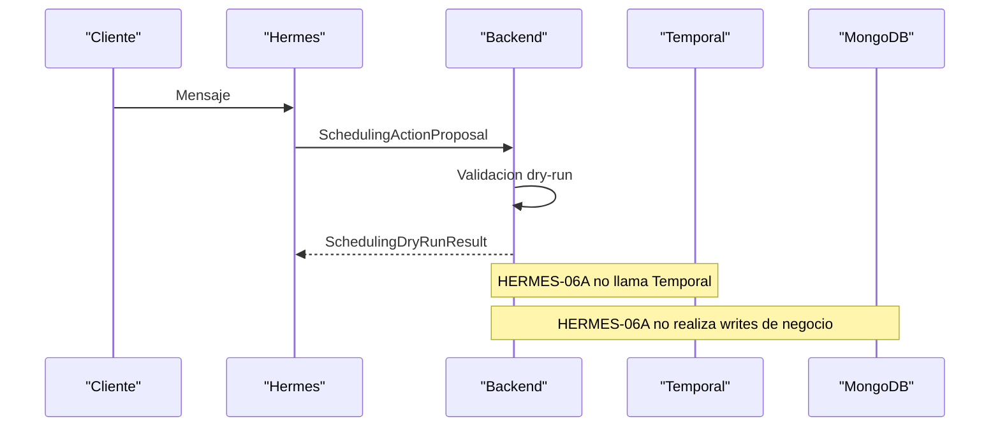

# HERMES-06A Scheduling Contract Audit

STATUS: COMPLETED

CURRENT SCHEDULING FLOW:

1. Public scheduling starts in [backend/src/controllers/agentSim.controller.ts] through `openMessage`, `message`, `start`, and workflow signal endpoints.
2. Legacy conversational routing runs in [backend/src/agent/runtime/agentRuntime.ts].
3. Semantic process access goes through [backend/src/agent/capabilities/agentCapabilityGateway.ts] and then [backend/src/mcp/temporal/client/temporalMcpClient.ts].
4. MCP maps semantic actions into workflow start/query/signal operations in [backend/src/mcp/temporal/temporalAgentBridge.ts].
5. Temporal orchestration lives in [backend/src/temporal/workflows/scheduleConsultation.workflow.ts].
6. Real reads and writes happen inside [backend/src/temporal/activities/scheduleConsultation.activities.ts] and downstream `demoTest` services.

AUTHORITATIVE SERVICES:

- Customer create/reuse: `createOrReuseCustomer` in [backend/src/temporal/activities/scheduleConsultation.activities.ts]
- ManagedEntity create/reuse: `createManagedEntity` in the same activity file
- Case create: `createOperationalCase` in the same activity file
- Workflow start: `startScheduleConsultation` in [backend/src/services/agentSim.service.ts]
- Workflow continuation: `signalWorkflow` in [backend/src/services/agentSim.service.ts]
- ProcessContext query: `getWorkflowProcessContext` in [backend/src/services/agentSim.service.ts]
- Availability read: `getAvailability` in [backend/src/temporal/activities/scheduleConsultation.activities.ts]
- Reservation + Appointment write: `scheduleConsultation` in [backend/src/services/demoTest/scheduleConsultation.service.ts]
- Timeline persistence: inside `scheduleConsultation.service.ts`
- Error translation: workflow state transitions + domain errors from `demoTest` services

TEMPORAL WORKFLOW:

- Workflow: `ScheduleConsultationWorkflow`
- Queries:
  - `getScheduleConsultationState`
  - `getScheduleConsultationProcessContext`
- Signals:
  - `selectCatalogOffering`
  - `submitCustomerData`
  - `requestSlots`
  - `selectSlot`
  - `cancelWorkflow`

EXISTING SEMANTIC BOUNDARY:

- Legacy runtime already speaks in semantic capabilities:
  - `start_schedule_consultation`
  - `continue_schedule_consultation`
  - `get_schedule_consultation_context`
- `AgentProcessContext` is the existing stable semantic response contract.
- `ExecutionContext` is the execution metadata carrier once backend or Temporal enters write territory.

SELECTED H06B BOUNDARY:

- Hermes will produce only semantic scheduling proposals.
- Backend will validate and map those proposals to:
  - `agentCapabilityGateway.startProcess`
  - `agentCapabilityGateway.continueProcess`
- H06B should bridge proposal actions onto the existing Temporal semantic bridge without exposing raw workflow primitives to Hermes.

PARTICIPATING FILES:

- `backend/src/controllers/agentSim.controller.ts`
- `backend/src/agent/runtime/agentRuntime.ts`
- `backend/src/agent/capabilities/agentCapabilityGateway.ts`
- `backend/src/mcp/temporal/client/temporalMcpClient.ts`
- `backend/src/mcp/temporal/temporalAgentBridge.ts`
- `backend/src/mcp/temporal/schemas/agentProcessContext.ts`
- `backend/src/services/agentSim.service.ts`
- `backend/src/temporal/workflows/scheduleConsultation.workflow.ts`
- `backend/src/temporal/activities/scheduleConsultation.activities.ts`
- `backend/src/services/demoTest/scheduleConsultation.service.ts`
- `backend/src/services/demoTest/core/ExecutionContext.ts`
- `backend/src/services/agentConversation.service.ts`

REAL PROCESS DATA MINIMUM:

- `workflowId`
- `businessSlug`
- `status`
- `selectedOffering`
- `requiredFields`
- `customerData`
- `availableSlots`
- `selectedSlotId`
- `appointment.case._id` when the process has already materialized a case

EXISTING SEMANTIC ERRORS AND RISK POINTS:

- Slot unavailability is translated back into workflow state, not directly into a Hermes-safe contract.
- Activities currently own both read and write sequencing, so raw Temporal access must stay outside Hermes.
- Legacy agent runtime mixes interpretation and execution in a single turn.
- `startScheduleConsultation` still generates workflow ids locally and starts Temporal directly.
- `requestSlots` reads real availability; this is explicitly out of scope for H06A.

IDEMPOTENCY:

- `ExecutionContext` carries `correlationId`, `causationId`, and `idempotencyKey`.
- `scheduleConsultation` is wrapped as required-key idempotent command under `consultation.schedule`.
- Temporal scheduling activity builds a stable scheduling idempotency key from business, case, offering, team, start, duration, and appointment type.

DEBT AND EXCEPTIONS RECORDED:

- Direct model reads exist in Temporal activities.
- Legacy runtime still preempts active-process messages and can call process actions inline.
- Process classification and execution remain coupled in the legacy path.
- `ProcessContext` summary in Hermes H04/H05 is read-only and intentionally narrower than full `AgentProcessContext`.

CONCLUSION:

- A reusable semantic boundary does exist.
- The correct H06B boundary is semantic-action mapping on the backend side, not a second orchestrator inside Hermes.
- H06A can safely stop at intent extraction, proposal validation, and dry-run simulation.

