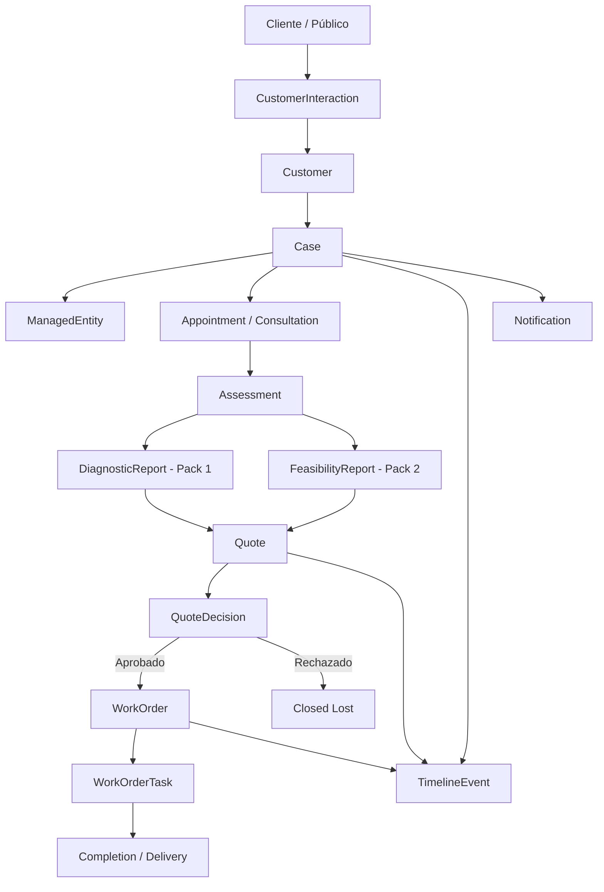
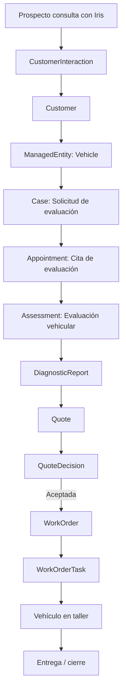
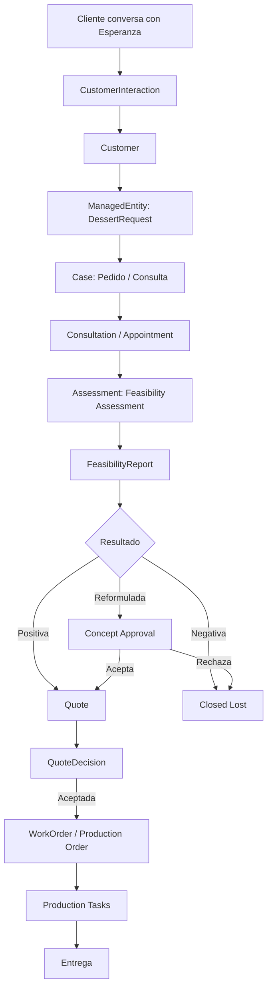

Sí. Con el **modelo de datos propuesto**, ya podemos declarar una matriz bastante clara de **casos de uso soportados** para:

* **VtkALL_Demo_Pack_1 / Turagua Racing**
* **VtkALL_Demo_Pack_2 / BateYLate**
* y, de forma indirecta, futuros verticales.

La idea clave es esta:

> El modelo no soporta solamente “citas” o “pedidos”. Soporta un ciclo operativo completo: **interacción → caso → entidad gestionada → evaluación/factibilidad → cotización → aprobación → orden de trabajo → ejecución → cierre → historial**.

---

# 1. Mapa general de casos de uso soportados



Este modelo soporta casos de uso en 8 familias:

```text
1. Captación e interacción con público
2. Registro de cliente
3. Gestión de entidad atendida
4. Agendamiento / consulta
5. Evaluación / diagnóstico / factibilidad
6. Cotización
7. Aprobación / rechazo
8. Orden de trabajo / producción / taller
9. Historial / timeline / auditoría
10. Notificaciones
```

---

# 2. Casos de uso soportados para Demo_Pack_1 / Turagua

## 2.1. Resumen del flujo Pack 1

Para Turagua, el modelo soporta este flujo:



En lenguaje de negocio:

```text
Cliente
→ Vehículo
→ Caso
→ Cita de evaluación
→ Evaluación del vehículo
→ Diagnóstico
→ Cotización
→ Aprobación
→ Orden de trabajo
→ Taller
→ Entrega
```

---

## 2.2. UC-P1-01 — Q&A sobre servicios de Turagua

### Descripción

Un visitante entra al website y pregunta a **Iris** sobre servicios de Turagua: lavado, mantenimiento, diagnóstico, revisión, mecánica, etc.

### Entidades usadas

```text
BusinessProfile
CustomerInteraction
CatalogOffering
Notification opcional
TimelineEvent opcional
```

### Soporte del modelo

**Soportado directamente.**

El modelo permite que Iris consulte el catálogo y responda con información pública de servicios/productos.

### Ejemplo JSON

```json
{
  "interaction": {
    "_id": "int_tur_001",
    "businessSlug": "turagua",
    "channel": "web",
    "agent": "Iris",
    "type": "qa",
    "customerId": null,
    "caseId": null,
    "message": "¿Tienen servicio de lavado premium?",
    "detectedIntent": "catalog_question",
    "relatedOfferingIds": ["off_lavado_premium"],
    "createdAt": "2026-07-01T10:00:00.000Z"
  }
}
```

---

## 2.3. UC-P1-02 — Captura de prospecto / lead

### Descripción

Iris conversa con una persona interesada y captura nombre, teléfono, servicio de interés y posible vehículo.

### Entidades usadas

```text
CustomerInteraction
Customer
Case
ManagedEntity opcional
TimelineEvent
```

### Soporte del modelo

**Soportado directamente.**

El `Case` puede nacer como `lead` antes de tener cita confirmada.

### Estado inicial

```text
case.status = lead
```

### Ejemplo JSON

```json
{
  "case": {
    "_id": "case_tur_001",
    "businessSlug": "turagua",
    "verticalType": "vehicle_service",
    "caseNumber": "TUR-2026-0001",
    "customerId": "cus_001",
    "managedEntityId": "me_vehicle_001",
    "source": {
      "channel": "web",
      "agent": "Iris",
      "origin": "landing_chat"
    },
    "intent": {
      "type": "assessment_request",
      "summary": "Cliente solicita revisión por ruido al frenar",
      "customerText": "Mi carro hace ruido al frenar."
    },
    "status": "lead"
  }
}
```

---

## 2.4. UC-P1-03 — Registro de cliente

### Descripción

El sistema registra datos básicos del cliente: nombre, teléfono, email opcional, WhatsApp, DNI opcional.

### Entidades usadas

```text
Customer
TimelineEvent
```

### Soporte del modelo

**Soportado directamente.**

Además, el modelo permite unificar clientes por teléfono normalizado.

### Ejemplo JSON

```json
{
  "customer": {
    "_id": "cus_001",
    "businessSlug": "turagua",
    "type": "person",
    "name": "Carlos Ramírez",
    "contact": {
      "phones": [
        {
          "countryCode": "+51",
          "number": "999888777",
          "normalized": "51999888777",
          "isWhatsapp": true,
          "primary": true
        }
      ],
      "email": "carlos@example.com"
    },
    "status": "active"
  }
}
```

---

## 2.5. UC-P1-04 — Registro de vehículo

### Descripción

Se registra el vehículo del cliente: placa, marca, modelo, año, kilometraje, color.

### Entidades usadas

```text
Customer
ManagedEntity
Case
TimelineEvent
```

### Soporte del modelo

**Soportado directamente.**

El vehículo se modela como `ManagedEntity` de tipo `vehicle`.

### Ejemplo JSON

```json
{
  "managedEntity": {
    "_id": "me_vehicle_001",
    "businessSlug": "turagua",
    "customerId": "cus_001",
    "type": "vehicle",
    "displayName": "Toyota Yaris ABC-123",
    "summary": "Toyota Yaris 2020, placa ABC-123",
    "data": {
      "brand": "Toyota",
      "model": "Yaris",
      "year": 2020,
      "plate": "ABC-123",
      "mileageKm": 80500,
      "color": "Negro"
    },
    "status": "active"
  }
}
```

---

## 2.6. UC-P1-05 — Selección de servicio/producto desde catálogo

### Descripción

El cliente selecciona un servicio desde catálogo: revisión de frenos, lavado, mantenimiento, etc.

### Entidades usadas

```text
CatalogOffering
Case.intent.selectedOfferingId
QuoteLine futuro
WorkOrderTask futuro
```

### Soporte del modelo

**Soportado directamente.**

Este caso de uso es clave porque el catálogo deja de ser informativo y pasa a ser fuente real del sistema.

### Ejemplo JSON

```json
{
  "case": {
    "_id": "case_tur_001",
    "intent": {
      "type": "assessment_request",
      "selectedOfferingId": "off_brake_service",
      "summary": "Cliente solicita revisión de frenos"
    }
  }
}
```

---

## 2.7. UC-P1-06 — Agendar cita de evaluación presencial

### Descripción

Iris o un usuario interno agenda una cita para que el vehículo sea evaluado en taller.

### Entidades usadas

```text
Case
Appointment
Customer
ManagedEntity
Notification
TimelineEvent
```

### Soporte del modelo

**Soportado directamente.**

### Estado

```text
lead → appointment_scheduled
```

### Ejemplo JSON

```json
{
  "appointment": {
    "_id": "appt_tur_001",
    "businessSlug": "turagua",
    "caseId": "case_tur_001",
    "customerId": "cus_001",
    "managedEntityId": "me_vehicle_001",
    "type": "onsite_assessment",
    "status": "scheduled",
    "scheduledStart": "2026-07-03T15:00:00.000Z",
    "scheduledEnd": "2026-07-03T16:00:00.000Z",
    "timezone": "America/Lima",
    "location": {
      "type": "workshop",
      "label": "Turagua Racing - Taller"
    }
  }
}
```

---

## 2.8. UC-P1-07 — Confirmar cita

### Descripción

Iris solicita confirmación al cliente y registra la respuesta.

### Entidades usadas

```text
Appointment
Notification
CustomerInteraction
TimelineEvent
```

### Soporte del modelo

**Soportado directamente.**

### Estado

```text
appointment_scheduled → appointment_confirmed
```

### Ejemplo JSON

```json
{
  "appointment": {
    "_id": "appt_tur_001",
    "status": "confirmed",
    "confirmation": {
      "required": true,
      "status": "confirmed_by_customer",
      "requestedAt": "2026-07-02T12:00:00.000Z",
      "confirmedAt": "2026-07-02T12:15:00.000Z",
      "channel": "whatsapp"
    }
  }
}
```

---

## 2.9. UC-P1-08 — Evaluación con fotos

### Descripción

El cliente envía fotos del vehículo o del problema. El técnico evalúa sin requerir cita presencial inmediata.

### Entidades usadas

```text
Case
ManagedEntity
Assessment
Attachment
TimelineEvent
```

### Soporte del modelo

**Soportado directamente.**

La modalidad se expresa en `Assessment.mode`.

### Ejemplo JSON

```json
{
  "assessment": {
    "_id": "assess_tur_photo_001",
    "businessSlug": "turagua",
    "caseId": "case_tur_001",
    "managedEntityId": "me_vehicle_001",
    "type": "vehicle_assessment",
    "mode": "photo_assessment",
    "status": "pending_review",
    "inputs": {
      "customerComplaint": "El parachoques está suelto.",
      "evidenceUrls": [
        "https://cdn.example.com/photo-front.jpg",
        "https://cdn.example.com/photo-side.jpg"
      ]
    }
  }
}
```

---

## 2.10. UC-P1-09 — Evaluación telefónica

### Descripción

Se agenda una llamada con un técnico para entender el problema antes de llevar el vehículo.

### Entidades usadas

```text
Appointment
Assessment
Worker
Notification
TimelineEvent
```

### Soporte del modelo

**Soportado directamente.**

### Ejemplo JSON

```json
{
  "appointment": {
    "_id": "appt_phone_001",
    "caseId": "case_tur_002",
    "type": "phone_assessment",
    "status": "scheduled",
    "scheduledStart": "2026-07-04T11:30:00.000Z",
    "assignedWorkerId": "worker_tech_001"
  }
}
```

---

## 2.11. UC-P1-10 — Inicio de evaluación vehicular

### Descripción

El vehículo llega al taller o se inicia la evaluación por fotos/teléfono.

### Entidades usadas

```text
Case
Assessment
TimelineEvent
StatusProfile
```

### Soporte del modelo

**Soportado directamente.**

### Estado

```text
appointment_confirmed → evaluating
```

### Ejemplo JSON

```json
{
  "assessment": {
    "_id": "assess_tur_001",
    "caseId": "case_tur_001",
    "type": "vehicle_assessment",
    "mode": "onsite_assessment",
    "status": "in_review",
    "startedAt": "2026-07-03T15:10:00.000Z",
    "performedBy": {
      "teamId": "team_mechanics",
      "workerId": "worker_001"
    }
  }
}
```

---

## 2.12. UC-P1-11 — Crear diagnóstico técnico

### Descripción

El técnico registra hallazgos del vehículo y recomendaciones.

### Entidades usadas

```text
Assessment
DiagnosticReport
CatalogOffering
Attachment
TimelineEvent
```

### Soporte del modelo

**Soportado directamente.**

### Estado

```text
evaluating → diagnostic_ready
```

### Ejemplo JSON

```json
{
  "diagnosticReport": {
    "_id": "diag_tur_001",
    "businessSlug": "turagua",
    "caseId": "case_tur_001",
    "assessmentId": "assess_tur_001",
    "status": "ready_for_quote",
    "customerComplaint": "Ruido al frenar",
    "technicalFindings": [
      {
        "area": "Frenos delanteros",
        "finding": "Pastillas con desgaste avanzado",
        "severity": "medium",
        "evidenceUrls": ["https://cdn.example.com/brakes.jpg"]
      }
    ],
    "recommendedActions": [
      {
        "catalogOfferingId": "off_brake_pads_replace",
        "title": "Cambio de pastillas delanteras",
        "required": true
      }
    ],
    "customerFacingSummary": "Recomendamos cambiar las pastillas delanteras."
  }
}
```

---

## 2.13. UC-P1-12 — Crear cotización desde diagnóstico

### Descripción

El diagnóstico se convierte en una cotización con ítems, precios, términos y vigencia.

### Entidades usadas

```text
DiagnosticReport
Quote
QuoteLine
CatalogOffering
TimelineEvent
```

### Soporte del modelo

**Soportado directamente.**

### Regla

```text
No debería existir Quote sin diagnóstico o evaluación completada.
```

### Estado

```text
diagnostic_ready → quote_draft
```

### Ejemplo JSON

```json
{
  "quote": {
    "_id": "quote_tur_001",
    "businessSlug": "turagua",
    "caseId": "case_tur_001",
    "quoteNumber": "Q-TUR-2026-0001",
    "status": "draft",
    "source": {
      "type": "diagnostic_report",
      "id": "diag_tur_001"
    },
    "currency": "PEN",
    "amounts": {
      "subtotalCents": 28000,
      "discountCents": 0,
      "taxCents": 0,
      "totalCents": 28000
    }
  },
  "lines": [
    {
      "_id": "ql_tur_001",
      "quoteId": "quote_tur_001",
      "description": "Cambio de pastillas delanteras",
      "quantity": 1,
      "unitPriceCents": 18000,
      "totalCents": 18000
    },
    {
      "_id": "ql_tur_002",
      "quoteId": "quote_tur_001",
      "description": "Juego de pastillas delanteras",
      "quantity": 1,
      "unitPriceCents": 10000,
      "totalCents": 10000
    }
  ]
}
```

---

## 2.14. UC-P1-13 — Diferenciar presupuesto interno vs presupuesto cliente

### Descripción

El taller puede manejar notas/márgenes internos y una versión visible para el cliente.

### Entidades usadas

```text
Quote
QuoteLine
```

### Soporte del modelo

**Soportado directamente.**

### Ejemplo JSON

```json
{
  "quote": {
    "_id": "quote_tur_001",
    "internal": {
      "notes": "Usar proveedor alternativo si no hay stock.",
      "marginNotes": "Margen estimado 30%",
      "visibleToCustomer": false
    },
    "customerFacing": {
      "summary": "Cotización para servicio de frenos delanteros.",
      "notes": "Incluye revisión, cambio de pastillas y prueba final.",
      "terms": "Válido por 5 días."
    }
  }
}
```

---

## 2.15. UC-P1-14 — Enviar cotización al cliente

### Descripción

El sistema envía cotización por WhatsApp, web o PDF.

### Entidades usadas

```text
Quote
Notification
TimelineEvent
```

### Soporte del modelo

**Soportado directamente.**

### Estado

```text
quote_draft → quote_sent
```

### Ejemplo JSON

```json
{
  "quote": {
    "_id": "quote_tur_001",
    "status": "sent_to_customer",
    "sent": {
      "sentAt": "2026-07-03T16:20:00.000Z",
      "sentBy": "worker_001",
      "channel": "whatsapp",
      "pdfUrl": "https://cdn.example.com/q-tur-2026-0001.pdf"
    }
  }
}
```

---

## 2.16. UC-P1-15 — Aprobar o rechazar cotización

### Descripción

El cliente acepta o rechaza la cotización.

### Entidades usadas

```text
Quote
QuoteDecision
TimelineEvent
CustomerInteraction
```

### Soporte del modelo

**Soportado directamente.**

### Estados

```text
quote_sent → quote_approved
quote_sent → quote_rejected
```

### Ejemplo JSON

```json
{
  "quoteDecision": {
    "_id": "qd_tur_001",
    "businessSlug": "turagua",
    "quoteId": "quote_tur_001",
    "caseId": "case_tur_001",
    "decision": "accepted",
    "decidedAt": "2026-07-03T17:00:00.000Z",
    "decidedBy": {
      "type": "customer",
      "customerId": "cus_001"
    },
    "evidence": {
      "channel": "whatsapp",
      "rawText": "Sí, acepto el presupuesto."
    }
  }
}
```

---

## 2.17. UC-P1-16 — Crear Work Order desde cotización aprobada

### Descripción

Al aprobarse la cotización, se crea una orden de trabajo para el taller.

### Entidades usadas

```text
Quote
QuoteDecision
WorkOrder
WorkOrderTask
TimelineEvent
```

### Soporte del modelo

**Soportado directamente.**

### Regla

```text
No WorkOrder sin Quote aprobada.
```

### Estado

```text
quote_approved → work_order_created
```

### Ejemplo JSON

```json
{
  "workOrder": {
    "_id": "wo_tur_001",
    "businessSlug": "turagua",
    "caseId": "case_tur_001",
    "customerId": "cus_001",
    "managedEntityId": "me_vehicle_001",
    "quoteIds": ["quote_tur_001"],
    "workOrderNumber": "WO-TUR-2026-0001",
    "type": "workshop_service",
    "status": "created",
    "financial": {
      "approvedAmountCents": 28000,
      "currency": "PEN",
      "paymentStatus": "pending"
    }
  }
}
```

---

## 2.18. UC-P1-17 — Admitir vehículo al taller

### Descripción

El vehículo entra físicamente al taller y se registra checklist de admisión.

### Entidades usadas

```text
WorkOrder
ManagedEntity
Attachment
TimelineEvent
```

### Soporte del modelo

**Soportado directamente.**

### Estado

```text
work_order_created → in_workshop
```

### Ejemplo JSON

```json
{
  "workOrder": {
    "_id": "wo_tur_001",
    "status": "in_workshop",
    "admission": {
      "admittedAt": "2026-07-03T17:30:00.000Z",
      "admittedBy": "worker_001",
      "location": "Bahía 1",
      "checklist": {
        "fuelLevel": "1/2",
        "mileageKm": 80600,
        "externalConditionNotes": "Rayón leve en puerta derecha.",
        "photos": ["https://cdn.example.com/admission1.jpg"]
      }
    }
  }
}
```

---

## 2.19. UC-P1-18 — Ejecutar tareas de taller

### Descripción

El equipo de trabajo ejecuta tareas asociadas a la orden.

### Entidades usadas

```text
WorkOrder
WorkOrderTask
Team
Worker
TimelineEvent
Attachment
```

### Soporte del modelo

**Soportado directamente.**

### Ejemplo JSON

```json
{
  "workOrderTask": {
    "_id": "wot_tur_001",
    "businessSlug": "turagua",
    "workOrderId": "wo_tur_001",
    "title": "Cambio de pastillas delanteras",
    "status": "in_progress",
    "assignedTeamId": "team_mechanics",
    "assignedWorkerId": "worker_001",
    "estimatedDurationMinutes": 90,
    "startedAt": "2026-07-03T18:00:00.000Z"
  }
}
```

---

## 2.20. UC-P1-19 — Notificar estado de orden al cliente

### Descripción

Iris comunica al cliente que su vehículo está en evaluación, cotización, taller, listo o entregado.

### Entidades usadas

```text
Notification
WorkOrder
Case
TimelineEvent
```

### Soporte del modelo

**Soportado directamente.**

### Ejemplo JSON

```json
{
  "notification": {
    "_id": "notif_tur_001",
    "businessSlug": "turagua",
    "caseId": "case_tur_001",
    "customerId": "cus_001",
    "channel": "whatsapp",
    "type": "workorder_status_update",
    "status": "sent",
    "content": {
      "templateKey": "turagua_workorder_in_progress",
      "text": "Hola Carlos, tu vehículo ya ingresó al taller y está en proceso."
    },
    "sentAt": "2026-07-03T18:10:00.000Z"
  }
}
```

---

## 2.21. UC-P1-20 — Historial técnico del vehículo

### Descripción

El sistema registra eventos, diagnósticos, notas, cotizaciones, trabajos y entregas asociadas al vehículo.

### Entidades usadas

```text
ManagedEntity
Case
TimelineEvent
DiagnosticReport
WorkOrder
```

### Soporte del modelo

**Soportado directamente.**

### Ejemplo JSON

```json
{
  "timelineEvent": {
    "_id": "evt_tur_001",
    "businessSlug": "turagua",
    "caseId": "case_tur_001",
    "customerId": "cus_001",
    "managedEntityId": "me_vehicle_001",
    "eventType": "diagnostic.created",
    "title": "Diagnóstico técnico creado",
    "description": "Se detectó desgaste avanzado en pastillas delanteras.",
    "visibility": "internal",
    "createdAt": "2026-07-03T15:45:00.000Z"
  }
}
```

---

# 3. Casos de uso soportados para Demo_Pack_2 / BateYLate

## 3.1. Resumen del flujo Pack 2

Para BateYLate, el modelo soporta este flujo:



En lenguaje de negocio:

```text
Cliente
→ Solicitud de postre
→ Consulta de factibilidad
→ Informe de factibilidad
→ Cotización
→ Aprobación
→ Orden de producción
→ Producción
→ Entrega
```

---

## 3.2. UC-P2-01 — Q&A sobre productos de BateYLate

### Descripción

Un cliente pregunta a **Esperanza** sobre productos, tortas, postres, tiempos, cobertura, formatos o personalización.

### Entidades usadas

```text
BusinessProfile
CustomerInteraction
CatalogOffering
Notification opcional
```

### Soporte del modelo

**Soportado directamente.**

### Ejemplo JSON

```json
{
  "interaction": {
    "_id": "int_byl_001",
    "businessSlug": "bateylate",
    "channel": "web",
    "agent": "Esperanza",
    "type": "qa",
    "message": "¿Hacen tortas personalizadas para cumpleaños?",
    "detectedIntent": "catalog_question",
    "relatedOfferingIds": ["off_custom_cake"],
    "createdAt": "2026-07-01T10:00:00.000Z"
  }
}
```

---

## 3.3. UC-P2-02 — Captura de solicitud inicial

### Descripción

Esperanza captura una intención de pedido: ocasión, fecha, número de personas, sabor, estilo, referencias, restricciones.

### Entidades usadas

```text
CustomerInteraction
Customer
ManagedEntity
Case
```

### Soporte del modelo

**Soportado directamente.**

### Ejemplo JSON

```json
{
  "managedEntity": {
    "_id": "me_byl_001",
    "businessSlug": "bateylate",
    "customerId": "cus_byl_001",
    "type": "dessert_request",
    "displayName": "Torta personalizada para cumpleaños",
    "summary": "Torta floral elegante para 20 personas",
    "data": {
      "dessertType": "cake",
      "occasion": "cumpleaños",
      "servings": 20,
      "flavorPreferences": ["vainilla", "chocolate"],
      "style": "elegante floral",
      "referenceImages": ["https://cdn.example.com/ref1.jpg"],
      "restrictions": ["sin nueces"],
      "deliveryMode": "delivery",
      "requestedDeliveryDate": "2026-07-05T18:00:00.000Z"
    }
  }
}
```

---

## 3.4. UC-P2-03 — Crear caso de pedido personalizado

### Descripción

La solicitud de postre se convierte en un `Case`.

### Entidades usadas

```text
Customer
ManagedEntity
Case
TimelineEvent
```

### Soporte del modelo

**Soportado directamente.**

### Estado

```text
inquiry
```

### Ejemplo JSON

```json
{
  "case": {
    "_id": "case_byl_001",
    "businessSlug": "bateylate",
    "verticalType": "custom_orders",
    "caseNumber": "BYL-2026-0001",
    "customerId": "cus_byl_001",
    "managedEntityId": "me_byl_001",
    "source": {
      "channel": "web",
      "agent": "Esperanza",
      "origin": "pedido_web"
    },
    "intent": {
      "type": "custom_order_request",
      "summary": "Cliente quiere torta personalizada floral",
      "customerText": "Quiero una torta elegante para el cumpleaños de mi mamá.",
      "selectedOfferingId": "off_custom_cake"
    },
    "status": "inquiry"
  }
}
```

---

## 3.5. UC-P2-04 — Agendar o registrar consulta de factibilidad

### Descripción

Se agenda o registra una consulta previa con el maestro repostero.

Puede ser:

* presencial;
* web/asíncrona;
* con fotos;
* por información capturada por Esperanza.

### Entidades usadas

```text
Appointment
Case
Customer
ManagedEntity
Notification
```

### Soporte del modelo

**Soportado directamente.**

### Estado

```text
inquiry → consultation_pending
```

### Ejemplo JSON

```json
{
  "appointment": {
    "_id": "appt_byl_001",
    "businessSlug": "bateylate",
    "caseId": "case_byl_001",
    "customerId": "cus_byl_001",
    "managedEntityId": "me_byl_001",
    "type": "feasibility_consultation",
    "status": "scheduled",
    "scheduledStart": "2026-07-01T15:00:00.000Z",
    "timezone": "America/Lima",
    "location": {
      "type": "virtual",
      "label": "Consulta de factibilidad vía web"
    }
  }
}
```

---

## 3.6. UC-P2-05 — Enviar requerimiento al maestro repostero

### Descripción

Esperanza o el sistema envía el brief al maestro repostero para evaluación.

### Entidades usadas

```text
Case
ManagedEntity
Assessment
Notification interna
TimelineEvent
Worker
```

### Soporte del modelo

**Soportado directamente.**

### Ejemplo JSON

```json
{
  "assessment": {
    "_id": "assess_byl_001",
    "businessSlug": "bateylate",
    "caseId": "case_byl_001",
    "customerId": "cus_byl_001",
    "managedEntityId": "me_byl_001",
    "type": "feasibility_assessment",
    "status": "pending_review",
    "mode": "web_inquiry",
    "performedBy": {
      "teamId": "team_bakery",
      "workerId": "worker_master_baker"
    },
    "inputs": {
      "customerRequest": "Torta floral elegante para cumpleaños",
      "requestedDate": "2026-07-05T18:00:00.000Z",
      "referenceImages": ["https://cdn.example.com/ref1.jpg"]
    }
  }
}
```

---

## 3.7. UC-P2-06 — Emitir informe de factibilidad positiva

### Descripción

El maestro repostero declara que el postre puede elaborarse sin cambios.

### Entidades usadas

```text
Assessment
FeasibilityReport
TimelineEvent
```

### Soporte del modelo

**Soportado directamente.**

### Estado

```text
feasibility_review → feasible_as_requested → ready_for_quote
```

### Ejemplo JSON

```json
{
  "feasibilityReport": {
    "_id": "feas_byl_001",
    "businessSlug": "bateylate",
    "caseId": "case_byl_001",
    "assessmentId": "assess_byl_001",
    "status": "feasible_as_requested",
    "decision": {
      "result": "feasible_as_requested",
      "reason": "El pedido puede elaborarse tal como fue solicitado.",
      "requiresCustomerConceptApproval": false
    },
    "customerFacingSummary": "Podemos elaborar tu torta según el diseño solicitado.",
    "createdBy": "worker_master_baker"
  }
}
```

---

## 3.8. UC-P2-07 — Emitir factibilidad negativa

### Descripción

El maestro repostero declara que el pedido no puede elaborarse.

### Entidades usadas

```text
Assessment
FeasibilityReport
Notification
TimelineEvent
```

### Soporte del modelo

**Soportado directamente.**

### Estado

```text
feasibility_review → not_feasible → closed_lost
```

### Ejemplo JSON

```json
{
  "feasibilityReport": {
    "_id": "feas_byl_002",
    "businessSlug": "bateylate",
    "caseId": "case_byl_002",
    "status": "not_feasible",
    "decision": {
      "result": "not_feasible",
      "reason": "No es posible cumplir con el diseño y la fecha solicitada.",
      "requiresCustomerConceptApproval": false
    },
    "customerFacingSummary": "No podemos elaborar el pedido en las condiciones solicitadas."
  }
}
```

---

## 3.9. UC-P2-08 — Emitir factibilidad reformulada

### Descripción

El maestro repostero propone cambios al requerimiento original.

### Entidades usadas

```text
FeasibilityReport
ReformulationProposal dentro del report
Notification
TimelineEvent
```

### Soporte del modelo

**Soportado directamente.**

### Estado

```text
feasibility_review → feasible_with_changes → waiting_concept_approval
```

### Ejemplo JSON

```json
{
  "feasibilityReport": {
    "_id": "feas_byl_003",
    "businessSlug": "bateylate",
    "caseId": "case_byl_003",
    "status": "feasible_with_changes",
    "decision": {
      "result": "feasible_with_changes",
      "reason": "El diseño es posible, pero debe simplificarse para llegar a la fecha.",
      "requiresCustomerConceptApproval": true
    },
    "reformulation": {
      "summary": "Mantener estilo floral elegante, pero reemplazar flores 3D por decoración plana.",
      "impact": {
        "price": "lower_than_original_complex_design",
        "deliveryDate": "same_date_possible",
        "complexity": "medium"
      }
    },
    "customerFacingSummary": "Podemos elaborar tu torta con algunos ajustes de decoración."
  }
}
```

---

## 3.10. UC-P2-09 — Validación conceptual del cliente

### Descripción

Si la factibilidad fue reformulada, el cliente debe aceptar o rechazar la propuesta antes de cotizar.

### Entidades usadas

```text
FeasibilityReport
CustomerInteraction
TimelineEvent
Notification
```

### Soporte del modelo

**Soportado directamente.**

### Estados

```text
waiting_concept_approval → concept_approved
waiting_concept_approval → concept_rejected
```

### Ejemplo JSON

```json
{
  "conceptDecision": {
    "caseId": "case_byl_003",
    "feasibilityReportId": "feas_byl_003",
    "decision": "concept_approved",
    "decidedAt": "2026-07-01T16:00:00.000Z",
    "evidence": {
      "channel": "whatsapp",
      "rawText": "Sí, me gusta la propuesta con flores planas."
    }
  }
}
```

Puede vivir inicialmente como metadata en `FeasibilityReport` o como `TimelineEvent`, no necesariamente como colección separada desde el MVP.

---

## 3.11. UC-P2-10 — Crear cotización desde factibilidad

### Descripción

La factibilidad positiva o reformulada aprobada se convierte en cotización.

### Entidades usadas

```text
FeasibilityReport
Quote
QuoteLine
TimelineEvent
```

### Soporte del modelo

**Soportado directamente.**

### Regla

```text
No Quote sin FeasibilityReport positiva o reformulada aprobada.
```

### Estado

```text
ready_for_quote → quote_draft
```

### Ejemplo JSON

```json
{
  "quote": {
    "_id": "quote_byl_001",
    "businessSlug": "bateylate",
    "verticalType": "custom_orders",
    "caseId": "case_byl_001",
    "customerId": "cus_byl_001",
    "managedEntityId": "me_byl_001",
    "quoteNumber": "Q-BYL-2026-0001",
    "status": "draft",
    "source": {
      "type": "feasibility_report",
      "id": "feas_byl_001"
    },
    "currency": "PEN",
    "amounts": {
      "subtotalCents": 18000,
      "discountCents": 0,
      "taxCents": 0,
      "totalCents": 18000
    }
  }
}
```

---

## 3.12. UC-P2-11 — Cotizar postre estándar

### Descripción

El cliente pide un postre estándar con precio conocido.

### Entidades usadas

```text
CatalogOffering
Case
Quote
QuoteLine
```

### Soporte del modelo

**Soportado con extensión menor.**

Puede saltarse parte de la factibilidad si la política del catálogo dice que no requiere factibilidad.

### Regla posible

```json
{
  "catalogOffering": {
    "name": "Box de brownies",
    "pricing": {
      "pricingType": "fixed_price",
      "basePriceCents": 4500,
      "requiresFeasibility": false
    }
  }
}
```

### Flujo

```text
Inquiry → Quote Draft → Quote Sent → Quote Approved → ProductionOrder
```

---

## 3.13. UC-P2-12 — Cotizar postre personalizado

### Descripción

El cliente pide un postre bajo especificación explícita.

### Entidades usadas

```text
DessertRequest / ManagedEntity
FeasibilityReport
Quote
QuoteLine
QuoteDecision
```

### Soporte del modelo

**Soportado directamente.**

Este es el caso de uso central de Pack 2.

---

## 3.14. UC-P2-13 — Enviar PDF/cotización al cliente

### Descripción

Esperanza envía cotización formal al cliente.

### Entidades usadas

```text
Quote
Notification
TimelineEvent
```

### Soporte del modelo

**Soportado directamente.**

### Ejemplo JSON

```json
{
  "quote": {
    "_id": "quote_byl_001",
    "status": "sent_to_customer",
    "sent": {
      "sentAt": "2026-07-01T17:30:00.000Z",
      "sentBy": "worker_master_baker",
      "channel": "whatsapp",
      "pdfUrl": "https://cdn.example.com/q-byl-2026-0001.pdf"
    }
  }
}
```

---

## 3.15. UC-P2-14 — Aprobar cotización

### Descripción

El cliente acepta la cotización.

### Entidades usadas

```text
Quote
QuoteDecision
TimelineEvent
Notification
```

### Soporte del modelo

**Soportado directamente.**

### Ejemplo JSON

```json
{
  "quoteDecision": {
    "_id": "qd_byl_001",
    "businessSlug": "bateylate",
    "quoteId": "quote_byl_001",
    "caseId": "case_byl_001",
    "decision": "accepted",
    "decidedBy": {
      "type": "customer",
      "customerId": "cus_byl_001"
    },
    "evidence": {
      "channel": "whatsapp",
      "rawText": "Acepto la cotización."
    },
    "decidedAt": "2026-07-01T18:00:00.000Z"
  }
}
```

---

## 3.16. UC-P2-15 — Aprobación en nombre del cliente

### Descripción

El maestro repostero o staff registra que el cliente aprobó por llamada, presencial o conversación informal.

### Entidades usadas

```text
QuoteDecision
TimelineEvent
User / Worker
```

### Soporte del modelo

**Soportado directamente.**

### Ejemplo JSON

```json
{
  "quoteDecision": {
    "_id": "qd_byl_002",
    "businessSlug": "bateylate",
    "quoteId": "quote_byl_001",
    "caseId": "case_byl_001",
    "decision": "accepted",
    "decidedBy": {
      "type": "staff_on_behalf_of_customer",
      "customerId": "cus_byl_001",
      "staffUserId": "worker_master_baker"
    },
    "evidence": {
      "channel": "phone_call",
      "rawText": null
    },
    "notes": "Cliente confirmó por llamada. Registrado por maestro repostero."
  }
}
```

---

## 3.17. UC-P2-16 — Crear orden de producción

### Descripción

La cotización aprobada genera una Work Order para producción repostera.

### Entidades usadas

```text
Quote
QuoteDecision
WorkOrder
WorkOrderTask
TimelineEvent
```

### Soporte del modelo

**Soportado directamente.**

### Estado

```text
quote_approved → production_order_created
```

### Ejemplo JSON

```json
{
  "workOrder": {
    "_id": "wo_byl_001",
    "businessSlug": "bateylate",
    "verticalType": "custom_orders",
    "caseId": "case_byl_001",
    "customerId": "cus_byl_001",
    "managedEntityId": "me_byl_001",
    "quoteIds": ["quote_byl_001"],
    "workOrderNumber": "WO-BYL-2026-0001",
    "type": "bakery_production",
    "status": "created",
    "customerFacingStatus": "Tu pedido fue ingresado a producción."
  }
}
```

---

## 3.18. UC-P2-17 — Ejecutar tareas de producción

### Descripción

Se gestionan tareas como preparar masa, hornear, decorar, empacar y entregar.

### Entidades usadas

```text
WorkOrder
WorkOrderTask
Team
Worker
TimelineEvent
```

### Soporte del modelo

**Soportado directamente.**

### Ejemplo JSON

```json
{
  "workOrderTasks": [
    {
      "_id": "wot_byl_001",
      "workOrderId": "wo_byl_001",
      "title": "Preparar masa",
      "status": "pending",
      "estimatedDurationMinutes": 60,
      "sortOrder": 1
    },
    {
      "_id": "wot_byl_002",
      "workOrderId": "wo_byl_001",
      "title": "Decorar torta",
      "status": "pending",
      "estimatedDurationMinutes": 120,
      "sortOrder": 2
    }
  ]
}
```

---

## 3.19. UC-P2-18 — Notificar estado de producción

### Descripción

Esperanza informa al cliente que su pedido fue aceptado, entró a producción, está listo o fue entregado.

### Entidades usadas

```text
Notification
WorkOrder
TimelineEvent
```

### Soporte del modelo

**Soportado directamente.**

### Ejemplo JSON

```json
{
  "notification": {
    "_id": "notif_byl_001",
    "businessSlug": "bateylate",
    "caseId": "case_byl_001",
    "customerId": "cus_byl_001",
    "channel": "whatsapp",
    "type": "production_status_update",
    "status": "sent",
    "content": {
      "templateKey": "bateylate_in_production",
      "text": "Hola, tu pedido ya ingresó a producción. Te avisaremos cuando esté listo."
    }
  }
}
```

---

# 4. Matriz comparativa de casos de uso

| ID     |  Caso de uso                      |             Pack 1 Turagua |         Pack 2 BateYLate | Soporte del modelo               |
| ------ | -------------------------------- | -------------------------: | -----------------------: | -------------------------------- |
| USE-01 | Q&A del agente IA                |                   Sí, Iris |            Sí, Esperanza | Directo                          |
| USE-02 | Registro de cliente              |                         Sí |                       Sí | Directo                          |
| USE-03 | Registro de entidad gestionada   |                   Vehículo |      Solicitud de postre | Directo                          |
| USE-04 | Crear caso operativo             |           Orden/evaluación |          Pedido/consulta | Directo                          |
| USE-05 | Agendar cita/consulta            |         Cita de evaluación | Consulta de factibilidad | Directo                          |
| USE-06 | Confirmar cita/consulta          |                         Sí |            Sí, si aplica | Directo                          |
| USE-07 | Evaluación con fotos             |                         Sí |    Sí, fotos/referencias | Directo                          |
| USE-08 | Evaluación telefónica            |                         Sí |               No central | Directo si el profile lo permite |
| USE-09 | Diagnóstico técnico              |                         Sí |                No aplica | Directo para Pack 1              |
| USE-10 | Informe de factibilidad          |                   Opcional |                       Sí | Directo para Pack 2              |
| USE-11 | Factibilidad positiva            |                 No central |                       Sí | Directo                          |
| USE-12 | Factibilidad negativa            |                 No central |                       Sí | Directo                          |
| USE-13 | Factibilidad reformulada         |                 No central |                       Sí | Directo                          |
| USE-14 | Validación conceptual            |                 No central |                       Sí | Directo / metadata               |
| USE-15 | Cotización formal                |                         Sí |                       Sí | Directo                          |
| USE-16 | Cotización con múltiples ítems   |                         Sí |                       Sí | Directo                          |
| USE-17 | Presupuesto interno vs cliente   |                         Sí |                       Sí | Directo                          |
| USE-18 | Envío de cotización/PDF          |                         Sí |                       Sí | Directo                          |
| USE-19 | Aprobación/rechazo               |                         Sí |                       Sí | Directo                          |
| USE-20 | Aprobación en nombre del cliente |            Sí, jefe taller |    Sí, maestro repostero | Directo                          |
| USE-21 | Work Order                       |            Orden de taller |      Orden de producción | Directo                          |
| USE-22 | Tareas internas                  |           Trabajo mecánico |     Producción repostera | Directo                          |
| USE-23 | Estado visible al cliente        |                         Sí |                       Sí | Directo                          |
| USE-24 | Historial                        | Historial técnico vehículo |      Historial de pedido | Directo                          |
| USE-25 | Timeline/auditoría               |                         Sí |                       Sí | Directo                          |
| USE-26 | Notificaciones                   |                       Iris |                Esperanza | Directo                          |
| USE-27 | Catálogo como fuente             |        Servicios/repuestos |        Postres/productos | Directo                          |
| USE-28 | Temporal workflow                |                         Sí |                       Sí | Directo a nivel conceptual       |

---

# 5. Casos de uso NO soportados todavía, o no prioritarios

El modelo puede extenderse, pero no debería prometer todo desde ya.

## 5.1. No soportado completamente todavía

| Caso                                 | Motivo                                                |
| ------------------------------------ | ----------------------------------------------------- |
| Inventario real de repuestos         | Requiere `InventoryItem`, `StockMovement`, `Supplier` |
| Inventario de insumos de repostería  | Requiere módulo de inventario/recetas                 |
| Facturación tributaria               | Requiere comprobantes, SUNAT, impuestos               |
| Pagos online completos               | Requiere `Payment`, pasarela, conciliación            |
| Multi-sucursal avanzado              | Requiere `Location`, capacidad, horarios por sede     |
| Multi-tenant con BD separada         | No es objetivo inmediato                              |
| Comisiones por trabajador            | Requiere reglas financieras                           |
| Planificación avanzada de producción | Requiere capacidad, calendario y carga de trabajo     |
| Delivery/logística avanzada          | Requiere rutas, repartidores, tracking                |
| CRM comercial completo               | El modelo soporta CRM pocket, no CRM enterprise       |

---

# 6. Casos de uso soportados por entidad

## `Customer`

Soporta:

```text
- Registrar cliente
- Unificar por teléfono
- Asociar WhatsApp
- Ver historial
- Medir gasto/deuda si se extiende
- Relacionar múltiples casos
```

## `ManagedEntity`

Soporta:

```text
- Vehículo en Turagua
- Postre solicitado en BateYLate
- Mascota en veterinaria
- Equipo en reparación técnica
- Paciente en salud
- Orden óptica en ópticas
```

## `Case`

Soporta:

```text
- Lead
- Pedido
- Consulta
- Evaluación
- Orden pre-operativa
- Seguimiento de estado
- Agrupador de todo el ciclo
```

## `Appointment`

Soporta:

```text
- Cita presencial
- Consulta virtual
- Evaluación telefónica
- Evaluación con fotos
- Confirmación
- Reagendamiento
- No-show/cancelación si se agrega
```

## `Assessment`

Soporta:

```text
- Evaluación vehicular
- Evaluación con fotos
- Evaluación telefónica
- Evaluación de factibilidad
- Revisión técnica previa
```

## `DiagnosticReport`

Soporta Pack 1:

```text
- Diagnóstico técnico
- Hallazgos
- Evidencias
- Recomendaciones
- Base para cotización
```

## `FeasibilityReport`

Soporta Pack 2:

```text
- Factibilidad positiva
- Factibilidad negativa
- Factibilidad reformulada
- Validación conceptual
- Base para cotización
```

## `Quote`

Soporta:

```text
- Cotización formal
- Múltiples líneas
- Versión cliente
- Versión interna
- Vigencia
- Envío
- Aprobación
- Rechazo
- Conversión a WorkOrder
```

## `WorkOrder`

Soporta:

```text
- Ingreso a taller
- Ingreso a producción
- Asociación a una o varias cotizaciones
- Estado interno
- Estado visible al cliente
- Equipo asignado
- Fechas planeadas
- Cierre
```

## `TimelineEvent`

Soporta:

```text
- Auditoría
- Historial técnico
- Historial de pedido
- Registro de aprobaciones
- Registro de notificaciones
- Debug operativo
```

---

# 7. Veredicto

Sí: el modelo soporta los casos de uso principales de ambos packs.

Para **Demo_Pack_1**, soporta:

```text
Iris
→ Q&A
→ cliente
→ vehículo
→ cita de evaluación
→ evaluación
→ diagnóstico
→ cotización
→ aprobación
→ Work Order
→ taller
→ historial
→ notificaciones
```

Para **Demo_Pack_2**, soporta:

```text
Esperanza
→ Q&A
→ cliente
→ solicitud de postre
→ consulta de factibilidad
→ informe de factibilidad
→ validación de reformulación si aplica
→ cotización
→ aprobación
→ Work Order / producción
→ entrega
→ historial
→ notificaciones
```

La gran ventaja del modelo es que ambos packs comparten la misma columna vertebral:

```text
Customer
→ Case
→ ManagedEntity
→ Appointment / Consultation
→ Assessment
→ Quote
→ QuoteDecision
→ WorkOrder
→ Timeline
```

Y cada pack cambia solamente la semántica vertical:

```text
Turagua:
ManagedEntity = Vehicle
Assessment = VehicleAssessment
Report = DiagnosticReport
WorkOrder = WorkshopWorkOrder

BateYLate:
ManagedEntity = DessertRequest
Assessment = FeasibilityAssessment
Report = FeasibilityReport
WorkOrder = BakeryProductionOrder
```

Con esto, el modelo de datos sí está alineado para soportar los casos de uso actuales y preparar nuevos tipos de negocio sin reescribir todo desde cero.
